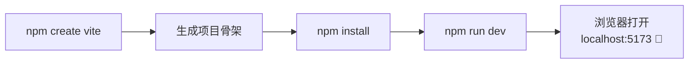
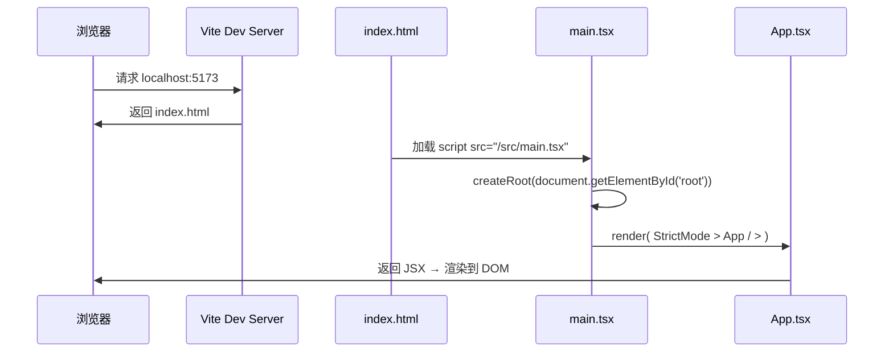
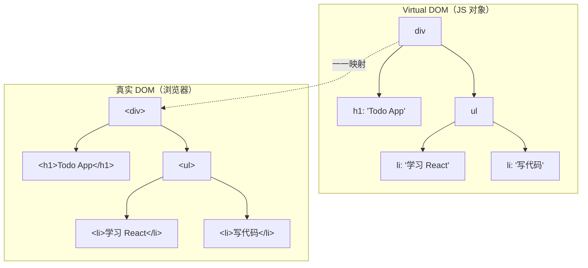
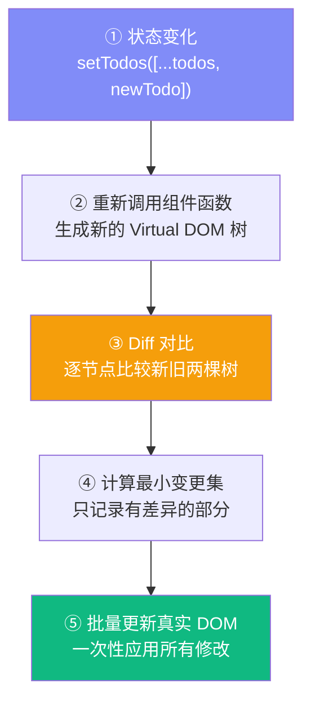
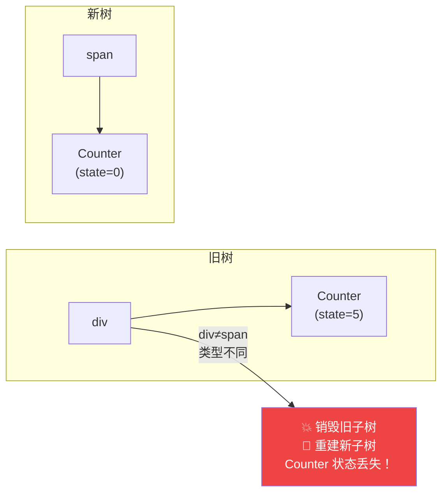
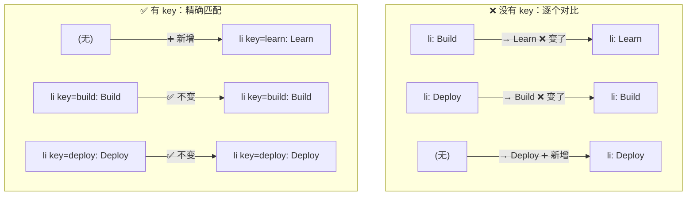
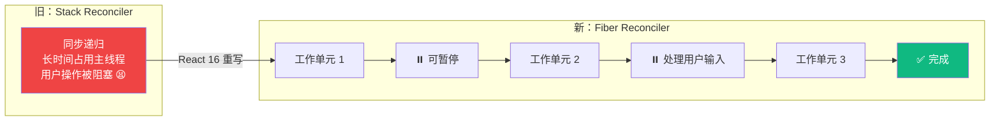

# Lesson 01：搭建项目 + 展示 Todo 静态页面

> 🎯 **本节目标**：用 Vite + React 19 + TypeScript + Tailwind CSS v4 搭建项目，渲染 Todo App 的静态界面。
>
> 📦 **本节产出**：一个可运行的静态 Todo 页面（数据硬编码，还不能交互）。

---

## 一、创建项目

### 1.1 初始化 Vite 项目

```bash
npm create vite@latest phase1-todo -- --template react-ts
cd phase1-todo
npm install
```



> [!NOTE]
> **为什么选 Vite 而不是 Create React App（CRA）？**
> - CRA 已于 2023 年停止维护，React 官方不再推荐
> - Vite 基于原生 ESM + ESBuild，冷启动 < 100ms（CRA 动辄 10 秒+）
> - HMR（热更新）几乎瞬时，修改代码秒级反馈

### 1.2 安装 Tailwind CSS v4

```bash
npm install tailwindcss @tailwindcss/vite
```

修改 **`vite.config.ts`**：

```typescript
import { defineConfig } from 'vite'
import react from '@vitejs/plugin-react'
import tailwindcss from '@tailwindcss/vite'

export default defineConfig({
  plugins: [
    react(),
    tailwindcss(),
  ],
})
```

替换 **`src/index.css`** 全部内容为：

```css
@import "tailwindcss";
```

> [!TIP]
> **Tailwind v4 vs v3 关键变化：**
> - ❌ 不再依赖巨大的 `tailwind.config.js`。v4 允许我们在 CSS 中直接用 `@theme` 覆盖默认配置。
> - ✅ 用 CSS 原生 `@import "tailwindcss"` 替代 `@tailwind` 指令
> - ✅ Vite 插件自动检测，零配置即可使用

### 1.3 清理模板 & 启动

```bash
rm src/App.css src/assets/react.svg
npm run dev
```

---

## 二、项目结构解析

```
phase1-todo/
├── index.html            ← 真正的入口文件（Vite 从这里开始）
├── package.json           ← 依赖和脚本
├── tsconfig.json          ← TypeScript 配置
├── vite.config.ts         ← Vite 构建配置
├── public/                ← 静态资源（不经过构建）
└── src/
    ├── main.tsx           ← React 启动入口
    ├── App.tsx            ← 根组件（我们写代码的地方）
    ├── index.css          ← 全局样式 + Tailwind 入口
    └── vite-env.d.ts      ← Vite 类型声明
```

### 启动流程



### 关键文件：`src/main.tsx`

```tsx
import { StrictMode } from 'react'
import { createRoot } from 'react-dom/client'
import './index.css'
import App from './App.tsx'

createRoot(document.getElementById('root')!).render(
  <StrictMode>
    <App />
  </StrictMode>,
)
```

三件事：

| 代码 | 作用 |
|------|------|
| `createRoot(...)` | 创建 React 渲染根节点，接管 `#root` DOM |
| `<StrictMode>` | 开发模式额外检查（渲染 2 次检测不纯副作用），生产环境无影响 |
| `<App />` | 渲染我们的根组件 |

---

## 三、JSX — 看起来像 HTML 的 JavaScript

### 3.1 JSX 的本质

```mermaid
flowchart LR
    A["你写的 JSX\n&lt;h1 className='title'&gt;Hello&lt;/h1&gt;"] 
    -->|"编译（Babel/SWC）"| 
    B["jsx('h1', {\n  className: 'title',\n  children: 'Hello'\n})"]
    -->|"执行"| 
    C["React Element\n（普通 JS 对象）\n{ type: 'h1', props: {...} }"]
    -->|"Reconciliation"| 
    D["真实 DOM\n&lt;h1&gt;Hello&lt;/h1&gt;"]
```

**核心认知：JSX 是 `createElement()` 的语法糖，返回一个描述 UI 的普通 JS 对象，不是真实 DOM。**

### 3.2 JSX 语法速查

```tsx
function Demo() {
  const name = 'React'
  return (
    <>
      {/* 1. {} 嵌入 JS 表达式 */}
      <h1>Hello, {name}! {2 + 3}</h1>

      {/* 2. className 代替 class */}
      <div className="text-blue-500">蓝色文字</div>

      {/* 3. 内联样式用对象 + camelCase */}
      <div style={{ fontSize: '20px', backgroundColor: '#f0f0f0' }}>样式</div>

      {/* 4. 条件渲染 */}
      {name === 'React' && <p>Yes!</p>}

      {/* 5. 列表渲染（每项需要 key） */}
      {['A', 'B', 'C'].map(item => <span key={item}>{item} </span>)}

      {/* 6. 所有标签必须闭合 */}
      
    </>
  )
}
```

JSX 与 HTML 的差异速查：

| HTML | JSX | 原因 |
|------|-----|------|
| `class` | `className` | `class` 是 JS 保留字 |
| `for` | `htmlFor` | `for` 是 JS 保留字 |
| `style="color: red"` | `style={{ color: 'red' }}` | JSX 中 style 是对象 |
| `<br>` | `<br />` | JSX 要求所有标签闭合 |
| `onclick` | `onClick` | JSX 事件用 camelCase |

---

## 四、TypeScript 快速入门

本项目中常用的类型：

```tsx
// 基础类型
const name: string = 'React'
const version: number = 19
const isNew: boolean = true

// 对象 —— 用 interface 或 type
interface Todo {
  id: number
  text: string
  completed: boolean
}

// 联合类型
type Filter = 'all' | 'active' | 'completed'

// 数组
const todos: Todo[] = []

// 函数
const greet = (name: string): string => `Hello, ${name}!`
```

> [!TIP]
> **`interface` vs `type`？**
> - `interface`：适合定义对象结构（如组件 Props），可 `extends` 继承
> - `type`：更灵活，支持联合 `A | B`、交叉 `A & B`
> - 本课程约定：**Props 用 `interface`，其他用 `type`**

---

## 五、实战：编写 Todo 静态页面

替换 **`src/App.tsx`** 全部内容：

```tsx
// src/App.tsx

// 硬编码数据（后续用 state 管理）
const todos = [
  { id: 1, text: '学习 React 19 基础知识', completed: true },
  { id: 2, text: '用 Vite 搭建开发环境', completed: true },
  { id: 3, text: '实现 Todo 的添加功能', completed: false },
  { id: 4, text: '学习 useState 和 useEffect', completed: false },
  { id: 5, text: '掌握 React Router v7', completed: false },
]

function App() {
  const total = todos.length
  const completed = todos.filter(t => t.completed).length

  return (
    <div className="min-h-screen bg-gradient-to-br from-indigo-50 via-white to-cyan-50">
      <div className="max-w-xl mx-auto px-4 py-12">

        {/* ── 头部 ── */}
        <header className="text-center mb-10">
          <h1 className="text-4xl font-bold bg-gradient-to-r from-indigo-600 to-cyan-600 bg-clip-text text-transparent">
            📝 Todo App
          </h1>
          <p className="mt-2 text-gray-500">React 19 · TypeScript · Tailwind v4</p>
          <div className="mt-4 inline-flex items-center gap-2 bg-white px-4 py-2 rounded-full shadow-sm border border-gray-100">
            <span className="text-sm text-gray-600">
              已完成 <strong className="text-indigo-600">{completed}</strong> / {total}
            </span>
            <div className="w-20 h-2 bg-gray-200 rounded-full overflow-hidden">
              <div
                className="h-full bg-gradient-to-r from-indigo-500 to-cyan-500 rounded-full transition-all"
                style={{ width: `${total > 0 ? (completed / total) * 100 : 0}%` }}
              />
            </div>
          </div>
        </header>

        {/* ── 输入区域（静态） ── */}
        <div className="flex gap-2 mb-6">
          <input
            type="text"
            placeholder="添加新任务..."
            className="flex-1 px-4 py-3 bg-white rounded-xl border border-gray-200 shadow-sm
                       focus:outline-none focus:ring-2 focus:ring-indigo-500/20 focus:border-indigo-400
                       transition-all placeholder:text-gray-400"
          />
          <button className="px-6 py-3 bg-indigo-600 text-white rounded-xl font-semibold shadow-sm
                             hover:bg-indigo-700 active:scale-95 transition-all">
            添加
          </button>
        </div>

        {/* ── 筛选按钮（静态） ── */}
        <div className="flex gap-2 mb-4">
          {['全部', '未完成', '已完成'].map((label, i) => (
            <button
              key={label}
              className={`px-4 py-1.5 rounded-full text-sm font-medium transition-colors ${
                i === 0
                  ? 'bg-indigo-600 text-white shadow-sm'
                  : 'bg-white text-gray-600 hover:bg-gray-100 border border-gray-200'
              }`}
            >
              {label}
            </button>
          ))}
        </div>

        {/* ── 任务列表 ── */}
        <div className="space-y-2">
          {todos.map(todo => (
            <div
              key={todo.id}
              className="flex items-center gap-3 p-4 bg-white rounded-xl border border-gray-100
                         shadow-sm hover:shadow-md transition-all group"
            >
              <input
                type="checkbox"
                checked={todo.completed}
                readOnly
                className="w-5 h-5 rounded-md border-gray-300 text-indigo-600
                           focus:ring-indigo-500/20 cursor-pointer"
              />
              <span className={`flex-1 transition-colors ${
                todo.completed ? 'line-through text-gray-400' : 'text-gray-800'
              }`}>
                {todo.text}
              </span>
              <button className="opacity-0 group-hover:opacity-100 text-gray-400
                                 hover:text-red-500 transition-all text-lg">
                ✕
              </button>
            </div>
          ))}
        </div>

        <footer className="mt-8 text-center text-sm text-gray-400">
          Phase 1 · Lesson 01 — 静态页面
        </footer>
      </div>
    </div>
  )
}

export default App
```

运行 `npm run dev`，你会看到一个渐变背景、带进度条、鼠标悬停显示删除按钮的 Todo 页面。

**目前所有数据硬编码，点击按钮无反应** —— 下节课用 useState 让它活起来。

---

## 六、🧠 深度专题：Virtual DOM 与 Reconciliation

### 6.1 为什么需要 Virtual DOM？

直接操作真实 DOM 是昂贵的——每次修改可能触发 **样式计算 → 布局 → 绘制 → 合成** 的完整渲染管线。

React 的方案：**用 JS 对象描述 UI 树，变化时对比新旧两棵树，只更新差异部分。**



### 6.2 Reconciliation 流程



### 6.3 Diff 算法的两个核心假设

React 把树对比从 O(n³) 优化到 **O(n)**，靠两个大胆假设：

#### 假设 1：不同类型 → 整棵子树替换



#### 假设 2：通过 `key` 识别列表元素



在我们的代码中：

```tsx
{todos.map(todo => (
  <div key={todo.id}>  {/* ← key 帮助 React 精确追踪每一项 */}
    {todo.text}
  </div>
))}
```

> [!WARNING]
> **不要用数组 index 做 key（当列表会增删/重排时）！**
> `key={index}` 在头部插入时会导致所有项重新渲染，性能差且可能出 bug。
> 永远用 **唯一且稳定的 id**。

### 6.4 Fiber 架构简介

React 16+ 将 Reconciliation 重写为 **Fiber 架构**：



| 特性 | Stack Reconciler | Fiber Reconciler |
|------|-----------------|-----------------|
| 渲染 | 同步递归，不可中断 | 异步可中断，分片执行 |
| 优先级 | 无 | 高优先级任务（如用户输入）可插队 |
| 并发 | ❌ | ✅ 支持并发渲染特性（Concurrent Rendering） |

**Fiber 是 React 18/19 所有并发特性的基础**——`Suspense`、`useTransition`、`useDeferredValue` 都建立在其上。

---

## 七、练习

1. **修改数据**：在 `todos` 数组中添加你自己的任务，确认页面更新
2. **改样式**：把渐变背景换成 `from-purple-50 to-pink-50`，调整圆角、颜色
3. **加元素**：在底部添加一个"清空已完成"按钮（纯静态，不需要交互）
4. **思考**：页面上的进度条是怎么算出来的？如果 `todos` 为空会怎样？

---

## 📌 本节小结

| 你做了什么 | 你学到了什么 |
|-----------|------------|
| 用 Vite 创建 React 19 + TS 项目 | Vite 的优势、项目结构、启动流程 |
| 安装配置 Tailwind CSS v4 | v4 零配置方式 |
| 渲染了静态 Todo 页面 | JSX = `createElement()` 的语法糖，返回 JS 对象 |
| 用 `.map()` + `key` 渲染列表 | key 如何帮助 Diff 算法高效运作 |
| — | Virtual DOM → Reconciliation → Fiber 架构全景 |

---

## ➡️ 下一课

[**Lesson 02：拆分组件 — 把大组件拆成可复用的小组件**](./Lesson_02.md)
