# Lesson 02：拆分组件 — Props 与组件组合

> 🎯 **本节目标**：将 Lesson 01 的单文件页面拆成独立组件，掌握 Props 传递与组件组合。
>
> 📦 **本节产出**：同样的 Todo 页面，从 1 个大组件变成 5 个职责清晰的小组件。

---

## 一、为什么要拆组件？

Lesson 01 所有代码挤在一个 `App.tsx`，真实项目中会很痛苦。组件化的核心思想：

**把 UI 拆成独立、可复用、职责单一的函数。**

```mermaid
flowchart LR
    subgraph "Lesson 01：单文件"
        A["App.tsx\n100+ 行\n所有逻辑混在一起"]
    end
    
    subgraph "Lesson 02：组件化"
        B["App.tsx\n（组装者）"]
        B --> C["Header"]
        B --> D["TodoInput"]
        B --> E["TodoFilter"]
        B --> F["TodoList"]
        F --> G["TodoItem"]
    end
    
    A -->|"拆分"| B
```



拆分后的好处：

| 方面 | 拆分前 | 拆分后 |
|------|-------|-------|
| 可维护性 | 找代码要上下滚动 | 每个文件职责清晰 |
| 可复用 | 无法复用 | 组件可在多处使用 |
| 协作 | 多人改同一文件，冲突不断 | 各改各的文件 |
| 测试 | 难以单独测试 | 每个组件可独立测试 |

---

## 二、什么是 Props？

组件就是函数，**Props 就是参数**：

```mermaid
flowchart LR
    A["Props（输入）\nname='Alice'"]
    -->
    B["组件函数\nGreeting"]
    -->
    C["JSX（输出）\n&lt;h1&gt;Hello, Alice!&lt;/h1&gt;"]
```



```tsx
// 把组件想象成函数：
// 输入 = Props     输出 = JSX     规则 = 纯函数（相同输入 → 相同输出）

function Greeting({ name }: { name: string }) {
  return <h1>Hello, {name}!</h1>
}

<Greeting name="Alice" />   // → <h1>Hello, Alice!</h1>
<Greeting name="Bob" />     // → <h1>Hello, Bob!</h1>
```

> [!IMPORTANT]
> **Props 是只读的！** 子组件不能修改收到的 Props——这是 React 单向数据流的基石。

---

## 三、动手拆分

### 3.1 创建共享类型文件

多个组件都需要 `Todo` 类型，提取到单独文件：

```tsx
// src/types.ts

export interface Todo {
  id: number
  text: string
  completed: boolean
}

export type Filter = 'all' | 'active' | 'completed'
```

### 3.2 文件结构

```
src/
├── components/
│   ├── Header.tsx       ← 标题 + 进度条
│   ├── TodoInput.tsx    ← 输入框 + 添加按钮
│   ├── TodoFilter.tsx   ← 筛选按钮组
│   ├── TodoList.tsx     ← 任务列表容器
│   └── TodoItem.tsx     ← 单个任务项
├── types.ts             ← 共享类型
├── App.tsx              ← 根组件（组装者）
├── main.tsx
└── index.css
```

### 3.3 Header — 标题和进度

```tsx
// src/components/Header.tsx

interface HeaderProps {
  total: number       // 总任务数
  completed: number   // 已完成数
}

function Header({ total, completed }: HeaderProps) {
  const percentage = total > 0 ? (completed / total) * 100 : 0

  return (
    <header className="text-center mb-10">
      <h1 className="text-4xl font-bold bg-gradient-to-r from-indigo-600 to-cyan-600
                     bg-clip-text text-transparent">
        📝 Todo App
      </h1>
      <p className="mt-2 text-gray-500">React 19 · TypeScript · Tailwind v4</p>
      <div className="mt-4 inline-flex items-center gap-2 bg-white px-4 py-2
                      rounded-full shadow-sm border border-gray-100">
        <span className="text-sm text-gray-600">
          已完成 <strong className="text-indigo-600">{completed}</strong> / {total}
        </span>
        <div className="w-20 h-2 bg-gray-200 rounded-full overflow-hidden">
          <div
            className="h-full bg-gradient-to-r from-indigo-500 to-cyan-500 rounded-full transition-all"
            style={{ width: `${percentage}%` }}
          />
        </div>
      </div>
    </header>
  )
}

export default Header
```

**要点：**
- `interface HeaderProps` 明确声明组件需要什么数据
- `{ total, completed }` 解构接收，比 `props.total` 简洁
- `percentage` 是 **派生数据**（从 Props 直接计算），不需要额外存储

### 3.4 TodoInput — 收集用户输入

```tsx
// src/components/TodoInput.tsx

interface TodoInputProps {
  onAdd: (text: string) => void   // 回调函数：通知父组件
}

function TodoInput({ onAdd }: TodoInputProps) {
  const handleSubmit = (e: React.FormEvent<HTMLFormElement>) => {
    e.preventDefault()  // 阻止表单默认提交（页面刷新）
    const form = e.currentTarget
    const input = form.elements.namedItem('todo') as HTMLInputElement
    const text = input.value.trim()
    // 💡 这里我们使用了“非受控组件”的方式读取表单（直接拿 DOM 的值），
    // 性能极佳。相对应的还有用 useState 绑定的“受控组件”方式，我们后面会讲。

    if (text) {
      onAdd(text)        // 通知父组件："用户输入了这段文字"
      input.value = ''   // 清空输入框
    }
  }

  return (
    <form onSubmit={handleSubmit} className="flex gap-2 mb-6">
      <input
        name="todo"
        type="text"
        placeholder="添加新任务..."
        className="flex-1 px-4 py-3 bg-white rounded-xl border border-gray-200 shadow-sm
                   focus:outline-none focus:ring-2 focus:ring-indigo-500/20 focus:border-indigo-400
                   transition-all placeholder:text-gray-400"
      />
      <button
        type="submit"
        className="px-6 py-3 bg-indigo-600 text-white rounded-xl font-semibold shadow-sm
                   hover:bg-indigo-700 active:scale-95 transition-all"
      >
        添加
      </button>
    </form>
  )
}

export default TodoInput
```

**关键概念 —— `onAdd` 回调：**

```mermaid
sequenceDiagram
    participant User as 用户
    participant Input as TodoInput
    participant App as App（父组件）

    User->>Input: 输入 "学习 Hooks"，点击添加
    Input->>Input: handleSubmit() 执行
    Input->>App: 调用 onAdd("学习 Hooks")
    App->>App: 处理数据（下节课实现）
    App->>Input: 新 Props 流下来（重新渲染）
```



子组件只负责 **收集输入**，父组件负责 **处理数据**。

### 3.5 TodoFilter — 筛选按钮

```tsx
// src/components/TodoFilter.tsx
import type { Filter } from '../types'

interface TodoFilterProps {
  current: Filter                      // 当前激活的筛选
  onChange: (filter: Filter) => void   // 切换筛选的回调
}

const filters: { value: Filter; label: string }[] = [
  { value: 'all', label: '全部' },
  { value: 'active', label: '未完成' },
  { value: 'completed', label: '已完成' },
]

function TodoFilter({ current, onChange }: TodoFilterProps) {
  return (
    <div className="flex gap-2 mb-4">
      {filters.map(({ value, label }) => (
        <button
          key={value}
          onClick={() => onChange(value)}
          className={`px-4 py-1.5 rounded-full text-sm font-medium transition-colors ${
            current === value
              ? 'bg-indigo-600 text-white shadow-sm'
              : 'bg-white text-gray-600 hover:bg-gray-100 border border-gray-200'
          }`}
        >
          {label}
        </button>
      ))}
    </div>
  )
}

export default TodoFilter
```

### 3.6 TodoItem — 单个任务

```tsx
// src/components/TodoItem.tsx
import type { Todo } from '../types'

interface TodoItemProps {
  todo: Todo                           // 任务数据
  onToggle: (id: number) => void       // 切换完成状态
  onDelete: (id: number) => void       // 删除任务
}

function TodoItem({ todo, onToggle, onDelete }: TodoItemProps) {
  return (
    <div className="flex items-center gap-3 p-4 bg-white rounded-xl border border-gray-100
                    shadow-sm hover:shadow-md transition-all group">
      <input
        type="checkbox"
        checked={todo.completed}
        onChange={() => onToggle(todo.id)}
        className="w-5 h-5 rounded-md border-gray-300 text-indigo-600
                   focus:ring-indigo-500/20 cursor-pointer"
      />
      <span className={`flex-1 transition-colors ${
        todo.completed ? 'line-through text-gray-400' : 'text-gray-800'
      }`}>
        {todo.text}
      </span>
      <button
        onClick={() => onDelete(todo.id)}
        className="opacity-0 group-hover:opacity-100 text-gray-400
                   hover:text-red-500 transition-all text-lg"
      >
        ✕
      </button>
    </div>
  )
}

export default TodoItem
```

### 3.7 TodoList — 列表容器

```tsx
// src/components/TodoList.tsx
import type { Todo } from '../types'
import TodoItem from './TodoItem'

interface TodoListProps {
  todos: Todo[]
  onToggle: (id: number) => void
  onDelete: (id: number) => void
}

function TodoList({ todos, onToggle, onDelete }: TodoListProps) {
  if (todos.length === 0) {
    return (
      <div className="text-center py-16 text-gray-400">
        <p className="text-5xl mb-3">📋</p>
        <p className="text-lg">暂无任务</p>
      </div>
    )
  }

  return (
    <div className="space-y-2">
      {todos.map(todo => (
        <TodoItem key={todo.id} todo={todo} onToggle={onToggle} onDelete={onDelete} />
      ))}
    </div>
  )
}

export default TodoList
```

### 3.8 组装：App.tsx

```tsx
// src/App.tsx
import type { Todo, Filter } from './types'
import Header from './components/Header'
import TodoInput from './components/TodoInput'
import TodoFilter from './components/TodoFilter'
import TodoList from './components/TodoList'

// 仍然硬编码（下节课用 useState 替代）
const todos: Todo[] = [
  { id: 1, text: '学习 JSX 语法', completed: true },
  { id: 2, text: '拆分组件，理解 Props', completed: false },
  { id: 3, text: '学习 useState', completed: false },
]

const currentFilter: Filter = 'all'

function App() {
  const completed = todos.filter(t => t.completed).length

  // 回调暂时只打印日志 —— 下节课真正工作
  const handleAdd = (text: string) => console.log('添加:', text)
  const handleToggle = (id: number) => console.log('切换:', id)
  const handleDelete = (id: number) => console.log('删除:', id)
  const handleFilterChange = (filter: Filter) => console.log('筛选:', filter)

  return (
    <div className="min-h-screen bg-gradient-to-br from-indigo-50 via-white to-cyan-50">
      <div className="max-w-xl mx-auto px-4 py-12">
        <Header total={todos.length} completed={completed} />
        <TodoInput onAdd={handleAdd} />
        <TodoFilter current={currentFilter} onChange={handleFilterChange} />
        <TodoList todos={todos} onToggle={handleToggle} onDelete={handleDelete} />
      </div>
    </div>
  )
}

export default App
```

页面和 Lesson 01 **看起来完全一样**，但代码架构清晰了 10 倍。打开浏览器控制台，点击按钮能看到 `console.log` 输出。

---

## 四、`children` — 最特殊的 Prop

有时你想让组件包裹 **任意内容**：

```tsx
interface CardProps {
  title: string
  children: React.ReactNode   // 接受任何可渲染内容
}

function Card({ title, children }: CardProps) {
  return (
    <div className="bg-white rounded-xl shadow-md overflow-hidden">
      <div className="px-6 py-4 bg-indigo-600">
        <h3 className="text-white font-bold">{title}</h3>
      </div>
      <div className="px-6 py-4">{children}</div>
    </div>
  )
}

// 标签之间的一切自动成为 children
<Card title="用户信息">
  <p>姓名：Alice</p>
  <p>邮箱：alice@example.com</p>
</Card>
```



```mermaid
flowchart TB
    subgraph "Card 组件"
        T["title='用户信息'"]
        C["children"]
        T --> Header["渲染为标题栏"]
        C --> Content["渲染为内容区"]
    end
    
    P1["&lt;p&gt;姓名&lt;/p&gt;"] -->|"作为 children"| C
    P2["&lt;p&gt;邮箱&lt;/p&gt;"] -->|"作为 children"| C
```

这就是 React 的 **组合模式**：组件通过 `children` 嵌套组合，而不是通过继承。

---

## 五、🧠 深度专题：单向数据流

### 5.1 数据如何流动？

```mermaid
flowchart TB
    App["App\n（数据源 · 唯一真相）"]
    
    App -->|"total, completed"| Header
    App -->|"onAdd"| TodoInput
    App -->|"current, onChange"| TodoFilter
    App -->|"todos, onToggle, onDelete"| TodoList
    TodoList -->|"todo, onToggle, onDelete"| TodoItem1["TodoItem"]
    TodoList -->|"todo, onToggle, onDelete"| TodoItem2["TodoItem"]
    
    TodoItem1 -.->|"onToggle(id) ↑"| App
    TodoItem2 -.->|"onDelete(id) ↑"| App
    TodoInput -.->|"onAdd(text) ↑"| App

    style App fill:#818cf8,color:#fff
```



- **实线 ↓**：Props 向下流（数据）
- **虚线 ↑**：回调向上传（事件通知）

### 5.2 为什么 Props 只读？

```tsx
// ❌ 如果子组件能修改 Props...
function TodoItem({ todo }: { todo: Todo }) {
  todo.completed = true
  // App 不知道数据变了 → 不会重新渲染 → UI 和数据不一致 → Bug！
}

// ✅ 只通过回调通知父组件
function TodoItem({ todo, onToggle }: TodoItemProps) {
  return (
    <input
      checked={todo.completed}
      onChange={() => onToggle(todo.id)}   // "我想改" → 请父组件去改
    />
  )
}
```

### 5.3 对比其他框架

```mermaid
flowchart LR
    subgraph "React 单向数据流"
        RP["Parent"] -->|"Props ↓"| RC["Child"]
        RC -.->|"Callback ↑"| RP
    end
    
    subgraph "Vue 双向绑定"
        VP["Parent"] <-->|"v-model ↕️"| VC["Child"]
    end
```



| | React（单向） | Vue（v-model 双向） |
|---|---|---|
| 数据修改 | 必须通过回调显式通知 | 子组件可直接修改 |
| 代码量 | 略多（要手写回调） | 略少（语法糖） |
| 可追踪性 | ✅ 数据来源清晰 | ⚠️ 大型项目较难追踪 |
| 调试 | ✅ 容易定位 bug | ⚠️ 可能出现循环更新 |

> **React 的哲学：显式优于隐式。** 用少量代码量换取数据流的可预测性。

---

## 六、练习

1. **创建 Footer 组件**：提取底部信息为独立组件，接收 `lesson: string` Prop
2. **用 children 做布局**：创建 `PageContainer` 组件，包裹页面内容区域（设置 max-w、mx-auto 等）
3. **思考**：如果 Header 和 TodoList 都需要 `todos` 数据，数据应该放在哪个组件？为什么？

---

## 📌 本节小结

| 你做了什么 | 你学到了什么 |
|-----------|------------|
| 把 App 拆成 5 个组件 | 组件 = 返回 JSX 的函数 |
| 用 interface 定义每个组件的 Props | Props 类型标注、解构接收 |
| 用回调实现事件传递 | `onXxx` 回调命名约定 |
| 创建了 types.ts 共享类型 | interface vs type 选择 |
| — | 单向数据流：数据向下，事件向上 |

---

## ➡️ 下一课

[**Lesson 03：实现添加任务 — useState 让数据活起来**](./Lesson_03.md)
