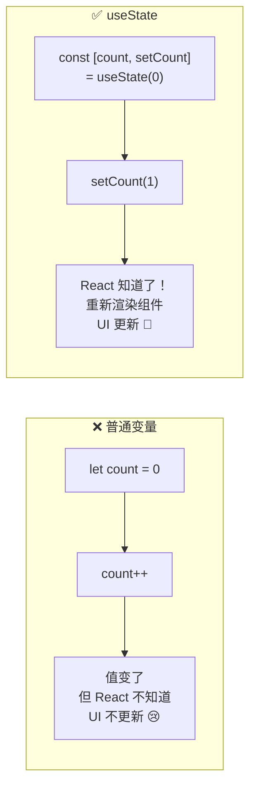
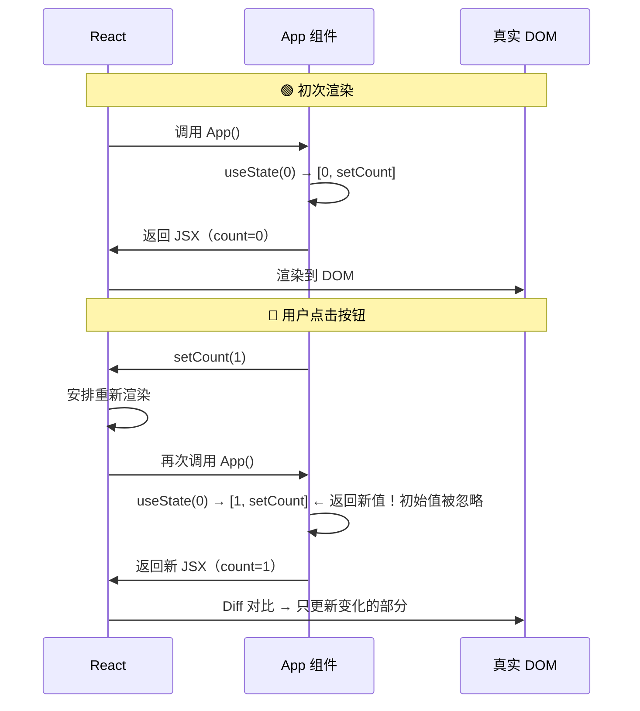
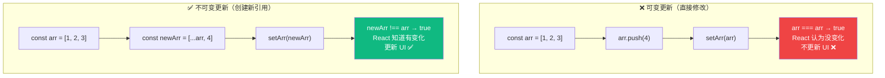
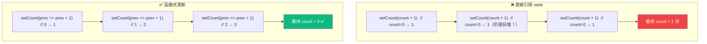
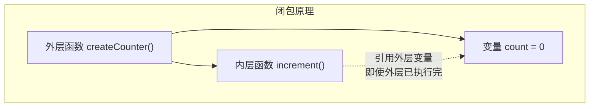
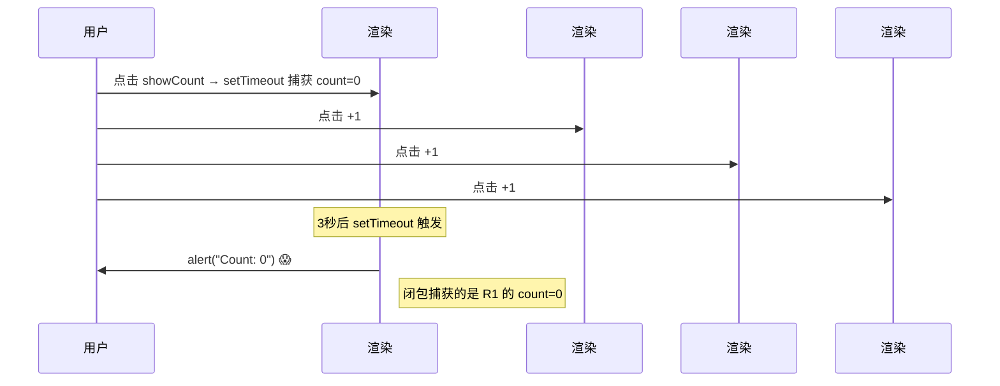

# Lesson 03：实现添加任务 — useState 让数据活起来

> 🎯 **本节目标**：用 `useState` 管理 Todo 数据，实现"输入文字 → 点击添加 → 列表更新"。
>
> 📦 **本节产出**：Todo App 可以动态添加新任务了！


## 一、为什么需要 State？

Lesson 02 的数据是硬编码的常量，UI 无法响应用户操作。**State 让组件拥有"记忆"——数据变了，UI 自动更新。**



```tsx
import { useState } from 'react'

// ❌ 普通变量：点击后 count 变了，但页面不变
function Bad() {
  let count = 0
  return <button onClick={() => { count++ }}>Count: {count}</button>
}

// ✅ useState：点击后 React 重新渲染，页面更新
function Good() {
  const [count, setCount] = useState(0)
  return <button onClick={() => setCount(count + 1)}>Count: {count}</button>
}
```

### useState 的渲染循环



---

## 二、改造 App.tsx

把硬编码数据替换为 `useState`：

```tsx
// src/App.tsx
import { useState } from 'react'
import type { Todo, Filter } from './types'
import Header from './components/Header'
import TodoInput from './components/TodoInput'
import TodoFilter from './components/TodoFilter'
import TodoList from './components/TodoList'

function App() {
  // ✅ 用 useState 管理数据
  const [todos, setTodos] = useState<Todo[]>([
    { id: 1, text: '学习 JSX 语法', completed: true },
    { id: 2, text: '拆分组件，理解 Props', completed: true },
    { id: 3, text: '用 useState 添加任务', completed: false },
  ])
  const [filter, setFilter] = useState<Filter>('all')

  // ✅ 添加任务 —— 真正能工作了！
  const addTodo = (text: string) => {
    setTodos(prev => [
      ...prev,
      { id: Date.now(), text, completed: false }
    ])
  }

  // 下节课实现
  const toggleTodo = (id: number) => console.log('toggle', id)
  const deleteTodo = (id: number) => console.log('delete', id)

  // 派生数据 —— 从 state 直接计算，不需要额外 useState
  const filteredTodos = todos.filter(todo => {
    if (filter === 'active') return !todo.completed
    if (filter === 'completed') return todo.completed
    return true
  })
  const completedCount = todos.filter(t => t.completed).length

  return (
    <div className="min-h-screen bg-gradient-to-br from-indigo-50 via-white to-cyan-50">
      <div className="max-w-xl mx-auto px-4 py-12">
        <Header total={todos.length} completed={completedCount} />
        <TodoInput onAdd={addTodo} />
        <TodoFilter current={filter} onChange={setFilter} />
        <TodoList todos={filteredTodos} onToggle={toggleTodo} onDelete={deleteTodo} />
      </div>
    </div>
  )
}

export default App
```

输入文字，点击"添加"，任务出现在列表中！🎉

---

## 三、useState 类型标注

```tsx
// 简单类型 —— TS 自动推断
const [count, setCount] = useState(0)         // number
const [name, setName] = useState('Alice')     // string
const [open, setOpen] = useState(false)        // boolean

// 复杂类型 —— 需要泛型 <>
const [todos, setTodos] = useState<Todo[]>([])         // Todo 数组
const [user, setUser] = useState<User | null>(null)     // 可能为 null
const [filter, setFilter] = useState<Filter>('all')    // 联合类型
```

---

## 四、⭐ 不可变更新（最重要的概念）

React 通过 **引用比较（`===`）** 检测状态是否变化，所以必须创建 **新引用**：



### 数组操作速查

```tsx
const [todos, setTodos] = useState<Todo[]>([])

// ✅ 添加 → 展开创建新数组
setTodos([...todos, newTodo])
setTodos([newTodo, ...todos])        // 添加到开头

// ✅ 删除 → filter 返回新数组
setTodos(todos.filter(t => t.id !== id))

// ✅ 修改某项 → map 返回新数组
setTodos(todos.map(t =>
  t.id === id ? { ...t, completed: !t.completed } : t
))

// ✅ 排序 → 先复制（sort 会修改原数组！）
setTodos([...todos].sort((a, b) => a.text.localeCompare(b.text)))

// ❌ 直接 push — 修改原数组，引用不变！
todos.push(newTodo)
setTodos(todos)     // React 认为没变化，不更新！
```

### 对象操作速查

```tsx
const [profile, setProfile] = useState({ name: 'Alice', age: 25, email: 'a@b.com' })

// ✅ 展开 + 覆盖
setProfile({ ...profile, name: 'Bob' })

// ❌ 直接修改
profile.name = 'Bob'
setProfile(profile)  // 同一引用，React 不更新！
```

### 速查表

| 操作 | ❌ 可变方法 | ✅ 不可变方法 |
|------|-----------|-------------|
| 添加 | `push`、`unshift` | `[...arr, item]` |
| 删除 | `splice`、`pop` | `filter` |
| 修改 | `arr[i] = x` | `map` |
| 排序 | `sort`、`reverse` | `[...arr].sort()` 或 `toSorted()` |

---

## 五、函数式更新

当新值 **依赖前一个值** 时，用函数式更新最安全：



```tsx
// 我们的 addTodo 就使用了函数式更新：
const addTodo = (text: string) => {
  setTodos(prev => [...prev, { id: Date.now(), text, completed: false }])
  //       ↑ prev 保证拿到最新值
}
```

> **原则：如果新值依赖旧值，永远用 `setState(prev => ...)` 形式。**

---

## 六、延迟初始化

如果初始值计算 **昂贵**，传函数避免每次渲染重复计算：

```tsx
// ❌ 每次渲染都执行 JSON.parse（即使只用第一次的结果）
const [data, setData] = useState(JSON.parse(localStorage.getItem('data') || '[]'))

// ✅ 传函数，只在首次渲染执行
const [data, setData] = useState(() => {
  const saved = localStorage.getItem('data')
  return saved ? JSON.parse(saved) : []
})
```

---

## 七、🧠 深度专题：Hooks 闭包陷阱

### 7.1 什么是闭包？



函数可以"记住"它被创建时的环境变量——这就是闭包。

### 7.2 在 React 中的陷阱

```tsx
function Timer() {
  const [count, setCount] = useState(0)

  const showCount = () => {
    setTimeout(() => {
      alert(`Count: ${count}`)  // ⚠️ 这个 count 是点击时的值！
    }, 3000)
  }

  // 操作：count=0 时点 showCount → 快速 +1 三次 → 3秒后弹窗显示 0（不是 3）
}
```



每次渲染创建新的闭包环境。旧的 `setTimeout` 仍持有旧闭包中的 `count=0`。

### 7.3 解决方案

```tsx
import { useState, useRef } from 'react'

function Timer() {
  const [count, setCount] = useState(0)
  const countRef = useRef(count)    // useRef 创建一个"盒子"
  countRef.current = count          // 每次渲染同步最新值

  const showCount = () => {
    setTimeout(() => {
      alert(`Count: ${countRef.current}`)  // ✅ 读的是 ref，始终最新
    }, 3000)
  }
}
```

### 7.4 setInterval 经典陷阱

```tsx
// ❌ count 永远显示 1（闭包捕获了 count=0）
useEffect(() => {
  const id = setInterval(() => {
    setCount(count + 1)    // count 永远是初始闭包中的 0
  }, 1000)
  return () => clearInterval(id)
}, [])

// ✅ 函数式更新不依赖闭包中的值
useEffect(() => {
  const id = setInterval(() => {
    setCount(prev => prev + 1)   // 不读闭包中的 count
  }, 1000)
  return () => clearInterval(id)
}, [])
```

---

## 八、练习

1. **实现 toggleTodo 和 deleteTodo**：用 `map` 和 `filter` 的不可变模式（答案在下节课）
2. **添加清空功能**：按钮"清空已完成"，删除所有 `completed: true` 的项
3. **闭包体验**：写一个 3 秒后弹窗显示 `todos.length` 的按钮，然后添加几个任务，观察弹窗值

---

## 📌 本节小结

| 你做了什么 | 你学到了什么 |
|-----------|------------|
| 用 useState 管理 todos 和 filter | `const [s, setS] = useState(init)` |
| 实现了"添加任务"功能 | 不可变更新：`[...arr, item]` / `filter` / `map` |
| 筛选功能工作了 | 派生数据不需要额外 state |
| — | 函数式更新 `setState(prev => ...)` |
| — | 延迟初始化 `useState(() => ...)` |
| — | Hooks 闭包陷阱原理与解决方案 |
