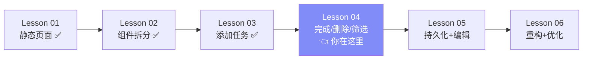
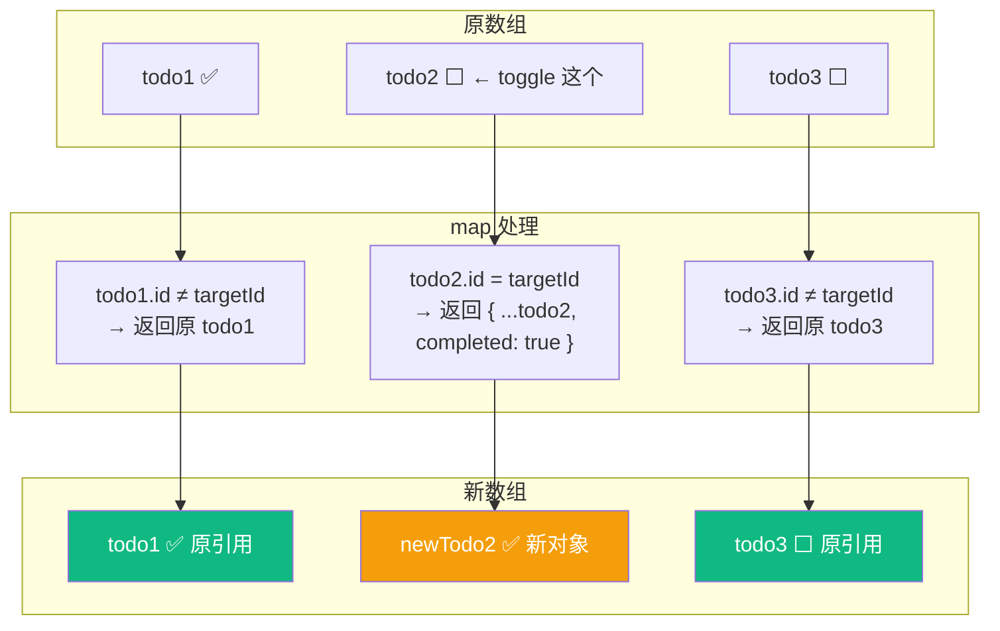
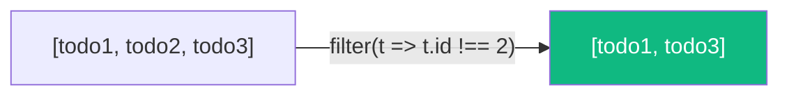
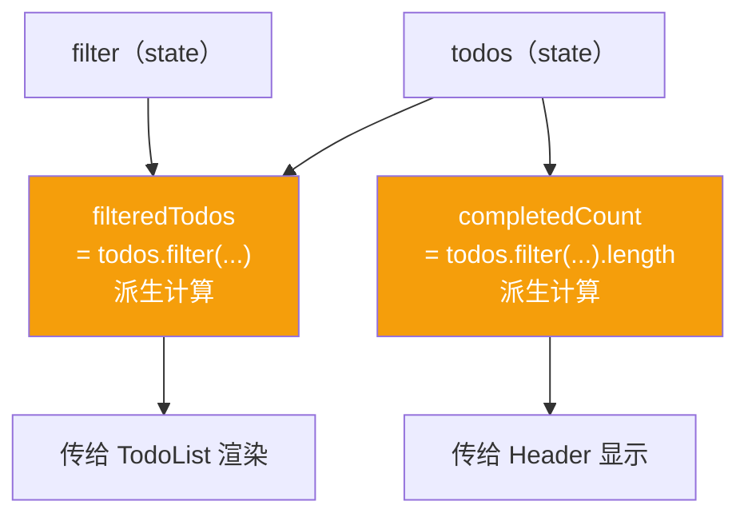
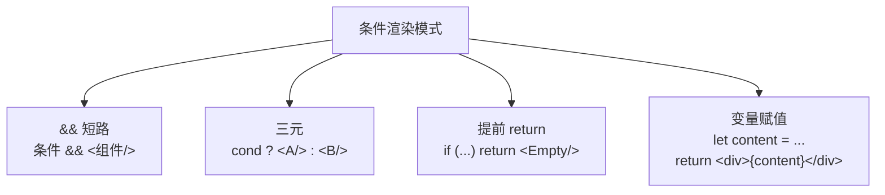
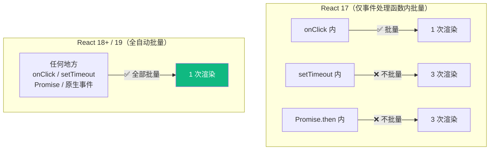

# Lesson 04：完成 / 删除 / 筛选 — 完善 Todo 交互

> 🎯 **本节目标**：实现勾选完成、删除任务、按状态筛选，Todo App 功能完整。
>
> 📦 **本节产出**：一个可以增、删、改（完成状态）、筛选、清除的 Todo App。

---

## 一、当前进度



---

## 二、实现 Toggle — 切换完成状态

```tsx
const toggleTodo = (id: number) => {
  setTodos(prev =>
    prev.map(todo =>
      todo.id === id
        ? { ...todo, completed: !todo.completed }   // 匹配项：创建新对象
        : todo                                        // 其余项：保持原引用
    )
  )
}
```

### 图解 map 的不可变更新



> React 对比新旧数组时：
> - `todo1 === todo1` ✅ 没变，跳过重新渲染
> - `newTodo2 !== todo2` ❌ 变了，重新渲染这个 TodoItem
> - `todo3 === todo3` ✅ 没变，跳过
>
> **这就是不可变更新的性能优势：只有变化的部分被重新渲染。**

---

## 三、实现 Delete — 删除任务

```tsx
const deleteTodo = (id: number) => {
  setTodos(prev => prev.filter(todo => todo.id !== id))
}
```

`filter` 天然返回新数组，完美符合不可变更新。



---

## 四、实现 Filter — 筛选显示

筛选是 **派生数据**，从已有 state 直接计算，不需要额外的 useState：



```tsx
// 派生数据 —— 直接计算
const filteredTodos = todos.filter(todo => {
  if (filter === 'active') return !todo.completed
  if (filter === 'completed') return todo.completed
  return true  // 'all'
})
const completedCount = todos.filter(t => t.completed).length
const activeCount = todos.length - completedCount
```

> [!IMPORTANT]
> **常见新手误区：把派生数据存到 useState**
> ```tsx
> // ❌ 多余的 state，会导致数据不同步 bug
> const [filteredTodos, setFilteredTodos] = useState<Todo[]>([])
>
> // ✅ 直接计算，永远和源数据保持一致
> const filteredTodos = todos.filter(...)
> ```
> **原则：能从现有 state 算出来的值，就不要存 state。**

---

## 五、完整 App.tsx

```tsx
// src/App.tsx
import { useState } from 'react'
import type { Todo, Filter } from './types'
import Header from './components/Header'
import TodoInput from './components/TodoInput'
import TodoFilter from './components/TodoFilter'
import TodoList from './components/TodoList'

function App() {
  const [todos, setTodos] = useState<Todo[]>([
    { id: 1, text: '学习 JSX 语法', completed: true },
    { id: 2, text: '拆分组件，理解 Props', completed: true },
    { id: 3, text: '用 useState 添加任务', completed: true },
    { id: 4, text: '实现完成/删除/筛选', completed: false },
  ])
  const [filter, setFilter] = useState<Filter>('all')

  // ── 事件处理 ──
  const addTodo = (text: string) => {
    setTodos(prev => [...prev, { id: Date.now(), text, completed: false }])
  }

  const toggleTodo = (id: number) => {
    setTodos(prev =>
      prev.map(todo =>
        todo.id === id ? { ...todo, completed: !todo.completed } : todo
      )
    )
  }

  const deleteTodo = (id: number) => {
    setTodos(prev => prev.filter(todo => todo.id !== id))
  }

  const clearCompleted = () => {
    setTodos(prev => prev.filter(todo => !todo.completed))
  }

  // ── 派生数据 ──
  const filteredTodos = todos.filter(todo => {
    if (filter === 'active') return !todo.completed
    if (filter === 'completed') return todo.completed
    return true
  })
  const completedCount = todos.filter(t => t.completed).length
  const activeCount = todos.length - completedCount

  return (
    <div className="min-h-screen bg-gradient-to-br from-indigo-50 via-white to-cyan-50">
      <div className="max-w-xl mx-auto px-4 py-12">
        <Header total={todos.length} completed={completedCount} />
        <TodoInput onAdd={addTodo} />

        <div className="flex items-center justify-between mb-4">
          <TodoFilter current={filter} onChange={setFilter} />
          {completedCount > 0 && (
            <button
              onClick={clearCompleted}
              className="text-sm text-gray-400 hover:text-red-500 transition-colors"
            >
              清除已完成 ({completedCount})
            </button>
          )}
        </div>

        <TodoList todos={filteredTodos} onToggle={toggleTodo} onDelete={deleteTodo} />

        <p className="mt-6 text-center text-sm text-gray-400">
          {activeCount} 个任务未完成
        </p>
      </div>
    </div>
  )
}

export default App
```

现在 Todo App 完整功能：✅ 添加 ✅ 完成 ✅ 删除 ✅ 筛选 ✅ 清除已完成

---

## 六、条件渲染模式总结

本节用到了多种条件渲染：



```tsx
// 1. && 短路 —— 条件为 true 时渲染
{completedCount > 0 && <button>清除</button>}

// 2. 三元 —— 二选一
{todo.completed ? <s>{text}</s> : <span>{text}</span>}

// 3. 提前 return
function TodoList({ todos }) {
  if (todos.length === 0) return <EmptyState />
  return <ul>{/* 正常渲染 */}</ul>
}

// ⚠️ && 陷阱：0 是 falsy 但会被渲染为 "0"
{count && <p>{count} 条</p>}      // count=0 → 显示 "0" ❌
{count > 0 && <p>{count} 条</p>}  // count=0 → 不渲染 ✅
```

---

## 七、🧠 深度专题：React 18/19 自动批量更新

### 什么是批量更新？

多个 `setState` 合并为一次渲染，避免中间状态的 UI 闪烁。



```tsx
function handleClick() {
  setCount(c => c + 1)     // 不会立即渲染
  setName('Bob')           // 不会立即渲染
  setIsOpen(false)         // 不会立即渲染
  // → React 合并为 1 次渲染 ✅
}

// 以前（React 17 及更早版本）在 setTimeout 里每个 setState 都会触发 1 次渲染
// React 18 引入了全自动批量更新（Automatic Batching），React 19 中自然沿用 ✅
setTimeout(() => {
  setCount(c => c + 1)
  setName('Bob')           // 仍然只渲染 1 次
}, 100)
```

### 想强制同步刷新？

极少需要，但可用 `flushSync`：

```tsx
import { flushSync } from 'react-dom'

flushSync(() => { setCount(c => c + 1) })
// 这里 DOM 已经更新了
console.log(document.getElementById('count')!.textContent)
```

---

## 八、练习

1. **全选/取消全选**：添加一个按钮，点击后所有任务变为已完成（再点变为未完成）
2. **筛选数量**：在按钮文字后显示数量，如 "全部 (5)" "未完成 (3)" "已完成 (2)"
3. **确认删除**：删除前弹出 `confirm()` 确认框
4. **思考**：刷新页面后任务消失了——如何解决？（答案在下节课）

---

## 📌 本节小结

| 你做了什么 | 你学到了什么 |
|-----------|------------|
| 实现 toggle / delete / filter | `map` 局部更新、`filter` 删除 |
| 添加"清除已完成" | 多个 state 协作 |
| 完整 CRUD + 筛选 | 派生数据不需要额外 state |
| — | 条件渲染 4 种模式 + `&&` 陷阱 |
| — | React 18+ 全自动批量更新（Automatic Batching） |

---

## ➡️ 下一课

[**Lesson 05：持久化 + 编辑 — useEffect 处理副作用**](./Lesson_05.md)
