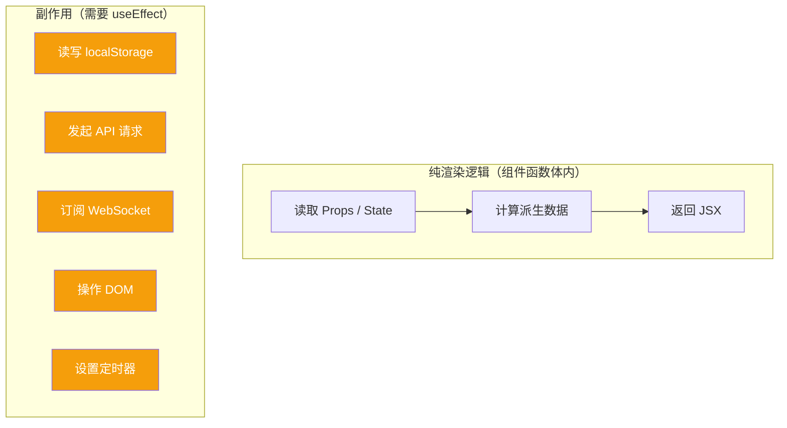
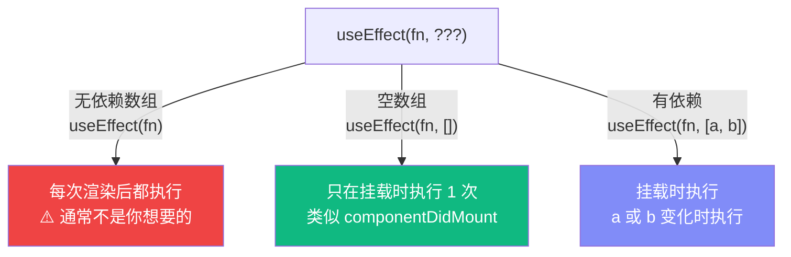
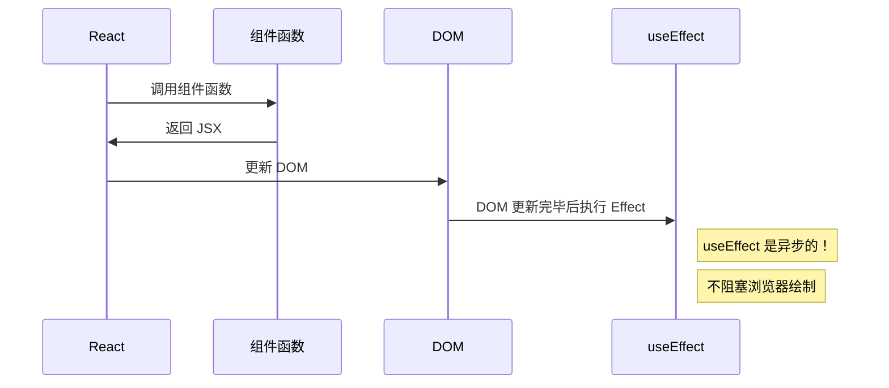
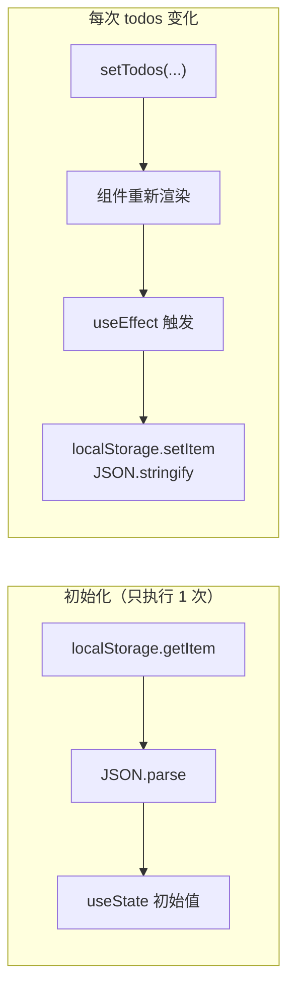
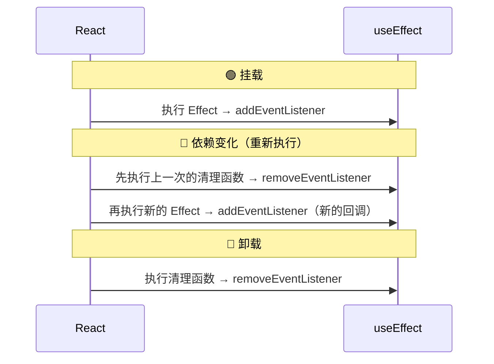
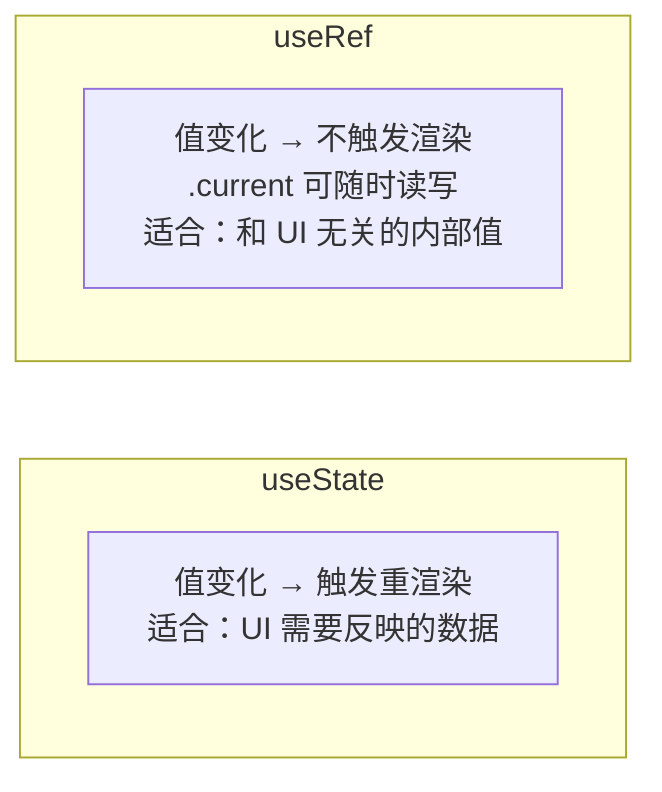
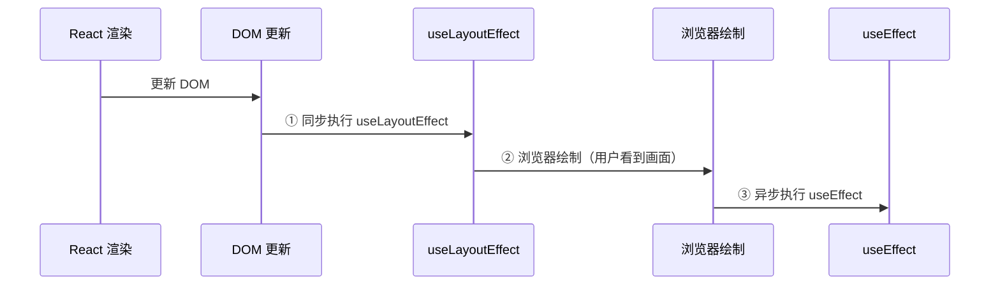
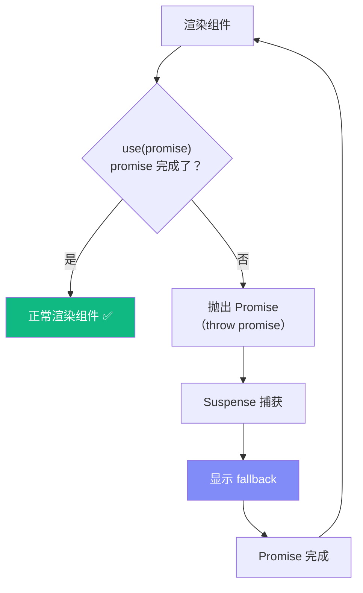

# Lesson 05：持久化 + 编辑 — useEffect 处理副作用

> 🎯 **本节目标**：用 `useEffect` + `localStorage` 实现数据持久化，添加双击编辑功能。
>
> 📦 **本节产出**：刷新页面数据不丢失，可以双击编辑任务文字。


## 一、什么是副作用（Side Effect）？

React 组件的核心职责是：**输入 Props/State → 输出 UI**。除此之外的操作都叫"副作用"：



---

## 二、useEffect 基础

### 2.1 语法

```tsx
useEffect(() => {
  // 副作用代码
  console.log('执行副作用')

  return () => {
    // 清理函数（可选）
    console.log('清理')
  }
}, [dep1, dep2])  // 依赖数组
```

### 2.2 依赖数组决定执行时机



```tsx
// 每次渲染都执行（几乎不用）
useEffect(() => { console.log('rendered') })

// 只在挂载时执行一次
useEffect(() => { console.log('mounted') }, [])

// count 变化时执行
useEffect(() => { document.title = `Count: ${count}` }, [count])
```

### 2.3 执行时序



> [!NOTE]
> `useEffect` 在 DOM 更新**之后**异步执行，不会阻塞页面渲染。
> 如果需要在 DOM 更新之前同步执行，用 `useLayoutEffect`（极少需要）。

---

## 三、实战：localStorage 持久化

### 3.1 保存数据

```tsx
// src/App.tsx
import { useState, useEffect } from 'react'

function App() {
  // 延迟初始化：从 localStorage 读取
  const [todos, setTodos] = useState<Todo[]>(() => {
    const saved = localStorage.getItem('todos')
    return saved ? JSON.parse(saved) : [
      { id: 1, text: '学习 React 19', completed: false },
    ]
  })

  // todos 变化时保存到 localStorage
  useEffect(() => {
    localStorage.setItem('todos', JSON.stringify(todos))
  }, [todos])   // ← 依赖 todos：只在 todos 变化时执行

  // ...其余代码不变
}
```



现在刷新页面，数据不会丢失了！🎉

> [!TIP]
> **关于 SSR（服务端渲染）的伏笔：**
> 目前我们是 Vite 构建的纯客户端应用，可以直接这样初始化读取 `localStorage`。
> 但如果在未来 Phase 3 中使用 Next.js 等框架做 SSR，首屏是跑在 Node 环境里的，没有 `localStorage`，直接这么写会导致 Hydration mismatch（水合不匹配）报错。到时候我们需要更精细的处理，现在先留个悬念！

### 3.2 清理函数

当 Effect 需要"撤销"之前的操作时，返回清理函数：

```tsx
// 例子：监听窗口大小
useEffect(() => {
  const handleResize = () => console.log(window.innerWidth)
  window.addEventListener('resize', handleResize)

  // 清理函数：组件卸载时移除监听
  return () => {
    window.removeEventListener('resize', handleResize)
  }
}, [])

// 例子：定时器
useEffect(() => {
  const id = setInterval(() => {
    setCount(prev => prev + 1)
  }, 1000)

  return () => clearInterval(id)  // 清理定时器
}, [])
```



> [!WARNING]
> **StrictMode 下 Effect 会执行 2 次！**
> 开发模式下 React 会"挂载 → 卸载 → 再挂载"来帮你发现缺少清理函数的 bug。
> 生产环境只执行 1 次。

---

## 四、实战：双击编辑功能

### 4.1 更新 TodoItem

```tsx
// src/components/TodoItem.tsx
import { useState, useRef, useEffect } from 'react'
import type { Todo } from '../types'

interface TodoItemProps {
  todo: Todo
  onToggle: (id: number) => void
  onDelete: (id: number) => void
  onEdit: (id: number, newText: string) => void   // 新增
}

function TodoItem({ todo, onToggle, onDelete, onEdit }: TodoItemProps) {
  const [isEditing, setIsEditing] = useState(false)
  const [editText, setEditText] = useState(todo.text)
  const inputRef = useRef<HTMLInputElement>(null)

  // 进入编辑模式时自动聚焦
  useEffect(() => {
    if (isEditing && inputRef.current) {
      inputRef.current.focus()
      inputRef.current.select()
    }
  }, [isEditing])

  const handleDoubleClick = () => {
    if (!todo.completed) {
      setIsEditing(true)
      setEditText(todo.text)
    }
  }

  const handleSubmit = () => {
    const trimmed = editText.trim()
    if (trimmed && trimmed !== todo.text) {
      onEdit(todo.id, trimmed)
    }
    // 小贴士：如果用户清空了输入框并回车，我们选择不触发修改，
    // 直接退出编辑状态并恢复原样。这是一个很好的产品体验设计细节。
    setIsEditing(false)
  }

  const handleKeyDown = (e: React.KeyboardEvent) => {
    if (e.key === 'Enter') handleSubmit()
    if (e.key === 'Escape') {
      setEditText(todo.text)
      setIsEditing(false)
    }
  }

  return (
    <div className="flex items-center gap-3 p-4 bg-white rounded-xl border border-gray-100
                    shadow-sm hover:shadow-md transition-all group">
      <input
        type="checkbox"
        checked={todo.completed}
        onChange={() => onToggle(todo.id)}
        className="w-5 h-5 rounded-md border-gray-300 text-indigo-600
                   focus:ring-indigo-500/20 cursor-pointer"
      />

      {isEditing ? (
        // 编辑模式
        <input
          ref={inputRef}
          value={editText}
          onChange={e => setEditText(e.target.value)}
          onBlur={handleSubmit}
          onKeyDown={handleKeyDown}
          className="flex-1 px-2 py-1 border border-indigo-400 rounded-lg
                     focus:outline-none focus:ring-2 focus:ring-indigo-500/20"
        />
      ) : (
        // 显示模式
        <span
          onDoubleClick={handleDoubleClick}
          className={`flex-1 transition-colors cursor-default ${
            todo.completed ? 'line-through text-gray-400' : 'text-gray-800'
          }`}
          title="双击编辑"
        >
          {todo.text}
        </span>
      )}

      <button
        onClick={() => onDelete(todo.id)}
        className="opacity-0 group-hover:opacity-100 text-gray-400
                   hover:text-red-500 transition-all text-lg"
      >
        ✕
      </button>
    </div>
  )
}

export default TodoItem
```

### 4.2 App.tsx 添加 editTodo

```tsx
// 在 App.tsx 中添加
const editTodo = (id: number, newText: string) => {
  setTodos(prev =>
    prev.map(todo =>
      todo.id === id ? { ...todo, text: newText } : todo
    )
  )
}

// TodoList 和 TodoItem 需要传递 onEdit
<TodoList todos={filteredTodos} onToggle={toggleTodo} onDelete={deleteTodo} onEdit={editTodo} />
```

### 4.3 同步更新 TodoList

```tsx
// src/components/TodoList.tsx — 添加 onEdit prop
interface TodoListProps {
  todos: Todo[]
  onToggle: (id: number) => void
  onDelete: (id: number) => void
  onEdit: (id: number, newText: string) => void   // 新增
}

function TodoList({ todos, onToggle, onDelete, onEdit }: TodoListProps) {
  // ... 空态不变

  return (
    <div className="space-y-2">
      {todos.map(todo => (
        <TodoItem
          key={todo.id}
          todo={todo}
          onToggle={onToggle}
          onDelete={onDelete}
          onEdit={onEdit}      // 传递
        />
      ))}
    </div>
  )
}
```

### 4.4 useRef 深度指南

`useRef` 是 React 中被低估但极其强大的 Hook。它有**两大用途**：

#### 用途 1：访问 DOM 元素

```tsx
const inputRef = useRef<HTMLInputElement>(null)
// inputRef.current 指向 <input> DOM 元素

<input ref={inputRef} />

// 之后可以操作 DOM
inputRef.current?.focus()
inputRef.current?.select()
```

#### 用途 2：可变容器（存储跨渲染的值，但不触发重渲染！）

这是被很多教程忽略的关键用法。`useRef` 本质是一个**在整个组件生命周期中持久存在的可变盒子**。



**场景 A：存储 Timer ID**

```tsx
function AutoSave({ content }: { content: string }) {
  // ✅ timer ID 不需要渲染到 UI，用 useRef
  const timerRef = useRef<ReturnType<typeof setTimeout> | null>(null)

  useEffect(() => {
    // 每次 content 变化，先取消上一次的定时保存
    if (timerRef.current) clearTimeout(timerRef.current)
    
    // 设置新的 2 秒后自动保存
    timerRef.current = setTimeout(() => {
      saveToDB(content)
    }, 2000)

    return () => {
      if (timerRef.current) clearTimeout(timerRef.current)
    }
  }, [content])

  return <span>自动保存中...</span>
}
```

如果你用 `useState` 存 timer ID，每次 set 都会触发无意义的重渲染！

**场景 B：记住"上一次渲染"的值**

```tsx
function PriceDisplay({ price }: { price: number }) {
  const prevPriceRef = useRef(price)

  useEffect(() => {
    prevPriceRef.current = price  // 渲染后更新为当前值
  }, [price])

  const diff = price - prevPriceRef.current

  return (
    <span>
      ¥{price} {diff > 0 ? '📈' : diff < 0 ? '📉' : ''}
    </span>
  )
}
```

**场景 C：避免闭包陷阱（存储最新的回调）**

```tsx
function SearchInput({ onSearch }: { onSearch: (q: string) => void }) {
  // 把最新的回调存在 ref 中，避免 useEffect 的依赖问题
  const onSearchRef = useRef(onSearch)
  onSearchRef.current = onSearch  // 每次渲染都更新为最新

  useEffect(() => {
    const timer = setTimeout(() => {
      onSearchRef.current(query)  // 永远调用最新的回调
    }, 300)
    return () => clearTimeout(timer)
  }, [query])  // 不需要把 onSearch 放进依赖数组了！
}
```

> [!IMPORTANT]
> **useState vs useRef 决策表：**
> | 问题 | 选择 |
> |------|------|
> | 这个值变了，UI 需要更新吗？ | **是** → `useState` |
> | 这个值只是内部使用（timer、前值、DOM）？ | **是** → `useRef` |
> | 需要在 useEffect 中读取"最新值"而不是闭包捕获的旧值？ | **是** → `useRef` |

---

## 五、`useLayoutEffect` — 同步 DOM 测量

在 L05 开头我们学了 `useEffect`。它在浏览器**绘制（paint）之后**异步执行。
但有一种场景需要在绘制**之前**同步执行：**读取 DOM 尺寸后立即调整布局**。



### 实战场景：Tooltip 位置计算

```tsx
import { useLayoutEffect, useRef, useState } from 'react'

function Tooltip({ text, targetRef }: { text: string; targetRef: React.RefObject<HTMLElement> }) {
  const tooltipRef = useRef<HTMLDivElement>(null)
  const [position, setPosition] = useState({ top: 0, left: 0 })

  // 必须用 useLayoutEffect！
  // 如果用 useEffect，用户会先看到 tooltip 出现在 (0,0) 位置，然后跳到正确位置（闪烁！）
  useLayoutEffect(() => {
    if (!targetRef.current || !tooltipRef.current) return
    const targetRect = targetRef.current.getBoundingClientRect()
    const tooltipRect = tooltipRef.current.getBoundingClientRect()
    
    setPosition({
      top: targetRect.top - tooltipRect.height - 8,
      left: targetRect.left + (targetRect.width - tooltipRect.width) / 2,
    })
  }, [targetRef])

  return (
    <div ref={tooltipRef} style={{ position: 'fixed', top: position.top, left: position.left }}
      className="bg-gray-900 text-white text-xs px-3 py-1.5 rounded-lg">
      {text}
    </div>
  )
}
```

> [!WARNING]
> **`useLayoutEffect` 会阻塞浏览器绘制！** 如果你在里面做了耗时操作（如大量计算），用户会感到页面卡顿。只在需要"测量 DOM → 立即调整"的场景使用。99% 的场景用 `useEffect` 就够了。

---

## 六、🧠 深度专题：React 19 的 `use()` Hook

React 19 新增了 `use()` —— 一个可以在条件/循环中使用的特殊 Hook：

### 5.1 use() + Promise（数据获取）

```tsx
import { use, Suspense } from 'react'

// use() 可以"解包" Promise
function UserProfile({ userPromise }: { userPromise: Promise<User> }) {
  const user = use(userPromise)   // 等待 Promise 完成
  return <h1>{user.name}</h1>
}

// 配合 Suspense 使用
function App() {
  const userPromise = fetchUser(1)  // 返回 Promise
  return (
    <Suspense fallback={<p>加载中...</p>}>
      <UserProfile userPromise={userPromise} />
    </Suspense>
  )
}
```

### 5.2 use() + Context

```tsx
import { use, createContext } from 'react'

const ThemeContext = createContext('light')

function Button() {
  // 传统：useContext(ThemeContext) —— 不能在 if 里用
  // React 19：use(ThemeContext) —— 可以在条件中使用！
  if (someCondition) {
    const theme = use(ThemeContext)
    return <button className={theme}>Click</button>
  }
  return <button>Default</button>
}
```

### 5.3 Suspense 机制



> [!NOTE]
> `use()` 是 React 19 的新特性，和 `useEffect` 定位不同：
> - `useEffect`：组件渲染后执行副作用（现在仍然常用）
> - `use()`：在渲染过程中直接等待异步数据（配合 Suspense）
>
> 我们在 Phase 2（TanStack Query）和 Phase 3（Server Components）中会深入使用 `use()`。

---

## 七、练习

1. **filter 也持久化**：用 `useEffect` 把 `filter` 的值也保存到 localStorage
2. **添加时间戳**：给 Todo 加 `createdAt: number` 字段，显示"X 分钟前"
3. **批量编辑**：添加"全部标记完成/全部取消"的切换按钮
4. **思考**：为什么 `useEffect` 的依赖数组很重要？如果漏掉依赖会怎样？

---

## 📌 本节小结

| 你做了什么 | 你学到了什么 |
|-----------|------------|
| 用 useEffect + localStorage 持久化 | useEffect 语法和依赖数组 |
| 实现双击编辑功能 | useRef 访问 DOM 元素 |
| 编辑状态的本地 state 管理 | 组件内部 state vs 提升的 state |
| — | 清理函数和 StrictMode 行为 |
| — | React 19 `use()` + Suspense 概念 |
