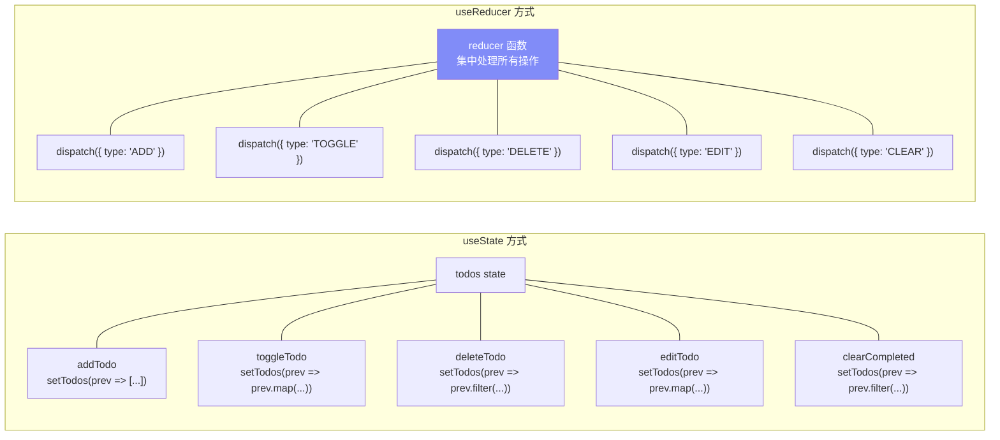
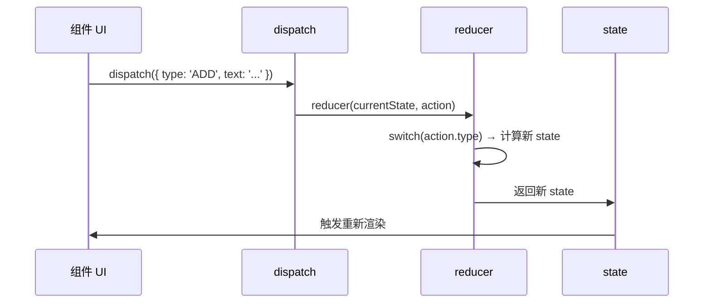
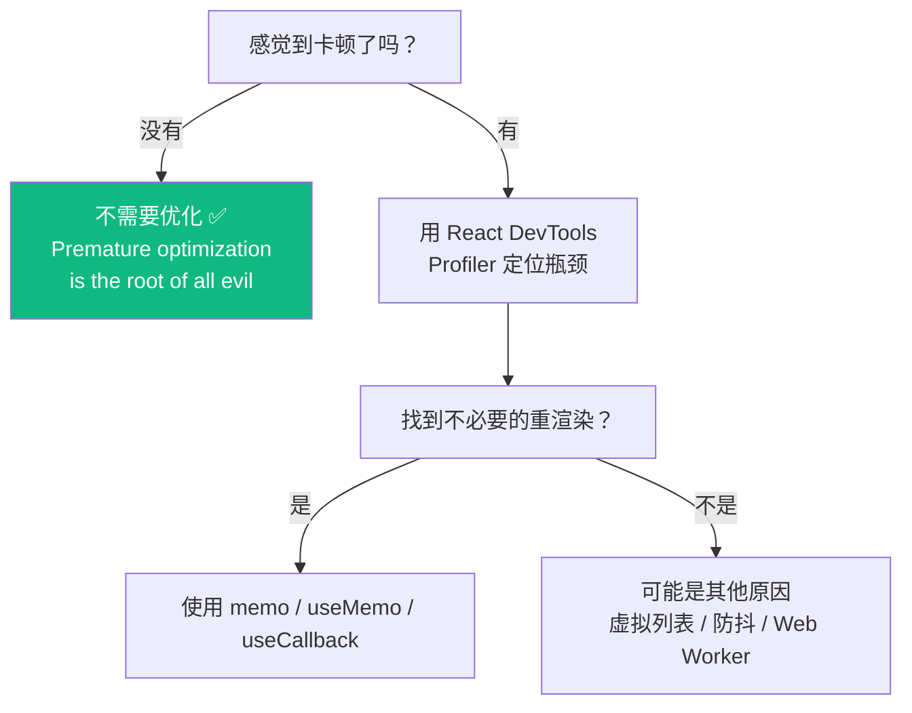
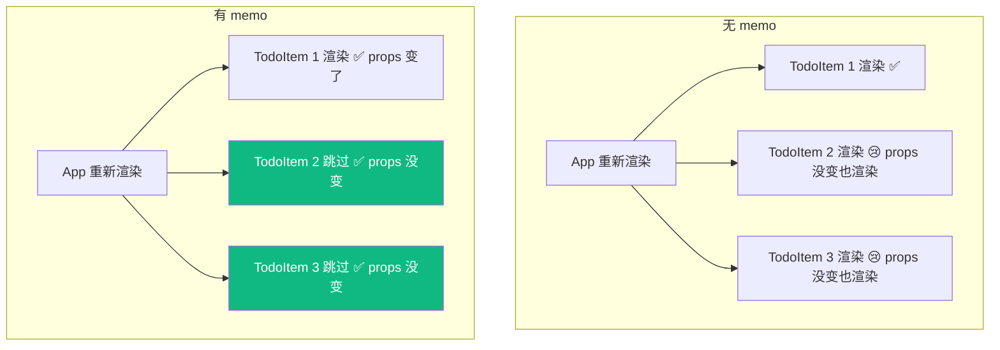
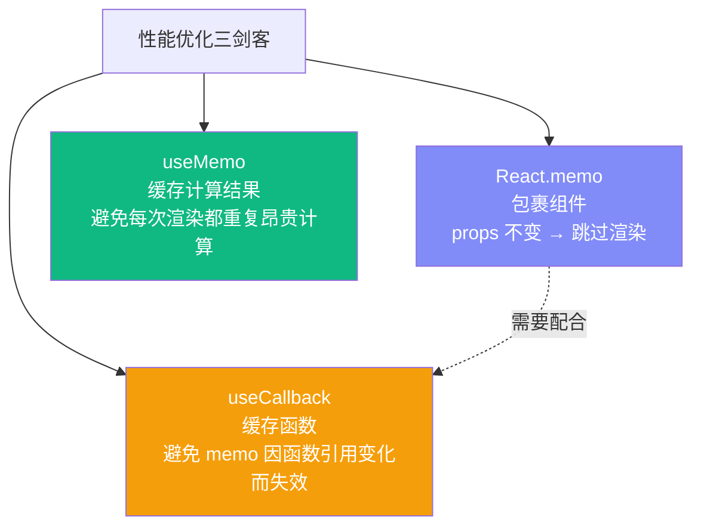
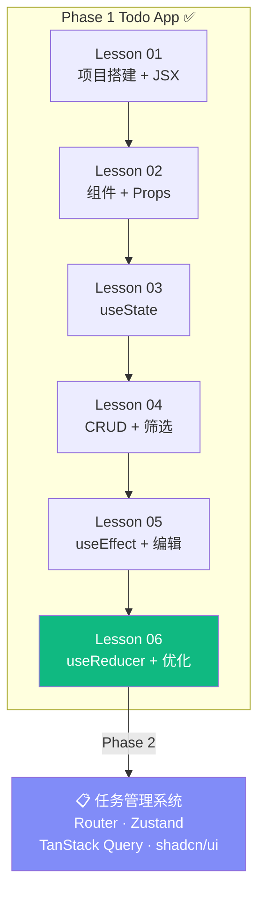

# Lesson 06：useReducer 重构 + 性能优化

> 🎯 **本节目标**：用 `useReducer` 统一管理 Todo 状态逻辑，学习 `React.memo` / `useMemo` / `useCallback` 性能优化。
>
> 📦 **本节产出**：Phase 1 Todo App 完成版——逻辑清晰、性能优化、代码规范。

---

## 一、为什么需要 useReducer？

App.tsx 中的状态逻辑越来越分散：`addTodo`、`toggleTodo`、`deleteTodo`、`editTodo`、`clearCompleted`…… 每个都单独写一个函数操作同一个 `todos` state。



**`useReducer` 把"做什么"和"怎么做"分离开：组件只负责 dispatch（做什么），reducer 负责具体逻辑（怎么做）。**

---

## 二、useReducer 语法

```tsx
const [state, dispatch] = useReducer(reducer, initialState)
//     ↑        ↑                      ↑          ↑
//   当前状态  发送动作               处理函数     初始值
```



---

## 三、重构 Todo App

### 3.1 定义 Action 类型和 Reducer

```tsx
// src/todoReducer.ts
import type { Todo } from './types'

// 所有可能的操作（用联合类型精确定义）
type TodoAction =
  | { type: 'ADD';    text: string }
  | { type: 'TOGGLE'; id: number }
  | { type: 'DELETE'; id: number }
  | { type: 'EDIT';   id: number; text: string }
  | { type: 'CLEAR_COMPLETED' }

function todoReducer(state: Todo[], action: TodoAction): Todo[] {
  switch (action.type) {
    case 'ADD':
      return [...state, { id: Date.now(), text: action.text, completed: false }]

    case 'TOGGLE':
      return state.map(todo =>
        todo.id === action.id ? { ...todo, completed: !todo.completed } : todo
      )

    case 'DELETE':
      return state.filter(todo => todo.id !== action.id)

    case 'EDIT':
      return state.map(todo =>
        todo.id === action.id ? { ...todo, text: action.text } : todo
      )

    case 'CLEAR_COMPLETED':
      return state.filter(todo => !todo.completed)

    default:
      return state
  }
}

export { todoReducer }
export type { TodoAction }
```

### 3.2 重构 App.tsx

```tsx
// src/App.tsx
import { useReducer, useState, useEffect } from 'react'
import type { Todo, Filter } from './types'
import { todoReducer } from './todoReducer'
import Header from './components/Header'
import TodoInput from './components/TodoInput'
import TodoFilter from './components/TodoFilter'
import TodoList from './components/TodoList'

function loadTodos(): Todo[] {
  const saved = localStorage.getItem('todos')
  return saved ? JSON.parse(saved) : [
    { id: 1, text: '完成 Todo App 🎉', completed: false },
  ]
}

function App() {
  // ✅ useReducer 替代 useState + 多个处理函数
  const [todos, dispatch] = useReducer(todoReducer, [], loadTodos)
  const [filter, setFilter] = useState<Filter>('all')

  // 持久化
  useEffect(() => {
    localStorage.setItem('todos', JSON.stringify(todos))
  }, [todos])

  // 派生数据
  const filteredTodos = todos.filter(todo => {
    if (filter === 'active') return !todo.completed
    if (filter === 'completed') return todo.completed
    return true
  })
  const completedCount = todos.filter(t => t.completed).length
  const activeCount = todos.length - completedCount

  return (
    <div className="min-h-screen bg-gradient-to-br from-indigo-50 via-white to-cyan-50">
      <div className="max-w-xl mx-auto px-4 py-12">
        <Header total={todos.length} completed={completedCount} />

        {/* 注意：现在传 dispatch，不再传单独的函数 */}
        <TodoInput onAdd={(text) => dispatch({ type: 'ADD', text })} />

        <div className="flex items-center justify-between mb-4">
          <TodoFilter current={filter} onChange={setFilter} />
          {completedCount > 0 && (
            <button
              onClick={() => dispatch({ type: 'CLEAR_COMPLETED' })}
              className="text-sm text-gray-400 hover:text-red-500 transition-colors"
            >
              清除已完成 ({completedCount})
            </button>
          )}
        </div>

        <TodoList
          todos={filteredTodos}
          onToggle={(id) => dispatch({ type: 'TOGGLE', id })}
          onDelete={(id) => dispatch({ type: 'DELETE', id })}
          onEdit={(id, text) => dispatch({ type: 'EDIT', id, text })}
        />

        <p className="mt-6 text-center text-sm text-gray-400">
          {activeCount} 个任务未完成
        </p>
      </div>
    </div>
  )
}

export default App
```

### 3.3 useState vs useReducer 对比

| | useState | useReducer |
|---|---|---|
| 适合 | 简单、独立的状态 | 复杂、关联的状态逻辑 |
| 更新方式 | `setState(newValue)` | `dispatch({ type, payload })` |
| 逻辑位置 | 分散在各个事件处理中 | 集中在 reducer 函数中 |
| 可测试性 | 需要渲染组件测试 | reducer 是纯函数，直接测试 |
| TypeScript | 类型推断足够 | 联合类型提供精确 action 约束 |

---

## 四、性能优化

### 4.1 什么时候需要优化？



> [!IMPORTANT]
> **React 官方建议：先不要优化！** React 本身已经很快了。
> 只在 **真正遇到性能问题** 时才使用优化手段。
> 过早优化会增加代码复杂度，而且往往效果甚微。

### 4.2 React.memo — 跳过不必要的重渲染

```tsx
import { memo } from 'react'

// 没有 memo：App 重新渲染时，TodoItem 全部重新渲染（即使 props 没变）
// 有 memo：只有 props 真正变化的 TodoItem 才重新渲染

const TodoItem = memo(function TodoItem({ todo, onToggle, onDelete, onEdit }: TodoItemProps) {
  console.log(`TodoItem ${todo.id} rendered`)  // 观察渲染次数
  // ...组件代码
})
```



### 4.3 useCallback — 稳定回调函数引用

`memo` 有个陷阱：每次 App 渲染都会创建新的函数引用，导致 `memo` 失效！

```tsx
// ❌ 每次 App 渲染，onToggle 都是新函数 → memo 对比 props 发现变了 → 白费
<TodoItem onToggle={(id) => dispatch({ type: 'TOGGLE', id })} />

// ✅ useCallback 缓存函数引用
import { useCallback } from 'react'

const handleToggle = useCallback((id: number) => {
  dispatch({ type: 'TOGGLE', id })
}, [dispatch])   // dispatch 是稳定的，不会变

const handleDelete = useCallback((id: number) => {
  dispatch({ type: 'DELETE', id })
}, [dispatch])

<TodoItem onToggle={handleToggle} onDelete={handleDelete} />
```

### 4.4 useMemo — 缓存昂贵计算

```tsx
import { useMemo } from 'react'

// 如果 todos 很多（如 10000 条），每次渲染都过滤一遍很昂贵
const filteredTodos = useMemo(() => {
  return todos.filter(todo => {
    if (filter === 'active') return !todo.completed
    if (filter === 'completed') return todo.completed
    return true
  })
}, [todos, filter])   // 只在 todos 或 filter 变化时重新计算
```

### 4.5 三者关系



---

## 五、🧪 初尝测试：Reducer 是最好的起点

还记得 `todoReducer` 是一个**纯函数**吗？输入确定 → 输出确定，没有副作用。
纯函数是世界上最容易写单元测试的东西！在 Phase 3 我们会系统学习 Vitest，但趁着热乎劲先体验一下"测试驱动"的快感：

```bash
npm install -D vitest
```

```ts
// src/todoReducer.test.ts
import { describe, it, expect } from 'vitest'
import { todoReducer } from './todoReducer'

describe('todoReducer', () => {
  it('ADD 应该新增一个未完成任务', () => {
    const result = todoReducer([], { type: 'ADD', text: '学 React' })
    
    expect(result).toHaveLength(1)
    expect(result[0].text).toBe('学 React')
    expect(result[0].completed).toBe(false)
  })

  it('TOGGLE 应该切换指定任务的完成状态', () => {
    const initial = [{ id: 1, text: '测试', completed: false }]
    const result = todoReducer(initial, { type: 'TOGGLE', id: 1 })
    
    expect(result[0].completed).toBe(true)
  })

  it('DELETE 应该移除指定任务', () => {
    const initial = [
      { id: 1, text: 'A', completed: false },
      { id: 2, text: 'B', completed: false },
    ]
    const result = todoReducer(initial, { type: 'DELETE', id: 1 })
    
    expect(result).toHaveLength(1)
    expect(result[0].id).toBe(2)
  })

  it('CLEAR_COMPLETED 应该移除所有已完成任务', () => {
    const initial = [
      { id: 1, text: 'A', completed: true },
      { id: 2, text: 'B', completed: false },
    ]
    const result = todoReducer(initial, { type: 'CLEAR_COMPLETED' })
    
    expect(result).toHaveLength(1)
    expect(result[0].completed).toBe(false)
  })
})
```

在 `package.json` 中添加测试脚本：
```json
"scripts": {
  "test": "vitest"
}
```

```bash
npm test
```

你应该看到 4 个绿色的 ✅ 通过！**这就是为什么 useReducer 优于散装的 useState 处理函数——集中的纯函数逻辑可以脱离组件独立测试。**

> [!TIP]
> Phase 3 的 Lesson 25 会系统教 Vitest + Testing Library。但在这里先让你体验一下：**测试不是"做完之后的流水作业"，而是开发过程中的质量保障。** 很多优秀的团队采用 TDD（测试驱动开发），先写测试再写实现。

---

## 六、🧠 深度专题：React Compiler

### 5.1 手动优化的痛点

```tsx
// 开发者需要手动决定：哪里加 memo？哪里加 useCallback？依赖数组写对了吗？
// 这是心智负担，也容易出错。
```

### 5.2 React Compiler（原名 React Forget）

React 团队正在开发的 **编译器**，目标是 **自动完成 memo / useCallback / useMemo**：

```mermaid
flowchart LR
    A["你写的代码\n（无需手动优化）"]
    -->|"React Compiler\n编译时自动分析"| 
    B["优化后的代码\n（自动 memo/useCallback）"]
    -->
    C["运行时\n性能最优 ✅"]
    
    style B fill:#818cf8,color:#fff
```

- 已在 Meta 内部生产环境使用
- React 19 发布时以实验性质提供
- 未来目标：开发者不再需要手写 memo / useCallback / useMemo

> **现阶段建议：**
> 1. 先理解 memo/useCallback/useMemo 的原理（面试会考）
> 2. 实际项目中除非遇到性能问题，否则不必主动加
> 3. 等 React Compiler 稳定后，这些将自动处理

---

## 七、React 19 新增：useActionState

React 19 引入了 `useActionState`，适用于表单操作：

```tsx
import { useActionState } from 'react'

function TodoForm() {
  const [error, submitAction, isPending] = useActionState(
    async (prevState: string | null, formData: FormData) => {
      const text = formData.get('todo') as string
      if (text.length < 2) return '任务至少 2 个字符'
      // 发送到服务器...
      return null  // 无错误
    },
    null  // 初始错误状态
  )

  return (
    <form action={submitAction}>
      <input name="todo" />
      <button disabled={isPending}>
        {isPending ? '提交中...' : '添加'}
      </button>
      {error && <p className="text-red-500">{error}</p>}
    </form>
  )
}
```

> 这在 Phase 1 的 Todo App 中不是必须的，但 Phase 2 和 Phase 3 会经常用到。

---

## 八、Phase 1 完成！🎉



### Phase 1 全面回顾

| 你掌握了 | 关键概念 |
|---------|---------|
| 项目搭建 | Vite + React 19 + TypeScript + Tailwind v4 |
| 组件设计 | 函数组件、Props、children、组合模式 |
| 状态管理 | useState、useReducer、派生数据 |
| 副作用 | useEffect、依赖数组、清理函数 |
| DOM 操作 | useRef |
| 性能优化 | memo、useMemo、useCallback |
| 核心原理 | Virtual DOM、Reconciliation、Fiber、闭包陷阱 |
| React 19 | 自动批量更新、use()、useActionState |

---

## 九、练习

1. **测试 reducer**：单独测试 `todoReducer`，验证每个 action 的行为
2. **添加 undo**：保存操作历史，实现撤销功能（提示：用 state 记录之前的 todos 快照）
3. **DevTools Profiler**：安装 React DevTools，用 Profiler 观察 memo 前后的渲染差异

---

## ➡️ 下一阶段

[**回到课程大纲**](../CURRICULUM.md) → Phase 2：📋 任务管理系统
