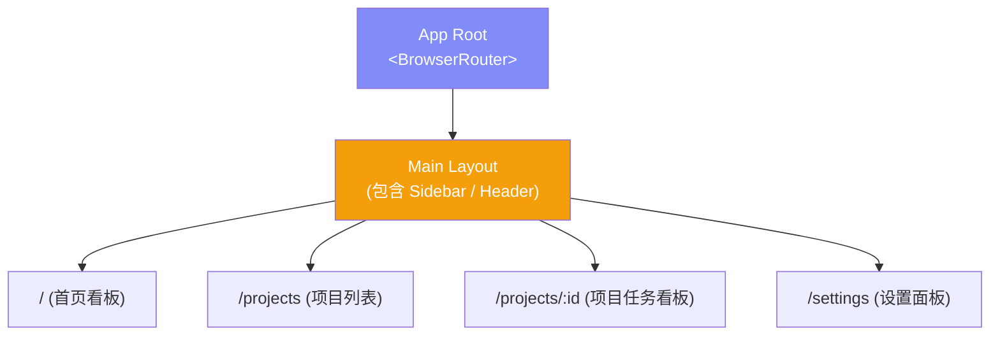
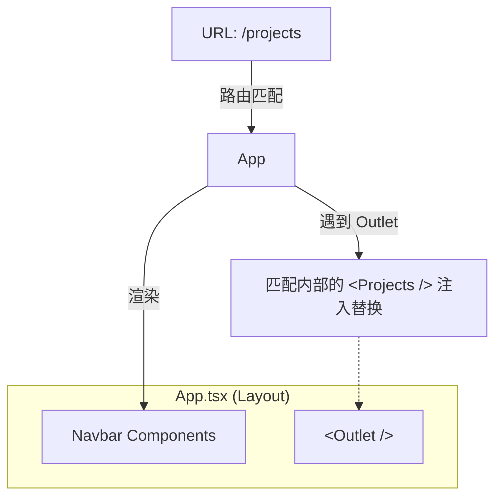
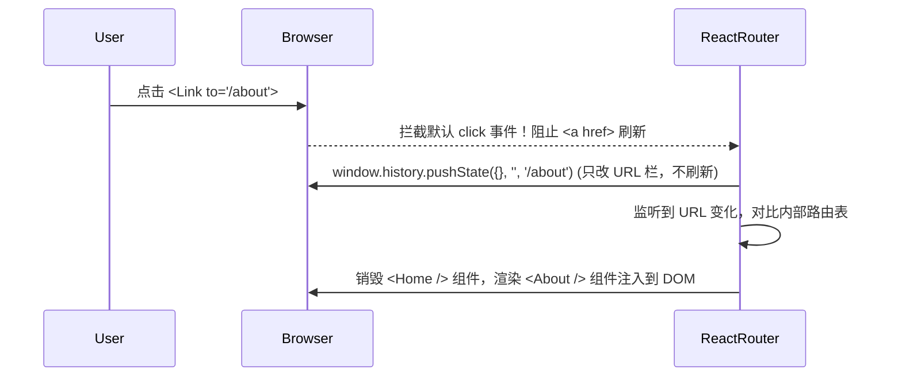

# Lesson 07：多页面架构 — React Router v7 基础

> 🎯 **本节目标**：从单页面（SPA）升级为多页面应用，搭建任务管理系统的外壳。
>
> 📦 **本节产出**：带有四个独立页面（首页、项目列表、任务看板、设置）的基础路由骨架。


## 一、Phase 2 整体规划：任务管理系统

Phase 1 的 Todo App 只有一个页面，管理一个列表。
Phase 2 我们要开发一个 **Trello 式的任务管理系统**，包含：
- **多页面体验**：React Router v7
- **复杂状态共享**：Zustand
- **服务端模拟**：TanStack Query（Mock API）
- **专业级 UI**：shadcn/ui + Tailwind v4

### 1.1 项目结构预览



---

## 二、初始化 Phase 2 项目

重新创建一个空项目（或者在你现有的代码库旁边新建一个文件夹）：

```bash
npm create vite@latest phase2-task-manager -- --template react-ts
cd phase2-task-manager
npm install
npm install tailwindcss @tailwindcss/vite
```

配置 Tailwind v4（修改 `vite.config.ts` 和 `src/index.css`，同 Lesson 01）。

清理无用模板代码后，安装 React Router v7：

```bash
npm install react-router
```

> [!TIP]
> **React Router v7 的变化**
> v7 时代官方更推荐围绕 `react-router` 使用 Data Router 能力。本课示例统一从 `react-router` 导入。
> 如果你看到旧教程使用 `react-router-dom`，那通常是 v6 时代或传统组件路由写法。

---

## 三、路由基础：搭建 4 个基本页面

先在 `src/pages` 目录下创建 4 个极其简单的占位组件：

```tsx
// src/pages/Home.tsx
export default function Home() {
  return <div className="p-8"><h1 className="text-2xl font-bold">🏠 首页看板</h1></div>
}

// src/pages/Projects.tsx
export default function Projects() {
  return <div className="p-8"><h1 className="text-2xl font-bold">📂 项目列表</h1></div>
}

// src/pages/ProjectBoard.tsx (注意：这是一个动态页面)
import { useParams } from 'react-router'
export default function ProjectBoard() {
  const { id } = useParams() // 获取 URL 中的参数
  return <div className="p-8"><h1 className="text-2xl font-bold">📋 看板 ID: {id}</h1></div>
}

// src/pages/Settings.tsx
export default function Settings() {
  return <div className="p-8"><h1 className="text-2xl font-bold">⚙️ 设置页</h1></div>
}

// src/pages/NotFound.tsx
import { Link } from 'react-router'
export default function NotFound() {
  return (
    <div className="p-8 text-center">
      <h1 className="text-4xl drop-shadow-sm text-red-500 font-bold mb-4">404 - 页面迷路了</h1>
      <Link to="/" className="text-indigo-600 hover:underline">返回首页</Link>
    </div>
  )
}
```

---

## 四、配置顶层路由 (Data Router 模式)

React Router v6.4+ 引入了基于对象的**数据路由 (Data Router)** 模式，v7 也是强推这种写法（而不是传统的 `<Routes>` 组件嵌套），因为它支持高级的数据加载 (Loader) 特性。

替换 `src/main.tsx`：

```tsx
// src/main.tsx
import { StrictMode } from 'react'
import { createRoot } from 'react-dom/client'
import { createBrowserRouter, RouterProvider } from 'react-router'
import './index.css'

// 导入页面
import Home from './pages/Home'
import Projects from './pages/Projects'
import ProjectBoard from './pages/ProjectBoard'
import Settings from './pages/Settings'
import NotFound from './pages/NotFound'

// 1. 定义路由配置数组
const router = createBrowserRouter([
  {
    path: '/',
    element: <Home />,
    errorElement: <NotFound /> // 全局 404/错误 边界
  },
  {
    path: '/projects',
    element: <Projects />,
  },
  {
    path: '/projects/:id',  // 动态路由段 (:id)
    element: <ProjectBoard />,
  },
  {
    path: '/settings',
    element: <Settings />,
  }
])

// 2. 将 router 注入到应用根节点
createRoot(document.getElementById('root')!).render(
  <StrictMode>
    <RouterProvider router={router} />
  </StrictMode>,
)
```

此时启动项目：
- 访问 `http://localhost:5173/` → 显示首页
- 访问 `http://localhost:5173/projects` → 显示项目列表
- 访问 `http://localhost:5173/projects/todo-app` → 页面会用 `useParams` 抓取并显示"看板 ID: todo-app"
- 访问 `http://localhost:5173/aaa` → 显示 404

---

## 五、用 Navbar 实现页面跳转

多页面应用不能直接用 `<a href="/...">` 跳转，因为那会触发完整的浏览器刷新，丢失 React 的所有状态！我们需要用 `<Link>` 组件。

创建一个简单的临时导航条（下节课我们会升级为完整的 Layout + Sidebar）：

```tsx
// src/App.tsx (我们把它改造成主应用的壳)
import { Link, Outlet } from 'react-router'

export default function App() {
  return (
    <div className="min-h-screen bg-gray-50 flex flex-col">
      {/* 顶部导航条 */}
      <nav className="bg-indigo-600 text-white p-4 shadow-md flex gap-6">
        <Link to="/" className="font-bold hover:text-indigo-200">🚀 TaskApp</Link>
        <div className="flex gap-4 ml-8">
          <Link to="/" className="hover:text-indigo-200">首页</Link>
          <Link to="/projects" className="hover:text-indigo-200">项目</Link>
          <Link to="/settings" className="hover:text-indigo-200">设置</Link>
        </div>
      </nav>

      {/* 页面内容占位符 */}
      <main className="flex-1">
        <Outlet /> 
      </main>
    </div>
  )
}
```

等一下！`App.tsx` 写好了，但怎么让它生效呢？我们需要用到**嵌套路由**！

将 `main.tsx` 中的路由配置包裹起来：

```tsx
// src/main.tsx (部分修改)
import App from './App'

const router = createBrowserRouter([
  {
    path: '/',
    element: <App />,         // 外层包裹组件
    errorElement: <NotFound />,
    children: [               // 内部嵌套页面
      { index: true, element: <Home /> },           // 默认子路由 (/)
      { path: 'projects', element: <Projects /> },
      { path: 'projects/:id', element: <ProjectBoard /> },
      { path: 'settings', element: <Settings /> }
    ]
  }
])
```

### 深入理解 `<Outlet />`



在这个结构下，无论你在哪个子页面切换，顶部的 Navbar 都永远不会被销毁和重新渲染（除非顶级 URL 改变），只有 `<Outlet>` 区域的内容在被替换，这就是 SPA 路由极其丝滑的原因。

---

## 六、🧠 深度专题：SPA 路由原理

### 为什么点击 `<Link>` 页面不会闪白刷新？

传统的 MPA（多页应用）：
1. 点击 `<a href="/about">`
2. 浏览器卸载当前页面，向服务器请求 `/about` 的 HTML
3. 服务器返回全新 HTML
4. 浏览器重新解析、加载 CSS/JS，白屏闪烁

React SPA（单页应用）使用 **Client-Side Routing (客户端路由)**：



这里面最核心的浏览器 API 是 **History API**：
- `history.pushState()`: 改变 URL 而不刷新页面
- `window.addEventListener('popstate', ...)`: 监听用户点击浏览器的"后退/前进"按钮

React Router 就是在这两者的基础上包了一层极其庞大和完善的 React 组件状态管理层。

---

## 七、练习

1. 在 `Projects.tsx` 页面中，手动写死三个项目的假数据，并使用 `<Link to="/projects/1">` 等链接指向它们。
2. 体验 `NavLink`：导入 `import { NavLink } from 'react-router'` 替换 App.tsx 中的 `Link`。`NavLink` 的 `className` 可以接收一个函数 `({ isActive }) => ...`，试着让当前激活的导航菜单变成高亮的颜色。

---

## 📌 本节小结

| 你做了什么 | 你学到了什么 |
|-----------|------------|
| 搭建了任务管理系统的 4 个骨架页面 | v7 Data Router 的 `createBrowserRouter` |
| 使用嵌套路由包裹页面 | `children` 和 `index: true` 路由 |
| 创建了包含 `Outlet` 的全局 `App` | 父布局组件与 `Outlet` 插槽协作 |
| 实现了无刷新的 SPA 跳转 | `<Link>` 替代 `<a href>` |
| — | SPA 客户端路由原理 (History API) |
