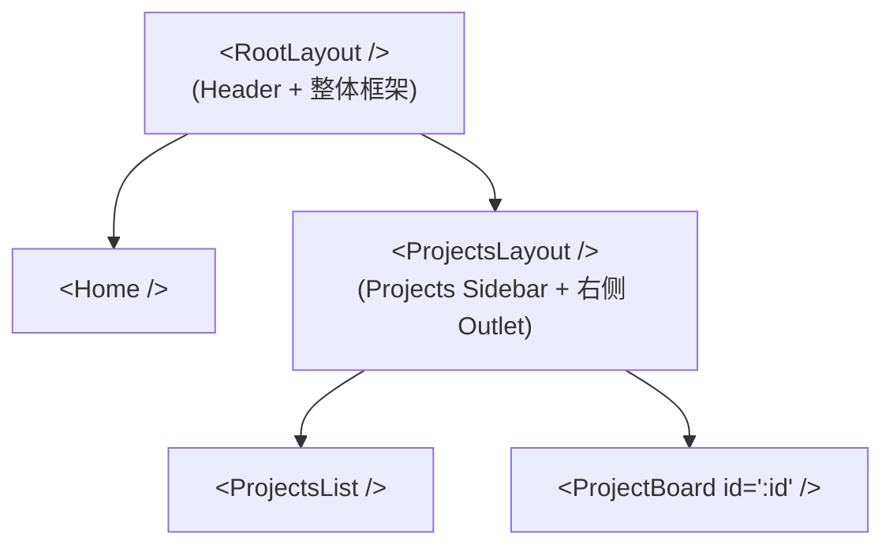
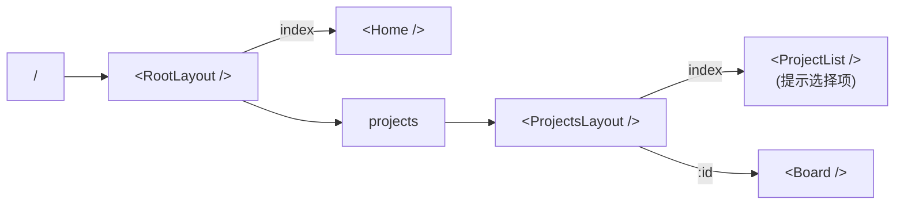

# Lesson 08：嵌套布局 — Sidebar 侧边栏与动态路由

> 🎯 **本节目标**：实现带有常驻侧边栏的嵌套布局结构，掌握动态路由的使用。
>
> 📦 **本节产出**：一个看起来很像真实应用的后台布局环境，并且能通过 `/projects/:id` 读取不同看板。


## 一、真实世界的嵌套布局设计

在任务管理系统中，我们不仅要有顶部的通用导航仪，还需要在某个区域提供特定的侧边栏。比如，在“项目管理”大模块下，左侧需要罗列出所有项目。



这就是路由的高级玩法：**多重嵌套 Outlet**。

---

## 二、重构代码结构

我们来创建一个更专业的布局包。

```
src/
├── layouts/
│   ├── RootLayout.tsx      ← 外层骨架 (Header + Main)
│   └── ProjectsLayout.tsx  ← 内层骨架 (Sidebar + Content)
├── pages/
│   ├── Home.tsx            
│   ├── projects/
│   │   ├── ProjectList.tsx ← 项目主页
│   │   └── Board.tsx       ← 动态看板
...
```

### 2.1 外壳 `RootLayout.tsx`

```tsx
// src/layouts/RootLayout.tsx
import { NavLink, Outlet } from 'react-router'

export default function RootLayout() {
  return (
    <div className="min-h-screen flex flex-col bg-gray-50">
      <header className="h-14 bg-indigo-600 px-6 flex items-center shadow-md shrink-0">
        <div className="font-bold text-lg text-white mr-8">🚀 TaskMaster</div>
        <nav className="flex gap-4">
          <NavLink 
            to="/" 
            className={({ isActive }) => 
              `px-3 py-1.5 rounded-md text-sm font-medium transition-colors ${
                isActive ? 'bg-indigo-700 text-white' : 'text-indigo-100 hover:bg-indigo-500'
              }`
            }
          >
            首页看板
          </NavLink>
          <NavLink 
            to="/projects" 
            className={({ isActive }) => 
              `px-3 py-1.5 rounded-md text-sm font-medium transition-colors ${
                isActive ? 'bg-indigo-700 text-white' : 'text-indigo-100 hover:bg-indigo-500'
              }`
            }
          >
            我的项目
          </NavLink>
        </nav>
      </header>

      {/* 留给下层页面的插槽 */}
      <main className="flex-1 overflow-auto">
        <Outlet />
      </main>
    </div>
  )
}
```

### 2.2 内壳带边栏 `ProjectsLayout.tsx`

当你处于 `/projects` 路径或其子路径下时，这里会被加载，并提供左侧 Sidebar 菜单。

```tsx
// src/layouts/ProjectsLayout.tsx
import { NavLink, Outlet } from 'react-router'

// 模拟的分类数据（后期可以通过 API 获取）
const MOCK_PROJECTS = [
  { id: 'app-rebuild', name: 'App 重构计划', icon: '📱' },
  { id: 'marketing-q3', name: 'Q3 营销活动', icon: '🎯' },
  { id: 'web-design', name: '官网重新设计', icon: '🎨' },
]

export default function ProjectsLayout() {
  return (
    <div className="flex h-full"> {/* 父级是 <main flex-1> */}
      {/* Sidebar 侧边栏 */}
      <aside className="w-64 bg-white border-r border-gray-200 shrink-0 flex flex-col py-4">
        <h2 className="px-6 text-xs font-bold text-gray-400 uppercase tracking-wider mb-2">
          近期项目
        </h2>
        
        <nav className="flex-1 px-3 space-y-1">
          {MOCK_PROJECTS.map(proj => (
            <NavLink
              key={proj.id}
              to={`/projects/${proj.id}`}
              className={({ isActive }) => 
                `flex items-center gap-3 px-3 py-2 rounded-lg text-sm font-medium transition-colors ${
                  isActive 
                    ? 'bg-indigo-50 text-indigo-700' 
                    : 'text-gray-600 hover:bg-gray-100 hover:text-gray-900'
                }`
              }
            >
              <span>{proj.icon}</span>
              {proj.name}
            </NavLink>
          ))}
        </nav>
      </aside>

      {/* 内容区域 (再次放出 Outlet) */}
      <div className="flex-1 overflow-auto bg-gray-50/50 p-8">
        <Outlet />
      </div>
    </div>
  )
}
```

---

## 三、动态路由解析与数据组装

现在的重点是 `/projects/:id` 指向的 `Board.tsx`。

我们需要使用 **`useParams()`** 钩子来抓取当前选中的是哪个看板。

```tsx
// src/pages/projects/Board.tsx
import { useParams, Navigate } from 'react-router'

// 假设这是我们的数据源
const BOARD_DATA: Record<string, { title: string, tasks: number }> = {
  'app-rebuild': { title: 'App 重构计划', tasks: 12 },
  'marketing-q3': { title: 'Q3 营销活动', tasks: 5 },
  'web-design': { title: '官网重新设计', tasks: 8 },
}

export default function Board() {
  // 1. 获取 URL 中的动态参数 (即 /projects/xxx 里的 xxx)
  const params = useParams<{ id: string }>()
  const projectId = params.id
  
  if (!projectId) return <div>未选择项目</div>
  
  // 2. 模拟从数据库或 API 查询当前数据
  const project = BOARD_DATA[projectId]

  // 3. 处理错误：如果 URL 里的 id 查不到项目，重定向或提示错误
  if (!project) {
    return (
      <div className="text-center py-20">
        <h2 className="text-xl text-gray-500 mb-4">找不到这个看板</h2>
        {/* 用 <Navigate> 组件做强制编程式跳转 */}
        <Navigate to="/projects" replace />
      </div>
    )
  }

  // 4. 正常渲染
  return (
    <div>
      <header className="mb-8">
        <h1 className="text-3xl font-extrabold text-gray-900">{project.title}</h1>
        <p className="text-gray-500 mt-2">当前共有 {project.tasks} 个活跃任务</p>
      </header>

      {/* 假装这里有一个复杂的拖拽看板 */}
      <div className="grid grid-cols-3 gap-6">
        <div className="bg-gray-100 rounded-xl p-4 min-h-[400px]">待处理</div>
        <div className="bg-gray-100 rounded-xl p-4 min-h-[400px]">进行中</div>
        <div className="bg-gray-100 rounded-xl p-4 min-h-[400px]">已完成</div>
      </div>
    </div>
  )
}
```

---

## 四、全新的完整路由配置 

现在我们要把双重嵌套的架构写进 `main.tsx`。



```tsx
// src/main.tsx 的核心修改
const router = createBrowserRouter([
  {
    path: '/',
    element: <RootLayout />,  // 最外层包含顶部导航
    children: [
      { 
        index: true, 
        element: <Home /> 
      },
      {
        path: 'projects',
        element: <ProjectsLayout />, // 带有侧边栏的中层
        children: [
          { 
            index: true, 
            element: <div className="text-gray-500 mt-10 text-center">👈 请从左侧选择一个项目看板</div> 
          },
          { 
            path: ':id',  // 动态参数
            element: <Board /> 
          }
        ]
      }
    ]
  }
])
```

> **注意：** `index: true` 意味着当用户直接访问上一级对应的路径（如精确命中 `/projects` 而不是 `/projects/xxx`）时，在 Outlet 的位置填充的默认组件。它保证了即便没选项目，右侧也有内容（而不是空白）。

---

## 五、🧠 深度专题：Loader 与 Action 模式

React Router v6.4+ 引入了重大的架构变革——把**数据获取**和**组件渲染**解耦，并在进入组件渲染之前，提前并发加载数据。

在目前的 `Board.tsx` 里，我们是在组件内利用 `BOARD_DATA` "同步"获取的。
如果在真实项目中，我们需要 fetch API 呢？传统做法是：

```tsx
// ❌ 传统瀑布流：组件渲染 → useEffect 触发 → 显示 Loading → 数据返回渲染
function Board() {
  const [data, setData] = useState(null)
  
  useEffect(() => {
    fetch(`/api/projects/${id}`).then(res => setData(res.data))
  }, [id])
  
  if (!data) return <Loading />
  return <div>{data.title}</div>
}
```

### v7 提倡的 Loader 模式 (提前预取)

```ts
// 1. 在单独的 loader 函数中获取数据
export async function boardLoader({ params }) {
  const res = await fetch(`/api/projects/${params.id}`)
  if (!res.ok) throw new Response('Not Found', { status: 404 })
  return res.json()
}

// 2. 组件内部只读数据，没有 loading，直接用！
import { useLoaderData } from 'react-router'

export default function Board() {
  const project = useLoaderData() // 百分百拿到数据，无需判存
  return <div>{project.title}</div>
}
```

而在 `main.tsx` 路由配置中绑定：

```ts
{ 
  path: ':id',
  element: <Board />,
  loader: boardLoader, // 绑定加载器，阻塞渲染直到请求完成
}
```

这带来了巨大的优势：**并行数据加载**。你在输入 URL 的瞬间就开始请求 API，而不是等所有父组件都渲染完了再请求，这彻底消灭了“请求瀑布流”（Network Waterfall）。

> 本阶段核心目标是构建页面架构和逻辑状态。我们在之后的 Lesson 中结合 TanStack Query 处理请求时，会深入体会这种模式。

---

## 六、练习

1.  **添加 404 捕获**：在 `RootLayout` 级别和 `ProjectsLayout` 级别都可以添加 `errorElement`。试着故意输入一个错误的项目 ID（如 `/projects/1234xx`）并在动态路由中 `throw new Error()`，看看 React Router 如何就近渲染错误边界而不崩溃整个应用。
2.  **提取 SideBar 菜单数据**：把侧边栏菜单的数据源提出成一个单独的钩子或者配置文件，避免写死在组件里。

---

## 📌 本节小结

| 你做了什么 | 你学到了什么 |
|-----------|------------|
| 构建了双层带边栏的 UI 布局 | 多重 `<Outlet />` 嵌套的作用和用法 |
| 创建了可切换高亮的 Sidebar | `<NavLink isActive>` API 使用 |
| 取出了 URL 里的项目 ID 渲染内容 | `useParams()` 和 动态路由语法 `:id` |
| 配置了无匹配时的编程式补救 | `<Navigate replace />` 或默认 `index: true` 路由 |
| — | v7 中 Loader 的数据预加载架构理念 |
