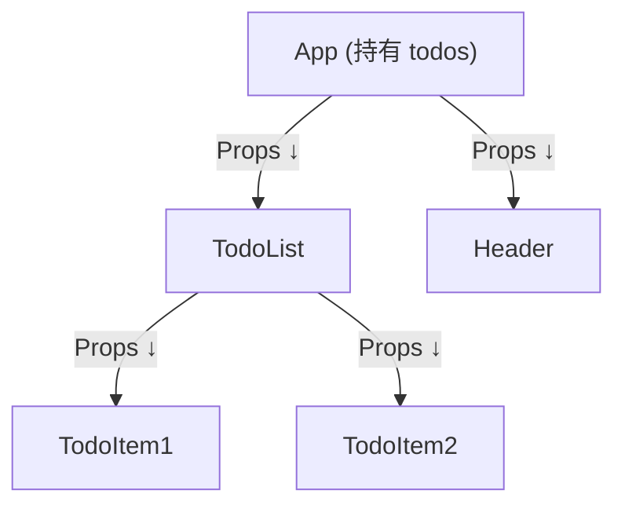
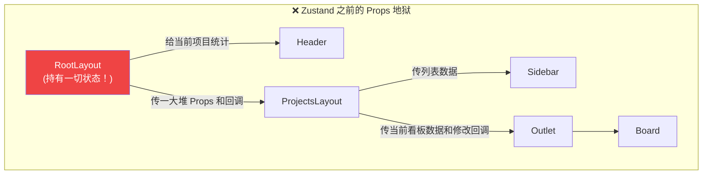
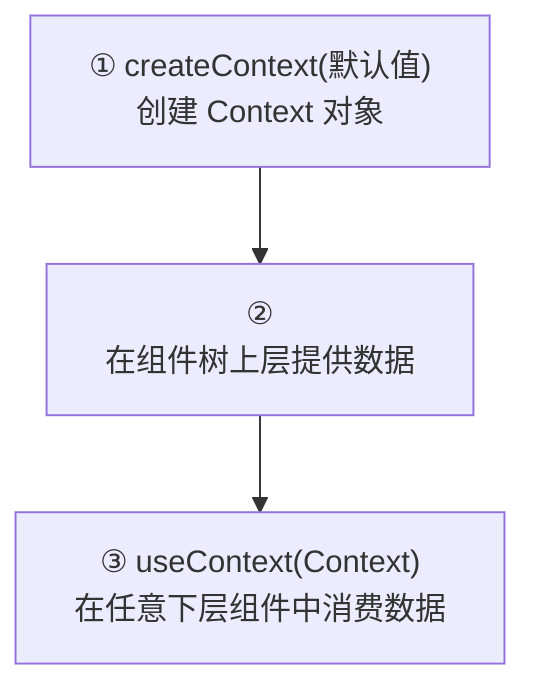
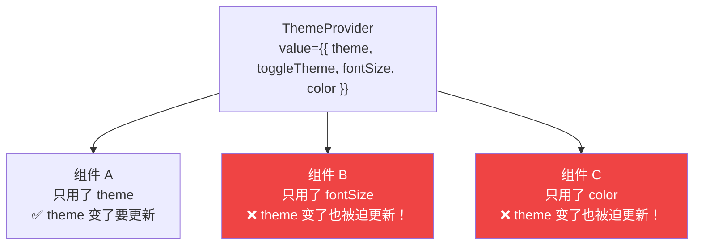
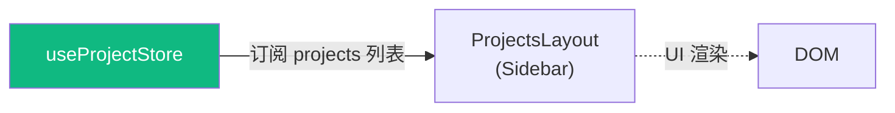
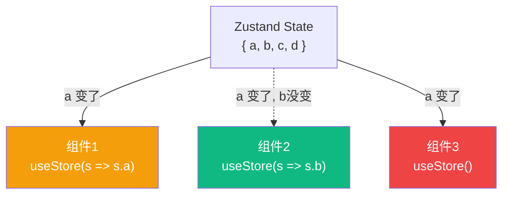

# Lesson 09：全局状态管理 — Zustand入门与项目状态共享

> 🎯 **本节目标**：解决 React 组件间跨级传参的痛点，使用 Zustand 搭建全局状态管理方案。
>
> 📦 **本节产出**：将散落在各个组件的 Sidebar 菜单数据和项目统计数据抽取为全局 store，并实现双向同步。

---

## 一、为什么需要全局状态管理？

在 Phase 1 (Todo App) 中，所有数据都存在根组件 `App.tsx` 的 `useState` 或 `useReducer` 里，然后一层一层地通过 Props 向下传。



这叫 **状态提升 (State Lifting)**。它的缺点是：
当组件层级极深时，中间层的组件（并不需要数据的组件）也被迫接收和传递 Props，这被称为 **Props 钻取 (Prop Drilling)**。

### 1.1 Phase 2 面临的痛点

我们的任务管理系统页面结构更复杂：
- `Sidebar` (侧边栏) 需要显示所有项目的列表。
- `Header` (顶部导航) 需要显示当前选中项目的进展统计。
- `ProjectBoard` (看板区) 需要针对某个项目进行 CRUD 操作。

如果依然使用状态提升，我们就必须把状态放到最顶层 `RootLayout` 里：



## 二、React 内置方案：Context API

在学习 Zustand 之前，我们先看看 React **自带**的跨组件通信方案 —— **Context API**。理解它的优势和局限，才能明白为什么我们需要 Zustand。

### 2.1 Context 三步走



```tsx
import { createContext, useContext, useState, type ReactNode } from 'react'

// ① 创建 Context（可以给默认值）
interface ThemeContextType {
  theme: 'light' | 'dark'
  toggleTheme: () => void
}
const ThemeContext = createContext<ThemeContextType | null>(null)

// ② Provider 组件：在组件树上层"广播"数据
function ThemeProvider({ children }: { children: ReactNode }) {
  const [theme, setTheme] = useState<'light' | 'dark'>('light')
  const toggleTheme = () => setTheme(prev => prev === 'light' ? 'dark' : 'light')

  return (
    <ThemeContext.Provider value={{ theme, toggleTheme }}>
      {children}
    </ThemeContext.Provider>
  )
}

// ③ 在任意深度的子组件中消费
function ThemeButton() {
  const ctx = useContext(ThemeContext)
  if (!ctx) throw new Error('必须在 ThemeProvider 内使用')
  
  return (
    <button onClick={ctx.toggleTheme}>
      当前主题：{ctx.theme === 'light' ? '☀️' : '🌙'}
    </button>
  )
}

// App 中使用
function App() {
  return (
    <ThemeProvider>
      <Header />        {/* 不需要传 props */}
      <Main />          {/* 不需要传 props */}
      <ThemeButton />   {/* 直接 useContext 拿到数据！ */}
    </ThemeProvider>
  )
}
```

> [!TIP]
> **React 19 新增：** 你可以用 `use(ThemeContext)` 替代 `useContext(ThemeContext)`。两者功能相同，但 `use()` 可以在条件语句和循环中使用（传统 Hook 不行）。

> [!NOTE]
> **React 19 语法简化：** 从 React 19 开始，你可以直接用 `<ThemeContext>` 替代 `<ThemeContext.Provider>`：
> ```tsx
> // React 18: 必须写 .Provider
> <ThemeContext.Provider value={{ theme, toggleTheme }}>
>   {children}
> </ThemeContext.Provider>
>
> // React 19: 直接用 Context 组件名即可
> <ThemeContext value={{ theme, toggleTheme }}>
>   {children}
> </ThemeContext>
> ```
> 现阶段两种写法都可用，`.Provider` 仍然有效；新写法主要是为了减少样板代码。

### 2.2 ⚠️ Context 的性能陷阱

Context 有一个致命的性能问题：**当 Provider 的 `value` 变化时，所有使用 `useContext` 消费该 Context 的组件都会重渲染，无论它是否用到了变化的那个字段。**



这意味着：**如果你把整个应用的状态都塞进一个 Context，任何一个字段的修改都会导致大面积的重渲染风暴**。

### 2.3 Context 适合什么？不适合什么？

| 适合 ✅ | 不适合 ❌ |
|---------|---------|
| 很少变的全局设置（语言、主题） | 频繁变化的数据（输入框、计时器） |
| 需要穿透很多层级的依赖注入 | 需要精确控制哪些组件重渲染 |
| 组合组件模式（如 L15 的 Accordion） | 复杂的业务状态管理 |

理解了 Context 的局限，就能明白为什么我们需要更好的方案。

---

## 三、Zustand 登场

> **"一只轻巧、快速、现代的熊（Zustand 德语原意为'状态'，图标是一头熊）"**。

Zustand 正是为了解决 Context 的"全局重渲染"问题而生的。它的 **Selector 机制** 可以让组件只在自己关心的那一小片数据变化时才重渲染。

### 3.1 安装

```bash
npm install zustand
```

### 3.2 Zustand vs Redux vs Context

| 特性 | Context API | Redux | Zustand |
|------|------------|-------|---------|
| 上手难度 | 易 | 难（超多模板代码） | **极易** |
| 性能 | ❌ Provider 一变，所有消费者全部重渲染 | ✅ 优（connect/selector） | **✅ 优（基于选择器的定向刷新）** |
| 包体积 | 内置 | 较大 | **极小** (< 1kb) |
| 书写 | 需要包一层 `<Provider>` | Provider + Slice + Actions | **只需写一个 Hook** |
| 适用范围 | 低频全局配置 | 超大型应用 | **中小到大型应用** |

---

## 四、创建第一个 Store

在 `src/store/` 目录下创建一个专门管理项目的 Zustand Store。

```ts
// src/store/useProjectStore.ts
import { create } from 'zustand'

// 1. 定义我们 Store 里的数据长什么样（类型说明）
export interface Task {
  id: string
  title: string
  status: 'todo' | 'in-progress' | 'done'
}

export interface Project {
  id: string
  name: string
  icon: string
  tasks: Task[]
}

// 2. 将数据和修改数据的方法，同时塞进一个接口里
interface ProjectState {
  projects: Project[]                           // 数据状态 (State)
  addProject: (name: string, icon: string) => void // 操作方法 (Action)
  deleteProject: (id: string) => void           // 操作方法 (Action)
}

// 3. 创造这头神奇的熊 (create store)
const useProjectStore = create<ProjectState>((set) => ({
  // 初始数据
  projects: [
    { id: 'app-rebuild', name: 'App 重构计划', icon: '📱', tasks: [
      { id: 't1', title: '分析竞品', status: 'done' },
      { id: 't2', title: '画原型图', status: 'in-progress' },
    ]},
    { id: 'marketing-q3', name: 'Q3 营销', icon: '🎯', tasks: [] },
  ],

  // 操作方法：类似 setXxx(prev => ...)
  addProject: (name, icon) => set((state) => ({ 
    projects: [...state.projects, { id: Date.now().toString(), name, icon, tasks: [] }] 
  })),

  // ⚠️ 记得不可变更新原则！使用 filter，不影响原对象
  deleteProject: (id) => set((state) => ({
    projects: state.projects.filter(p => p.id !== id)
  }))
}))

export default useProjectStore
```

就是这么简单！**没有 Provider，没有 Reducer 样板代码，没有 Dispatch。仅仅是一个自定义 Hook 返回的对象，里面有我们要的状态和修改函数。**

---

## 五、在组件中"消费" Store

现在让组件脱离 Props 苦海，直接向 Zustand "索要" 它们需要的数据。

### 4.1 改造侧边栏 (`ProjectsLayout.tsx`)

我们让侧边栏去订阅 `projects` 列表数组。



```tsx
// src/layouts/ProjectsLayout.tsx
import { NavLink, Outlet } from 'react-router'
import useProjectStore from '../store/useProjectStore' // 引入 hook

export default function ProjectsLayout() {
  // 🐻 关键一步：从 store 中取出 projects! 
  // 这句话等于宣告："当 projects 发⽣变化时，请重新渲染我所在组件。"
  const projects = useProjectStore(state => state.projects)

  return (
    <div className="flex h-full"> 
      <aside className="w-64 bg-white border-r border-gray-200 shrink-0 flex flex-col py-4">
        {/* ... */}
        <nav className="flex-1 px-3 space-y-1">
          {projects.map(proj => (                       // 直接拿取数据渲染
            <NavLink key={proj.id} to={`/projects/${proj.id}`}>
              {/* ... */}
            </NavLink>
          ))}
        </nav>
      </aside>
      <div className="flex-1 overflow-auto bg-gray-50/50 p-8">
        <Outlet />
      </div>
    </div>
  )
}
```

### 4.2 改造具体看板页 (`Board.tsx`)

我们需要在这里同时拿到"当前看板对应的数据"和"修改行为"，并且添加个“删除项目”按钮测试反应！

```tsx
// src/pages/projects/Board.tsx
import { useParams, Navigate, useNavigate } from 'react-router'
import useProjectStore from '../../store/useProjectStore'

export default function Board() {
  const { id } = useParams()
  const navigate = useNavigate() // 编程式导航

  // 这里的查找逻辑可以直接内联，但性能不佳。下面会讲进阶做法。
  const project = useProjectStore(state => state.projects.find(p => p.id === id))
  const deleteProject = useProjectStore(state => state.deleteProject)
  
  if (!project) return <Navigate to="/projects" replace />
  
  const handleDelete = () => {
    deleteProject(project.id)             // 全局删除
    navigate('/projects', { replace: true }) // 回退
  }

  return (
    <div>
      <header className="mb-8 flex justify-between items-center">
        <div>
          <h1 className="text-3xl font-extrabold text-gray-900">{project.name}</h1>
          <p className="text-gray-500 mt-2">共 {project.tasks.length} 项任务</p>
        </div>
        <button 
          onClick={handleDelete}
          className="bg-red-50 text-red-600 px-4 py-2 rounded font-medium hover:bg-red-100 transition"
        >
          删除项目
        </button>
      </header>
      {/* ...看板 UI 省略 */}
    </div>
  )
}
```

当我们在 Board 页面点击"删除"时：
1. `deleteProject` 被调用，Store 中 `projects` 变化。
2. 订阅了 `projects` 的 `Sidebar` (侧边栏) 立刻、自动剥离并去除了该项目！
3. Board 页面重渲染找不到 id，重定向弹回 /projects 页面。

没有任何 Props 被传递，一切自然发生。这就是全局 Store 爽点所在。

---

## 六、🧠 深度专题：Zustand 选择器与精确渲染

在上面代码中，我们这样写：
`const projects = useProjectStore((state) => state.projects)`

**为什么要传个箭头函数（选择器/Selector）进去？为什么不直接解构？**

```tsx
// 🧨 ❌ 千万别这样写！这会导致性能大灾难
const { projects, addProject } = useProjectStore() 
```

### Selector 的精细刀法



**Zustand 的核心性能魔法：组件是否重渲染，只取决于那个 Selector 函数返回的值 `===` 变没变。**
如果你什么都不传，默认取出整只熊 `state`，那么这只熊任何一毛掉落（哪怕你不关心的字段变化），这个组件都会疯狂重新渲染。

为了方便复用而且确保切片精确，我们可以把选择器**抽取出来写在外面**：

```ts
// src/store/useProjectStore.ts
// ... (之前的代码在上面)

// ✅ 推荐实践：导出精确的 Selector (自定义 Hook 化)
export const useProjectList = () => useProjectStore(state => state.projects)

// 让挑选单个项目逻辑更丝滑
export const useProjectById = (id: string | undefined) => 
  useProjectStore(state => state.projects.find(p => p.id === id))

export const useProjectActions = () => useProjectStore(state => ({
  addProject: state.addProject,
  deleteProject: state.deleteProject
}))
```

那么在 `Board.tsx` 中使用就会超级干净（并且安全地规避性能隐患）：
```tsx
const project = useProjectById(id)
const { deleteProject } = useProjectActions()
```

> [!TIP]
> **Zustand 控制重渲染的进阶玩法**
> 在现代的 Zustand 实战中，如果你的对象层级极深或者你需要返回一个派生数组，默认的 `===` 引用比较可能会失效。这时候你可以引入 `useStoreWithEqualityFn` 搭配 `shallow`（浅比较）等函数。如果在复杂的商业项目中，通常也会直接暴露 `useProjectStore` 让业务层自行做精细的切割。我们在这节课封装成自定义 Hook 的写法对初学者极其友好且足够应付绝大多数场景。

---

## 七、练习

1. **实现新增项目**：在 `ProjectsLayout` 侧边栏下方，放一个输入框和按钮，调用刚才定义的 `addProject` 方法。测试当你敲击回车，左侧导航和对应的路由页面是否立刻可用。
2. **任务 CRUD**：现在 Store 里每个 Project 有个 `tasks` 数组。试着为 Store 增加 `addTask`，`toggleTask`，`deleteTask` 的能力（注意，在修改嵌套很深对象中的某个数组时，不可变更新原则会让代码稍微有点点复杂）。

---

## 📌 本节小结

| 你做了什么 | 你学到了什么 |
|-----------|------------|
| 明白了 Props Drilling 的窘境 | 全局状态库 (状态提升 vs 外部化 Store) |
| 用 Zustand 搭建了全局 Store | `create((set) => ...)` 核心 API |
| 跨页面完成项目删除交互同步 | 不传任何 Props 保持组件间状态双向绑定 |
| — | Zustand Selector 获取最小数据片并限制重渲染爆炸原理 |

---

## ➡️ 下一课

[**Lesson 10：持久化 + 主题 — Zustand 中间件**](./Lesson_10.md)
