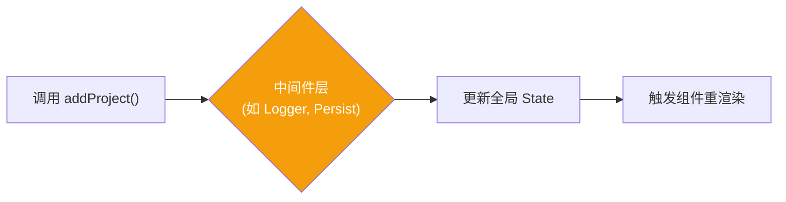
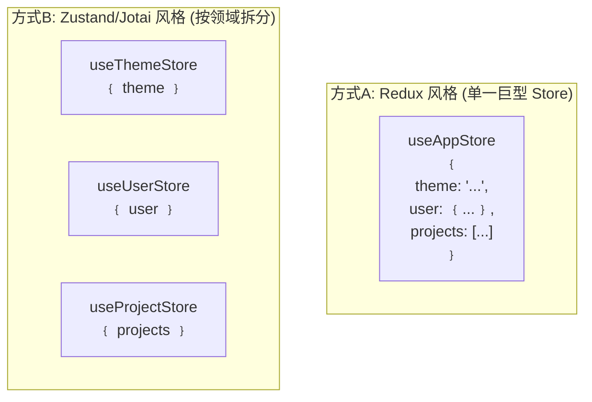

# Lesson 10：持久化 + 主题 — Zustand 中间件与状态架构设计

> 🎯 **本节目标**：利用 Zustand 中间件实现项目数据持久化存储和页面暗色主题切换。
>
> 📦 **本节产出**：带有本地化存储功能（刷新不丢数据）的项目看板，以及一个全局的主题切换开关。


## 一、什么是 Zustand 中间件 (Middleware)？

在 Redux 或 Zustand 中，状态的改变流是：`触发 Action -> 修改 State -> 更新 UI`。
中间件是在 `触发 Action` 到 `修改 State` 之间拦截并执行额外逻辑的特殊函数。



Zustand 自带了多个非常实用的原生中间件：
- `persist`：自动将 Store 数据保存到 `localStorage` / `sessionStorage`。
- `devtools`：将状态变化同步给 Redux DevTools 浏览器插件。
- `immer`：支持用可变的方式写不可变数据（稍后会讲）。

---

## 二、使用 `persist` 持久化项目数据

在 Lesson 05 中，我们使用了 `useEffect` 手动监听 state 变化并 `JSON.stringify` 写入 `localStorage`。
现在有了 Zustand，我们可以**一行代码**完成这件事。

### 改造 `useProjectStore.ts`

```tsx
// src/store/useProjectStore.ts
import { create } from 'zustand'
import { persist, createJSONStorage } from 'zustand/middleware'

export interface Task {
  id: string
  title: string
  status: 'todo' | 'in-progress' | 'done'
}

export interface Project {
  id: string
  name: string
  icon: string
  tasks: Task[]
}

interface ProjectState {
  projects: Project[]                           
  addProject: (name: string, icon: string) => void 
  deleteProject: (id: string) => void           
}

// 🐻 用 persist 中间件包裹原有的 store 配置
const useProjectStore = create<ProjectState>()(
  persist(
    (set) => ({
      projects: [
        { id: 'app-rebuild', name: 'App 重构', icon: '📱', tasks: [] },
      ],
      addProject: (name, icon) => set((state) => ({ 
        projects: [...state.projects, { id: Date.now().toString(), name, icon, tasks: [] }] 
      })),
      deleteProject: (id) => set((state) => ({
        projects: state.projects.filter(p => p.id !== id)
      }))
    }),
    {
      name: 'task-manager-projects', // 存储在 localStorage 的 key 名称（必需）
      storage: createJSONStorage(() => localStorage), // 默认就是 localStorage，可省略
      partialize: (state) => ({ projects: state.projects }) // 可选：只持久化哪些字段
    }
  )
)

export default useProjectStore
```

现在，试着在浏览器中添加或删除一个项目，然后**刷新页面**。
你不需要写任何读取和写入的代码，Zustand 自动帮你恢复了全部数据！🎉

---

## 三、实战：全局主题切换 Store

除了业务数据（项目、任务），我们还需要保存 UI 偏好状态，比如当前是“日间模式”还是“暗黑模式”。

这种状态非常适合单独建立一个 Store。

### 3.1 创建 `useThemeStore.ts`

```tsx
// src/store/useThemeStore.ts
import { create } from 'zustand'
import { persist } from 'zustand/middleware'

type Theme = 'light' | 'dark'

interface ThemeState {
  theme: Theme
  toggleTheme: () => void
}

export const useThemeStore = create<ThemeState>()(
  persist(
    (set) => ({
      theme: 'light',
      toggleTheme: () => set((state) => ({ 
        theme: state.theme === 'light' ? 'dark' : 'light' 
      }))
    }),
    {
      name: 'app-theme', // 将主题配置单独持久化
    }
  )
)
```

### 3.2 同步状态到 `<html>` 标签

Tailwind v4 默认支持通过添加 `dark` 类名到 HTML 根元素来开启暗色模式。我们需要在状态变化时更新 `<html>` 的 class。

这是一个**副作用**，应该写在哪里？
最合适的地方是在应用的顶层包裹组件，比如 `RootLayout.tsx`。

```tsx
// src/layouts/RootLayout.tsx (部分)
import { useEffect } from 'react'
import { NavLink, Outlet } from 'react-router'
import { useThemeStore } from '../store/useThemeStore'

export default function RootLayout() {
  const { theme, toggleTheme } = useThemeStore()

  // 监听 theme 的变化，并修改真实的 DOM HTML class
  useEffect(() => {
    const root = document.documentElement
    if (theme === 'dark') {
      root.classList.add('dark')
    } else {
      root.classList.remove('dark')
    }
  }, [theme])

  return (
    // 使用 Tailwind 的 dark: 前缀支持暗色模式
    <div className="min-h-screen flex flex-col bg-gray-50 dark:bg-gray-900 transition-colors duration-200">
      <header className="h-14 bg-indigo-600 dark:bg-indigo-900 px-6 flex items-center justify-between shadow-md shrink-0 transition-colors">
        
        {/* ...原有导航代码... */}

        {/* 增加一个切换按钮 */}
        <button 
          onClick={toggleTheme}
          className="text-white bg-white/10 hover:bg-white/20 px-3 py-1.5 rounded-full text-sm font-medium backdrop-blur-sm"
        >
          {theme === 'light' ? '🌙 暗色' : '☀️ 亮色'}
        </button>
      </header>

      <main className="flex-1 overflow-auto text-gray-900 dark:text-gray-100">
        <Outlet />
      </main>
    </div>
  )
}
```

现在点击右上角的按钮，你的整个应用（只要写了 `dark:` 规则的地方）都会平滑过渡到暗色模式，并且刷新后会**永远记住**你的偏好。

> [!TIP]
> **结合 Tailwind v4 暗色模式：**
> 在你的 css 或者通过 utility 类：
> `bg-white dark:bg-slate-800 text-gray-900 dark:text-gray-100`。
> 尽量使用这套统一范式：亮色背景配暗字，暗色背景配亮字。

---

## 四、🧠 深度专题：大型项目的状态架构设计

现在我们有了 `useProjectStore` 和 `useThemeStore`，那未来如果在电商项目里，是不是还会有 `useUserStore`，`useCartStore`...？

### 4.1 拆分还是合并？



**现代 React 的最佳实践推荐"方式 B"：按业务领域 (Domain) 或者功能模块切分。**
原因：
1. **天然的代码分割 (Code Splitting)**：首页只需要 Theme 和 User，加载首页时就不会打包 Project 相关的代码。
2. **避免不必要的渲染**：彻底杜绝不同领域的数据变化引发的交叉渲染。
3. **独立化持久策略**：就像我们做的，theme 存本地永不过期，而某些业务数据可能需要设置短期缓存甚至是仅存在会话 (`sessionStorage`) 中。

### 4.2 Zustand 的 Immer 中间件 (拯救复杂嵌套)

在 Lesson 03 中我们强调了：React 更新状态必须是**不可变更新**。

如果你要在 Zustand 里更新一个"项目数组中的某一个项目里的某一个任务的状态"：

```tsx
// 没用 immer：纯手写，恶梦级别
updateTask: (projectId, taskId, status) => set((state) => ({
  projects: state.projects.map(p => 
    p.id === projectId 
      ? { 
          ...p, 
          tasks: p.tasks.map(t => 
            t.id === taskId ? { ...t, status } : t
          ) 
        }
      : p
  )
}))
```

Zustand 官方提供了 `immer` 中间件解决方案。**Immer 的核心魔法是：你可以假装在使用 "可变操作" (`push`, `=` 赋值等)，它在底层会自动帮你转换成不可变安全更新（通过 Proxy 代理拦截）。**

```bash
npm install immer
```

```tsx
import { immer } from 'zustand/middleware/immer'

// 用 immer 包裹 set
const useProjectStore = create<ProjectState>()(
  immer((set) => ({
    projects: [...],
    
    // 🐻 魔法时刻：代码瞬间变得直白如话
    updateTask: (projectId, taskId, status) => set((state) => {
      // 直接像写原生 JS 一样修改 state！
      const project = state.projects.find(p => p.id === projectId)
      if (project) {
        const task = project.tasks.find(t => t.id === taskId)
        if (task) {
          task.status = status // 直接赋值！
        }
      }
    })
  }))
)
```

> **注意！** 只有在使用 Immer 的包裹下才能这么直接赋值！

---

## 五、练习

1. 为 `ProjectsLayout.tsx` 的侧边栏添加适配暗色模式的类名（如 `dark:bg-gray-900 border-gray-800 text-gray-300` 等）。
2. 在 `Board.tsx` 中也适配暗色的深灰色背景。
3. （进阶挑战）尝试通过 `window.matchMedia('(prefers-color-scheme: dark)')` API 读取操作系统的偏好设置，实现真正的跟随系统！
4. （进阶挑战）使用 `Zustand` 结合 `Immer`，在 `Board.tsx` 里完成增加具体看版任务卡片（Task）的功能。

---

## 📌 本节小结

| 你做了什么 | 你学到了什么 |
|-----------|------------|
| 使用 `persist` 中间件实现存储 | Zustand 中间件的概念 |
| 建立了全局 `useThemeStore` | 按业务领域拆解 Store 的架构理念 |
| 将副作用和 HTML Class 进行绑定 | 针对全站的 Tailwind Dark Mode 应用方式 |
| — | 极为强大的、拯救复杂深层对象嵌套的 `Immer` 库 |
