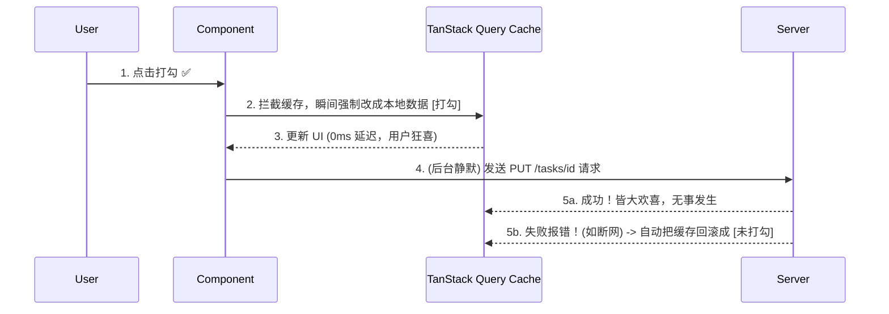
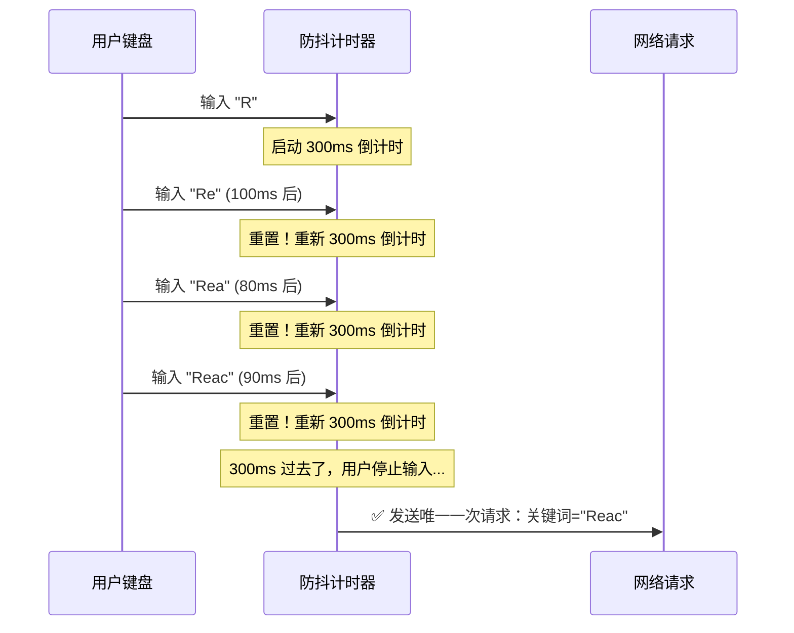
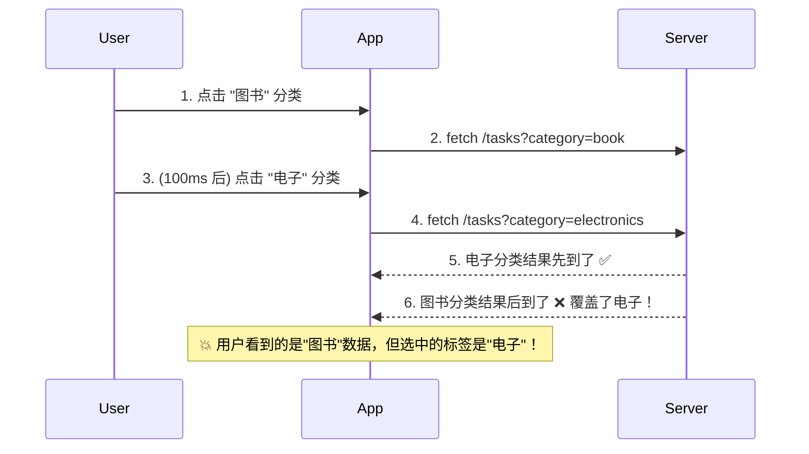
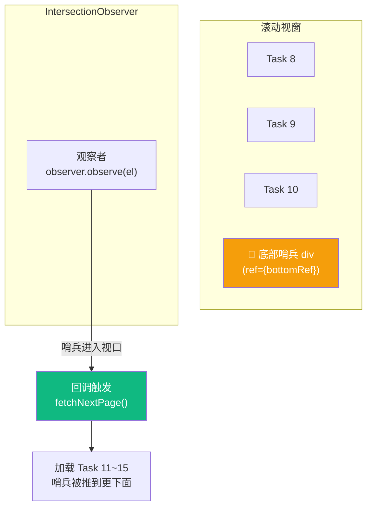

# Lesson 12：进阶数据交互 — 乐观更新、防抖搜索与无限滚动

> 🎯 **本节目标**：解决网络延迟带来的 UX 割裂感，掌握乐观更新、搜索防抖、请求竞态取消和无限滚动等工业级数据交互模式。
>
> 📦 **本节产出**：通过乐观更新实现任务状态瞬间切换，带防抖功能的搜索栏，以及滑动加载的无限列表。

---

## 一、网络延迟带来的糟糕 UX

假设用户在一个有着几十个任务的列表（如 `Board.tsx`）中，想要勾选完成一个名为「上线 v1.0」的任务：

**传统的后端渲染或普通 AJAX：**
1. 用户点击 checkbox。
2. 按钮变成 `Loading (Spinner 菊花图)`。
3. 经过 800ms（或者弱网 3 秒），收到后端 { status: 200 }。
4. checkbox 终于打上了勾 `✅`。

**在极高频的操作（比如点赞、勾选 Todo、切换开关）中，这种体验极度拖沓。**

### 解决方案：乐观更新 (Optimistic Updates)

"乐观" 的意思是：**我们选择"相信"不仅服务器没挂，网速甚至快如闪电。**



---

## 二、实战：给改变任务状态加上"乐观更新"的魔法！

我们回到 `Board.tsx`，准备改变单个任务 (`t-1`) 的状态。

```tsx
// src/api/taskRequests.ts — 提取 API 请求层
export const updateTaskStatus = async ({ taskId, status }: { taskId: string; status: string }) => {
  const res = await fetch(`http://localhost:3001/tasks/${taskId}`, {
    method: 'PATCH', // 部分更新
    headers: { 'Content-Type': 'application/json' },
    body: JSON.stringify({ status })
  })
  if (!res.ok) throw new Error('更新失败')
  return res.json()
}
```

在组件里使用 `useMutation` 对象来实现这套回滚逻辑。这里涉及到了针对全局缓存 (`queryClient`) 手动进行外科手术般的精细修改。

```tsx
// src/components/TaskItem.tsx
import { useMutation, useQueryClient } from '@tanstack/react-query'
import { updateTaskStatus } from '../api/taskRequests'

interface Task {
  id: string
  projectId: string
  title: string
  status: 'todo' | 'done'
}

export default function TaskItem({ task }: { task: Task }) {
  const queryClient = useQueryClient()
  const projectId = task.projectId

  const mutation = useMutation({
    mutationFn: updateTaskStatus,
    
    // 💥 重点 1: onMutate 在发送网络请求前立即执行！
    onMutate: async (variables) => {
      // 1. 先取消任何正在进行的查询（防止我们正在乐观更新的时候，
      //    旧的真实数据回来了把我们覆盖掉）
      await queryClient.cancelQueries({ queryKey: ['tasks', projectId] })

      // 2. 将旧的缓存数据 "快照" 下来（为了万一失败了能够回滚）
      const previousTasks = queryClient.getQueryData(['tasks', projectId])

      // 3. 乐观地、强行修改缓存并让 UI 立刻重绘！
      queryClient.setQueryData(['tasks', projectId], (old: Task[] | undefined) => 
        // 🛡️ 注意加可选链 ?.，防止缓存还没建立好时就点触发报错崩溃！
        old?.map(t => t.id === variables.taskId 
          ? { ...t, status: variables.status } 
          : t
        )
      )

      // 4. 将旧的快照传递到错误处理函数（context 的机制）
      return { previousTasks }
    },

    // 💣 重点 2: 如果网络请求崩了怎么办？ (如 500 后端错误，或者是断网)
    onError: (_err, _variables, context) => {
      // 5. 使用刚才保存的快照，强行把缓存倒带回滚！
      if (context?.previousTasks) {
        queryClient.setQueryData(['tasks', projectId], context.previousTasks)
      }
    },

    // 🏁 重点 3: 终于不论是成功还是失败（settled = ended）
    onSettled: () => {
      // 6. 强制让 React Query 从服务器再拉取一次绝对正确的数据，校准最终一致性
      queryClient.invalidateQueries({ queryKey: ['tasks', projectId] })
    }
  })

  // 用户点击事件
  const handleToggle = () => {
    mutation.mutate({ 
      taskId: task.id, 
      status: task.status === 'done' ? 'todo' : 'done' 
    })
  }

  return (
    <div 
      onClick={handleToggle} 
      className={`flex items-center gap-3 p-4 border rounded-xl cursor-pointer transition-all
        ${task.status === 'done' ? 'bg-green-50 border-green-200' : 'bg-white hover:bg-gray-50'}
        ${mutation.isPending ? 'opacity-60' : 'opacity-100'}
      `}
    >
      <span className="text-xl">{task.status === 'done' ? '✅' : '⬜️'}</span>
      <span className={task.status === 'done' ? 'line-through text-gray-400' : ''}>
        {task.title}
      </span>
      {mutation.isError && (
        <span className="ml-auto text-xs text-red-500 animate-pulse">⚠️ 更新失败，已回滚</span>
      )}
    </div>
  )
}
```

体验一下：
1. **第一次点击**：因为 `delay=800`，你的感觉却是——瞬间打勾！因为 `onMutate` 在请求发出的那一刻就改了缓存。
2. **关闭假服务器**（`Ctrl+C` 停掉 `json-server`），然后再点击——勾先打上了，约 1 秒后 **自动回滚** 成未打勾状态，并出现错误提示。

这就是乐观更新的完整闭环。

> [!CAUTION]
> 尽管这段代码在 TanStack Query 中被奉为经典，但它极其繁琐且极容易写错。
> **乐观更新不要滥用**。只有在高频、低感知失败率的场景（点赞、简单开关）才值得使用。复杂的表单提交（可能含有多种校验规则）不要这么搞。

---

## 三、搜索防抖 (Debounce)

假设我们要给任务列表加一个实时搜索框。用户每按一个键，就触发一次接口查询。
如果用户快速打了 "React 状态管理" 这 7 个字，那就会连发 7 次无用请求！

### 3.1 什么是防抖？



**核心思想：** 只有当用户**停止输入**一段时间（比如 300ms）后，才真正执行搜索请求。中间的中间按键全部忽略！

### 3.2 实现 `useDebounce` 自定义 Hook

```tsx
// src/hooks/useDebounce.ts
import { useState, useEffect } from 'react'

/**
 * 将快速变化的值延迟更新。
 * @param value 原始值（可能每毫秒都在变）
 * @param delay 防抖延迟（建议 300-500ms）
 * @returns 稳定后的值
 */
export function useDebounce<T>(value: T, delay: number = 300): T {
  const [debouncedValue, setDebouncedValue] = useState(value)

  useEffect(() => {
    // 每次 value 改变时，设一个计时器
    const timer = setTimeout(() => {
      setDebouncedValue(value)
    }, delay)

    // 如果 value 在 delay 毫秒内又变了，清掉上一个计时器
    return () => clearTimeout(timer)
  }, [value, delay])

  return debouncedValue
}
```

### 3.3 搭配 TanStack Query 使用

```tsx
// src/components/TaskSearch.tsx
import { useQuery } from '@tanstack/react-query'
import { useState } from 'react'
import { useDebounce } from '../hooks/useDebounce'

export default function TaskSearch({ projectId }: { projectId: string }) {
  const [searchText, setSearchText] = useState('')
  
  // 🔑 核心！把原始值"减速"
  const debouncedSearch = useDebounce(searchText, 300)

  // queryKey 中使用防抖后的值！
  // 这样只有在用户停止输入 300ms 后，这个 queryKey 才会变，才触发请求
  const { data: results, isPending } = useQuery({
    queryKey: ['tasks', projectId, 'search', debouncedSearch],
    queryFn: () => 
      fetch(`http://localhost:3001/tasks?projectId=${projectId}&q=${debouncedSearch}`)
        .then(res => res.json()),
    enabled: debouncedSearch.length > 0, // 空字符串时不发请求
  })

  return (
    <div>
      <input
        value={searchText}
        onChange={e => setSearchText(e.target.value)}
        placeholder="搜索任务..."
        className="w-full border rounded-xl px-4 py-2.5 focus:ring-2 focus:ring-indigo-500 focus:border-indigo-500 outline-none"
      />
      
      {/* 视觉反馈：用户在打字时给一点提示 */}
      {searchText && searchText !== debouncedSearch && (
        <p className="text-xs text-gray-400 mt-1 animate-pulse">正在等你停下来...</p>
      )}

      {isPending && debouncedSearch && (
        <p className="text-sm text-gray-500 mt-2">搜索中...</p>
      )}

      {results?.map((task: any) => (
        <div key={task.id} className="p-3 border-b">{task.title}</div>
      ))}
    </div>
  )
}
```

---

## 四、🧠 深度专题：请求竞态与取消 (Race Conditions)

### 4.1 什么是请求竞态？

假设用户快速切换分类筛选：先点"图书"，再马上点"电子"。



**这就是竞态条件 (Race Condition)：后发的请求先到，先发的请求后到，导致 UI 显示错了！**

### 4.2 TanStack Query 的自动保护

好消息：TanStack Query **默认就解决了这个问题**！

当 `queryKey` 从 `['tasks', 'book']` 变为 `['tasks', 'electronics']` 时：
1. 旧的 `['tasks', 'book']` 查询被标记为"过期"。
2. 即使它的网络响应后来到了，TanStack Query **也不会用它更新当前 UI**——因为当前 active 的 key 已经变了。

但如果你自己用原生 `fetch` + `useState` 做搜索，就必须手动处理竞态了。

### 4.3 用 AbortController 手动取消请求

如果你不使用 TanStack Query，而是自己用 `useEffect` + `fetch`，需要用 `AbortController`：

```tsx
// ⚠️ 教学目的：展示为什么 TanStack Query 帮你做了多少脏活累活
useEffect(() => {
  const controller = new AbortController()  // 创建一个 "取消开关"

  fetch(`/api/tasks?q=${query}`, { signal: controller.signal })
    .then(res => res.json())
    .then(data => setResults(data))
    .catch(err => {
      if (err.name === 'AbortError') return  // 被主动取消的，正常情况，别报错
      console.error(err)
    })

  // 每次 query 变化时，先取消上一次的请求！
  return () => controller.abort()
}, [query])
```

TanStack Query 在底层也是用 `AbortController` 实现的。它把 `signal` 自动注入到你的 `queryFn` 中：

```tsx
useQuery({
  queryKey: ['tasks', query],
  // 第二个参数 context 中包含 signal
  queryFn: ({ signal }) => 
    fetch(`/api/tasks?q=${query}`, { signal }).then(r => r.json()),
})
```

---

## 五、分页 (Pagination) 与无限加载 (Infinite Queries)

当一个项目的记录达到 1000 条，一次性 `useQuery` 返回全部是不现实的。我们必须分页。

### `json-server` 的分页支持
我们的 Mock 也可以通过修改 URL 分页：`http://localhost:3001/tasks?projectId=1&_page=1&_limit=10`

### 5.1 经典上一页/下一页

其实这就是个 `useState` 管理 `page` 变量的正常 `useQuery`！

```tsx
const [page, setPage] = useState(1)

// 当 page 改变，queryKey 变了，React Query 自动触发新请求！
const { data, isPending, isPlaceholderData } = useQuery({
  queryKey: ['tasks', projectId, page], 
  queryFn: () => fetch(`...&_page=${page}&_limit=10`).then(res => res.json()),
  
  // ✨ 在切换页时保留上一页的数据在屏幕上，避免闪白屏
  placeholderData: (previousData) => previousData,
})

// UI 代码
return (
  <>
    {/* 数据区域 —— 如果正在用占位数据，给一个半透明效果 */}
    <div className={isPlaceholderData ? 'opacity-50 transition-opacity' : ''}>
      {data?.map(task => <TaskItem key={task.id} task={task} />)}
    </div>
    
    {/* 分页控件 */}
    <div className="flex gap-2 mt-4">
      <button 
        onClick={() => setPage(p => Math.max(1, p - 1))} 
        disabled={page === 1}
        className="px-4 py-2 border rounded disabled:opacity-30"
      >
        ← 上一页
      </button>
      <span className="px-4 py-2 text-gray-500">第 {page} 页</span>
      <button 
        onClick={() => setPage(p => p + 1)} 
        disabled={isPlaceholderData || (data && data.length < 10)}
        className="px-4 py-2 border rounded disabled:opacity-30"
      >
        下一页 →
      </button>
    </div>
  </>
)
```

### 5.2 瀑布流下拉加载 `useInfiniteQuery`

在社交媒体和现代后台的无限表格中，非常常见滚动到底部加载更多。
TanStack 专门提供了一个 Hook `useInfiniteQuery` 来接管这种数组合并。

```tsx
import { useInfiniteQuery } from '@tanstack/react-query'
import React, { useRef, useEffect, useCallback } from 'react'

const PAGE_SIZE = 5

function InfiniteTaskList({ projectId }: { projectId: string }) {
  const {
    data,              // 返回的是一个包着多页数据的 { pages: [[A,B], [C,D]] } 结构
    fetchNextPage,     // 去加载下一页的触发器函数
    hasNextPage,       // 根据 getNextPageParam 算出来的有没有下一页
    isFetchingNextPage,// 正在加载下一页状态中
    isPending,         // 首次加载
  } = useInfiniteQuery({
    queryKey: ['tasks', projectId],
    queryFn: async ({ pageParam }) => {
      const res = await fetch(
        `http://localhost:3001/tasks?projectId=${projectId}&_page=${pageParam}&_limit=${PAGE_SIZE}`
      )
      return res.json()
    },
    initialPageParam: 1,
    // 这个回调告诉库：根据现在这一页的返回值，下一页应该请求第几页？
    getNextPageParam: (lastPage, allPages) => {
      // 如果最近一页返回的条目数等于 PAGE_SIZE，说明可能还有更多
      return lastPage.length === PAGE_SIZE ? allPages.length + 1 : undefined
    },
  })

  // ====== IntersectionObserver 自动触底加载 ======
  const bottomRef = useRef<HTMLDivElement>(null)
  
  const handleObserver = useCallback((entries: IntersectionObserverEntry[]) => {
    const [entry] = entries
    if (entry.isIntersecting && hasNextPage && !isFetchingNextPage) {
      fetchNextPage()
    }
  }, [hasNextPage, isFetchingNextPage, fetchNextPage])

  useEffect(() => {
    const el = bottomRef.current
    if (!el) return
    
    const observer = new IntersectionObserver(handleObserver, {
      // 当底部哨兵元素进入视口时触发
      threshold: 0,
    })
    observer.observe(el)
    
    return () => observer.disconnect()
  }, [handleObserver])

  if (isPending) return <div className="animate-pulse p-8 text-gray-400">加载中...</div>

  return (
    <div className="space-y-2">
      {/* 因为数据被分面包裹，需要双重循环展平 */}
      {data?.pages.map((page, i) => (
        <React.Fragment key={i}>
          {page.map((task: any) => (
            <TaskItem key={task.id} task={task} />
          ))}
        </React.Fragment>
      ))}

      {/* 底部哨兵元素 —— IntersectionObserver 的监视目标 */}
      <div ref={bottomRef} className="h-4" />

      {/* 状态文案 */}
      {isFetchingNextPage && (
        <div className="text-center py-4 text-gray-400 animate-pulse">
          加载更多中...
        </div>
      )}
      {!hasNextPage && data?.pages.length > 0 && (
        <div className="text-center py-4 text-gray-300 text-sm">
          — 到底啦，没有更多了 —
        </div>
      )}
    </div>
  )
}
```

### 5.3 IntersectionObserver 原理图解



当用户滚动到列表底部时，`底部哨兵 div` 进入视口 → `IntersectionObserver` 触发回调 → `fetchNextPage()` → 新数据渲染后哨兵被推到更下面 → 用户继续滚动 → 循环。

---

## 六、练习

1. 在 `ProjectsLayout` 尝试引入并开启 `ReactQueryDevtools`。去点击修改某个任务的值，看着可视化的 DevTools 里那个对应的缓存项是如何由 "fresh" → "stale" → 重抓最新值的。
2. 修改 `useDebounce` 的延迟时间（改成 1000ms 和 100ms），感受不同的体验差异，寻找最佳平衡点。
3. 尝试在不使用 TanStack Query 的情况下，纯手写 `useEffect` + `fetch` + `AbortController` 来实现搜索功能，感受 TanStack Query 帮你省掉了多少代码。

---

## 📌 本节小结

| 你做了什么 | 你学到了什么 |
|-----------|------------|
| 了解了修改服务端资源导致 UI 同步延迟的问题 | 服务端响应速度导致的 UX 打折 |
| 编写了 `onMutate` 与缓存操作结合的回滚逻辑 | 什么是乐观更新 (Optimistic Updates) |
| 实现了 `useDebounce` 自定义 Hook | 防抖原理、300ms 延迟窗口设计 |
| 了解了快速切换导致的请求竞态 | TanStack Query 自动竞态保护 + `AbortController` |
| 用 `placeholderData` 改善换页体验 | 防止重新进入 Loading 态 |
| 引入 `useInfiniteQuery` 接管分页追加逻辑 | 多维数组结构展平 + `IntersectionObserver` 自动触底 |

---

## ➡️ 下一课

[**Lesson 13：专业级 UI 集成 — shadcn/ui 组件库基础**](./Lesson_13.md)
