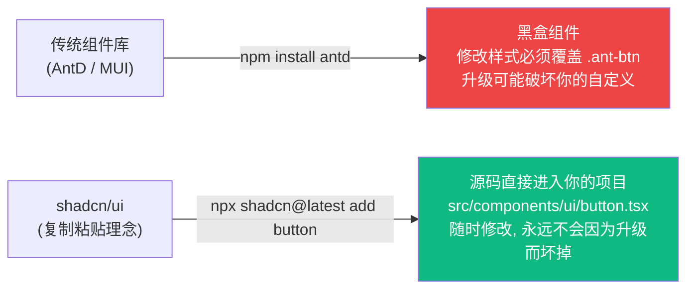
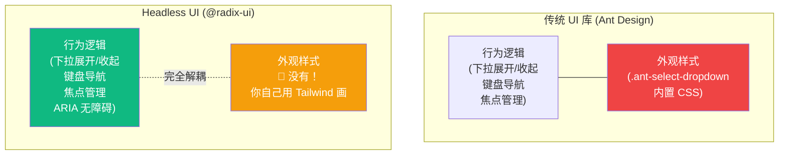

# Lesson 13：专业级 UI 集成 — shadcn/ui 组件库基础

> 🎯 **本节目标**：告别纯手写基础样式，使用业界最火的"非打包组件库" shadcn/ui 快速构建美观的界面，深入理解 Headless UI 的设计哲学。
>
> 📦 **本节产出**：将项目中的原生 HTML 元素替换为专业的 Button、Dialog、Select、Toast 等多态组件。


## 一、为什么是 shadcn/ui？

在之前的课程里，我们所有的按钮都是这样手写的：
```tsx
<button className="px-6 py-3 bg-indigo-600 text-white rounded-xl font-semibold ... hover:bg-indigo-700">提交</button>
```

当组件多了以后，每次都这么写容易出错且难以维护。
传统做法是引入 Ant Design 或 Material UI 这种**组件库**。

**但传统的重量级组件库有几个痛点：**
1. 难以自定义样式（覆盖深层 DOM 节点的 CSS 极其痛苦）。
2. 打包体积大（哪怕你按需引入，底层的依赖也很庞大）。
3. 主题定制受死板的框架变量限制。

**shadcn/ui 不是一个你要 `npm install` 的"库"。**
它是一组由 Radix UI（提供极佳的可访问性体验）和 Tailwind CSS 编写的开源代码片段。
它的理念是：**将组件的原始代码直接贴到你的项目里，它们属于你，你可以随意修改。**



---

## 二、🧠 深度专题：Headless UI 理念

在理解 shadcn/ui 之前，我们需要先搞清楚它的底层 —— **Headless UI（无头 UI）** 是什么。

### 2.1 什么叫"无头"？

传统 UI 库 = **行为逻辑** + **样式外观** 绑死在一起。
Headless UI = **只提供行为逻辑**，完全不管长什么样。



**Radix UI** 就是一个 Headless UI 库。它帮你解决了组件开发中 **最痛苦的 10% 问题**：
- 弹窗打开时焦点被锁定在内部（Tab 键循环）
- 按 Esc 关闭弹窗
- 下拉菜单的键盘上下方向键导航
- ARIA 无障碍属性（屏幕阅读器能正确朗读）
- 点击弹窗外部区域自动关闭

而 **shadcn/ui = Radix UI 的行为 + Tailwind CSS 的样式**，打包好送你一份可修改的源码。

### 2.2 为什么选择这种模式？

| 特性 | Ant Design | shadcn/ui (Radix + Tailwind) |
|------|-----------|---------------------------|
| 自定义难度 | 😫 覆盖 CSS 容易出错 | 😊 直接改源码 |
| 升级风险 | 😫 大版本可能破坏覆盖 | 😊 代码在你手里，不受库升级影响 |
| 包体积 | 😫 即使 TreeShaking 也偏大 | 😊 只有你用到的组件 |
| 无障碍 | ✅ 内置 | ✅ Radix 内置 |
| 上手速度 | ✅ 开箱即用 | 🔶 需要理解结构后才能改 |

---

## 三、初始化 shadcn/ui (Tailwind v4)

```bash
# 在 phase2-task-manager 目录下执行
npx shadcn@latest init
```

按照提示一路回车确认：
- 选择默认风格 `New York` (看起来紧凑、现代)
- 选择默认颜色 `Zinc`

初始化完成后，发生了什么变化？
1. `components.json` 出现在了根目录（记录你的配置）。
2. `src/lib/utils.ts` 出现在了项目中（它包含 `cn` 核心合并样式函数）。
3. `src/index.css` 被注入了大量 CSS 变量（决定了默认颜色体系）。

### 看看神奇的 `cn` 函数

```ts
// src/lib/utils.ts (由 shadcn 初始化自动生成)
import { clsx, type ClassValue } from "clsx"
import { twMerge } from "tailwind-merge"

export function cn(...inputs: ClassValue[]) {
  return twMerge(clsx(inputs))
}
```

#### `cn()` 做了什么？

它其实是 **两个库合力** 的结果：

**第一层 `clsx`** —— 条件拼接类名：
```ts
clsx("base", false && "hidden", { "active": true })
// => "base active"
```

**第二层 `twMerge`** —— 解决 Tailwind 冲突：
```ts
// 没有 twMerge 的话：
"p-4 p-8"  // 两个 padding 同时存在！浏览器随机取一个，结果不可预测

// 有了 twMerge：
twMerge("p-4 p-8")  // => "p-8" (后面的覆盖前面的)
twMerge("text-red-500 text-blue-600")  // => "text-blue-600"
```

**合在一起**：这意味着你可以安全地给 shadcn 组件追加自定义类名，不怕冲突：
```tsx
<Button className="w-full mt-8">  {/* 你的类名会与组件内部的合并，互不冲突 */}
```

---

## 四、安装你的第一个组件：Button

```bash
npx shadcn@latest add button
```

检查 `src/components/ui/button.tsx`，你会看到组件**源代码**直接下载到了你的项目里！

```tsx
// src/components/ui/button.tsx (简化截取)
import { Slot } from "@radix-ui/react-slot"
import { cva, type VariantProps } from "class-variance-authority"
import { cn } from "@/lib/utils"

// cva = Class Variance Authority (类名变体管理器)
// 它定义了一套"变体系统"——同一个组件可以有多种外观
const buttonVariants = cva(
  // 基础类名（所有变体共享）
  "inline-flex items-center justify-center gap-2 whitespace-nowrap rounded-md text-sm font-medium transition-colors focus-visible:outline-none focus-visible:ring-1 ...",
  {
    variants: {
      variant: {
        default: "bg-primary text-primary-foreground shadow hover:bg-primary/90",
        destructive: "bg-destructive text-destructive-foreground shadow-sm hover:bg-destructive/90",
        outline: "border border-input bg-background shadow-sm hover:bg-accent",
        secondary: "bg-secondary text-secondary-foreground shadow-sm hover:bg-secondary/80",
        ghost: "hover:bg-accent hover:text-accent-foreground",
        link: "text-primary underline-offset-4 hover:underline",
      },
      size: {
        default: "h-9 px-4 py-2",
        sm: "h-8 rounded-md px-3 text-xs",
        lg: "h-10 rounded-md px-8",
        icon: "h-9 w-9",
      }
    },
    defaultVariants: { variant: "default", size: "default" },
  }
)
```

### `cva` 的强大之处

它让组件有了"换肤"的 Props API，调用者只需要传 `variant="destructive"` 就能切换完全不同外观：

```tsx
import { Button } from '@/components/ui/button'

function Example() {
  return (
    <div className="flex gap-4 flex-wrap">
      {/* 默认深色主要按钮 */}
      <Button>确认提交</Button>
      
      {/* 红色危险按钮 */}
      <Button variant="destructive">删除项目</Button>
      
      {/* 灰色描边按钮 */}
      <Button variant="outline">取消</Button>
      
      {/* 透明幽灵按钮（常用于工具栏） */}
      <Button variant="ghost" size="icon">✖️</Button>
      
      {/* 链接样式的按钮 */}
      <Button variant="link">查看详情</Button>
      
      {/* 自己追加特殊类名覆盖 */}
      <Button className="w-full text-lg mt-8 rounded-full bg-blue-600">
        完全自定义覆盖按钮
      </Button>
    </div>
  )
}
```

---

## 五、安装更多高级组件

### 5.1 Dialog (对话框)

对话框纯手写坑极多（Esc 关闭、焦点锁定、遮罩点击关闭）：

```bash
npx shadcn@latest add dialog
```

这不仅下载文件，还自动安装底层依赖 `@radix-ui/react-dialog`。

```tsx
// src/pages/projects/Board.tsx (部分)
import { Button } from '@/components/ui/button'
import {
  Dialog, DialogContent, DialogDescription,
  DialogFooter, DialogHeader, DialogTitle, DialogTrigger,
} from "@/components/ui/dialog"

export default function Board() {
  const handleDelete = () => { /* 真实删除逻辑 */ }

  return (
    <header className="mb-8 flex justify-between items-center">
      <h1>看板</h1>
      
      {/* 声明式对话框 */}
      <Dialog>
        <DialogTrigger asChild>
          <Button variant="destructive">删除项目</Button>
        </DialogTrigger>
        
        <DialogContent className="sm:max-w-md">
          <DialogHeader>
            <DialogTitle>确定要删除这个看板吗？</DialogTitle>
            <DialogDescription>
              这一步操作不可逆！项目删除后，所有任务数据将永久消失。
            </DialogDescription>
          </DialogHeader>
          <DialogFooter className="gap-2">
            <Button variant="outline">我再想想</Button>
            <Button variant="destructive" onClick={handleDelete}>
              确定删除 💥
            </Button>
          </DialogFooter>
        </DialogContent>
      </Dialog>
    </header>
  )
}
```

自带丝滑的进出场 CSS 动画、焦点锁定、Esc 关闭。零额外代码。

### 5.2 Select (下拉选择)

```bash
npx shadcn@latest add select
```

```tsx
import {
  Select, SelectContent, SelectItem, SelectTrigger, SelectValue,
} from "@/components/ui/select"

function PrioritySelector() {
  return (
    <Select defaultValue="medium">
      <SelectTrigger className="w-40">
        <SelectValue placeholder="选择优先级" />
      </SelectTrigger>
      <SelectContent>
        <SelectItem value="low">🟢 低优先级</SelectItem>
        <SelectItem value="medium">🟡 中优先级</SelectItem>
        <SelectItem value="high">🔴 高优先级</SelectItem>
      </SelectContent>
    </Select>
  )
}
```

自带键盘上下键导航和完整的 ARIA 无障碍支持。

### 5.3 Toast (全局通知)

```bash
npx shadcn@latest add toast sonner
```

```tsx
// 在任何地方触发全局提示
import { toast } from "sonner"

function SaveButton() {
  const handleSave = () => {
    // 成功提示
    toast.success('保存成功！', {
      description: '你的修改已同步到服务器。',
    })
    
    // 错误提示
    toast.error('保存失败', {
      description: '请检查网络连接后重试。',
    })
  }

  return <Button onClick={handleSave}>保存</Button>
}
```

> [!TIP]
> 别忘了在 `RootLayout` 中添加 `<Toaster />` 组件，这是 Toast 的全局挂载点。

---

## 六、练习

1. 使用 `npx shadcn@latest add input` 下载输入框组件，替换项目中所有手写的 `<input>` 元素。
2. 使用 `npx shadcn@latest add card` 卡片组件，去包裹 Board 看板页面里的每一个 Task 任务。
3. （进阶）去编辑 `src/components/ui/button.tsx` 源码。新增一个 `variant: 'magic'` 选项，让其带有一层彩虹渐变背景色（`bg-gradient-to-r from-pink-500 via-purple-500 to-indigo-500`），并在 App 中调用看看效果。

---

## 📌 本节小结

| 你做了什么 | 你学到了什么 |
|-----------|------------|
| 了解了 shadcn/ui 的核心思想 | 复制源代码即所有权 (Copy-Paste Component) |
| 理解了 Headless UI 的设计哲学 | Radix UI 提供行为逻辑，Tailwind 提供样式 |
| 搞清了 `cn()` 的工作原理 | `clsx` 条件拼接 + `twMerge` 冲突解决 |
| 学会了 `cva` 变体系统 | 一个组件多种外观的 Props API |
| 安装使用了 Button、Dialog、Select、Toast | 组合式组件的使用姿势 |
