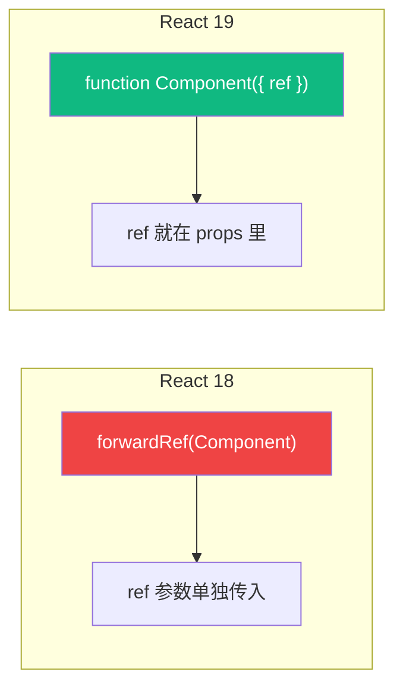

# Lesson 14：复杂表单构建 — React Hook Form 与 Zod 校验

> 🎯 **本节目标**：告别繁琐的受控组件双向绑定，掌握工业级的高性能表单处理与字段校验方案。
>
> 📦 **本节产出**：通过组合 React Hook Form 和 Zod，创建“新建项目”和“新建任务”两个高复杂度、带严格校验规则且带有丝滑交互报错提示的弹窗表单。

---

## 一、原生 React 表单的痛点

在 Phase 1 (Todo App) 的输入框实现中，如果表单很大（比如有 10 个字段），原生受控组件的问题就暴露了：

```tsx
// ❌ 传统受控组件 (Controlled Components)
function SignupForm() {
  const [name, setName] = useState('')
  const [email, setEmail] = useState('')
  const [password, setPassword] = useState('')
  // ...10个字段的巨大痛苦
  
  // 最大的问题：你在输入 Email 时，每按下一个字母，
  // 整个 SignupForm 以及它包含的所有 10 个 Input DOM 都会重新渲染！
}
```

为了解决「每次输入都触发全组件树重绘」造成的性能问题，以及管理纷繁复杂的校验规则（如手机号校验、密码强度校验、两遍密码必须一致校验），业界现在几乎垄断了最佳实践： **React Hook Form (RHF)**。

### RHF 的核心优势：非受控 (Uncontrolled)

RHF 默认把原生的 DOM input 元素“接管”了，利用 HTML5 原生表单属性维护状态。**在用户敲击键盘时，React 根本不会发生重新渲染！** 直到发生校验错误或者用户点击提交时，状态才暴露。

### 💡 表单无障碍：`useId` 生成唯一 ID

在表单中，`<label>` 的 `htmlFor` 属性需要关联 `<input>` 的 `id`，这对屏幕阅读器（无障碍）至关重要。但在 SSR 环境中，用 `Math.random()` 生成 ID 会导致 **Hydration Mismatch**（服务端和客户端生成的随机数不同）。

React 18+ 提供了 `useId`，生成的 ID 在服务端和客户端**保证一致**：

```tsx
import { useId } from 'react'

function FormField({ label }: { label: string }) {
  const id = useId()  // 生成类似 ":r1:" 的唯一 ID
  
  return (
    <div>
      <label htmlFor={id}>{label}</label>
      <input id={id} className="border rounded-xl px-4 py-3" />
    </div>
  )
}

// 多个字段时，用前缀扩展
function ComplexForm() {
  const id = useId()
  return (
    <>
      <label htmlFor={`${id}-name`}>名称</label>
      <input id={`${id}-name`} />
      
      <label htmlFor={`${id}-email`}>邮箱</label>
      <input id={`${id}-email`} />
    </>
  )
}
```

> [!TIP]
> 在 Phase 3 的 Next.js SSR 项目中，`useId` 尤为重要。如果你用 `Math.random()` 或者自增计数器生成 ID，服务端渲染和客户端 Hydration 会生成不同的值，React 会报错！

---

## 二、引入 Zod 建立类型校验墙

如何定义一份严格的数据规则？
比如：“新建项目”弹窗中，项目名称 `name` 必须是 2 ~ 20 个字的字符串，图标 `icon` 只能是 1 个 Emoji，同时还要给这些规则配上中文报错语。

**Zod** 是近年来最火的 Schema 声明与校验库，完美契合 TypeScript。

### 2.1 安装全家桶

```bash
npm install react-hook-form zod @hookform/resolvers
```
*(注：`@hookform/resolvers` 是一座桥梁，把 Zod 解析器对接到 react-hook-form 里)*

### 2.2 定义你的 Zod Schema

我们将在独立文件里统一定义校验规则。

```ts
// src/lib/validations.ts
import { z } from "zod"

// 方案声明：定义“新建项目”表单应该长什么样
export const projectFormSchema = z.object({
  name: z.string()
    .min(2, { message: "项目名称太短啦，至少要2个字" })
    .max(20, { message: "太长了，最多只能写20个字" }),
  
  icon: z.string()
    .length(2, { message: "图标必须是单个 Emoji 表情" }) // Emoji 通常占2个字节 
    .optional() // 设为可选
    .or(z.literal('')), // 或者为空字符串
})

// 🎉 自动推导出 TypeScript 类型 (不用手写 interface 了)
export type ProjectFormValues = z.infer<typeof projectFormSchema>
```

---

## 三、实战：结合 shadcn/ui 创建高能表单

shadcn/ui 刚好内置了一个极度好用的包裹组件，叫做 `Form`，底层封装了 `react-hook-form`。

```bash
npx shadcn@latest add form
npx shadcn@latest add input label
```

现在我们将以上三部分力量完美融合：

```tsx
// src/components/CreateProjectDialog.tsx
import { useForm } from "react-hook-form"
import { zodResolver } from "@hookform/resolvers/zod"
import { projectFormSchema, type ProjectFormValues } from "@/lib/validations"
// 引入刚刚通过 shadcn 生成的大量原语
import { Form, FormControl, FormField, FormItem, FormLabel, FormMessage } from "@/components/ui/form"
import { Input } from "@/components/ui/input"
import { Button } from "@/components/ui/button"
// 假设这是我们之前做的存储库
import { useProjectActions } from "@/store/useProjectStore"

export function CreateProjectDialog() {
  const { addProject } = useProjectActions()

  // 1. 初始化 UseForm！挂上 Zod
  const form = useForm<ProjectFormValues>({
    resolver: zodResolver(projectFormSchema),
    defaultValues: {
      name: "",
      icon: "📁",
    },
  })

  // 2. 表单被完美提交（仅当全通过 Zod 校验后）才会走到这里
  function onSubmit(data: ProjectFormValues) {
    addProject(data.name, data.icon || '📁')
    form.reset() // 清空草稿
    // 这里应当还要接着执行 "关闭弹窗" 的逻辑
  }

  return (
    // 3. 用 shadcn 的 Form 组件把原始 form 包裹起来，将实例注下
    <Form {...form}>
      {/* 4. 执行 handleSubmit 高阶函数拦截原生提交事件 */}
      <form onSubmit={form.handleSubmit(onSubmit)} className="space-y-6">
        
        {/* 字段 1：项目名称 */}
        <FormField
          control={form.control}
          name="name" // 与 Zod 的对应
          render={({ field }) => (
            <FormItem>
              <FormLabel>项目名称</FormLabel>
              <FormControl>
                {/* {...field} 把 value, onChange, onBlur 等所有必要的事件解构挂上去！ */}
                <Input placeholder="例如：Q3 营销计划" {...field} />
              </FormControl>
              {/* 这行组件会自动感知验证错误，变成红字展示出我们在 zod 里写好的汉字提示 */}
              <FormMessage />
            </FormItem>
          )}
        />
        
        {/* 字段 2：项目图标 */}
        <FormField
          control={form.control}
          name="icon"
          render={({ field }) => (
            <FormItem>
              <FormLabel>图标 (选填)</FormLabel>
              <FormControl>
                {/* 各种复杂的输入组件，甚至日期选择器都可以塞在这里 */}
                <Input placeholder="输入 Emoji" {...field} />
              </FormControl>
              <FormMessage />
            </FormItem>
          )}
        />
        
        {/* 按钮控制 */}
        <div className="flex justify-end gap-2">
           {/* btn 绑定状态：如果表格脏的且非法、或者是正在网络提交中，禁用自己 */}
          <Button 
            type="submit" 
            disabled={!form.formState.isValid || form.formState.isSubmitting}
          >
            建立项目
          </Button>
        </div>
      </form>
    </Form>
  )
}
```

体验这套顶级工业化流程带来的感受：
当你提交表单时，如果名称留空，那么“项目名称”输入框下面会优雅地浮现出红色微标提示：`"项目名称太短啦，至少要2个字"`。这完全由 Zod 驱动！并且在此之前（在输入过程中），你的外层组件（即 `CreateProjectDialog` 函数）没有任何重重触发重新渲染！

这极大地解脱了前端工程师们手写长篇大论的验证逻辑的心智损耗。

---

## 四、🧠 深度专题：为何 `FormField` 采用 Render Props 模式？

刚才代码中极其诡异的一段是：
```tsx
<FormField
  render={ ({ field }) => (
    <Input {...field} />
  )}
/>
```

为什么 React Hook Form 不直接提供一个 `<Input>`，而一定要用个包裹器传递 `({ field })`，让你把 `...field` 原封不动复制进你的组件里呢？

这种模式叫 **Render Props 渲染属性（又名 Controller 层剥离）**。

### 无痛对接任何异构 DOM 库
现实世界中，不可能所有的表单都是简单的 `<input>`，尤其是接入各种奇美乱目的第三方组件：
- 自定义下拉选框 `Select`
- 复杂的富文本编辑器 `TipTap` 或 `Quill`
- 可点选并拥有自己专属状态的日期选框 `DatePicker`

这些组件都不是原生的，往往没有标准的原生 `ref` 或 `name` 来完成双向互操作。
`({ field })` 把包含 `{ onChange, onBlur, value, ref }` 这一大堆连接管线直接送给了你。你要做的，仅仅是把它们插入到第三方的 Props 中去！它是真正的“万能胶水”。

```tsx
// 对接一个毫不相干的、极其冷门的第三方开关组件：
<FormField
  render={({ field }) => (
    <MyWeirdToggleLibrary
      checkedState={field.value}           // 对准它的 value prop
      handleToggle={field.onChange}        // 对准它的改变回调 prop
    />
  )}
/>
```

这就是 Controller 模式极其可怕的拓展性。shadcn/ui 让这一切看起来都是一体且无缝的。

---

## 五、🧠 深度专题：React 19 的 `ref` 革命 — 告别 `forwardRef`

### 5.1 问题背景：为什么组件需要传递 ref？

在 React Hook Form 中，`field` 对象包含一个 `ref`。RHF 需要通过这个 ref 直接访问 DOM 输入框，以便在校验失败时自动 `focus()` 到出错的字段。

但是在 React 18 及以前，**函数组件默认无法接收 `ref` prop**。如果你尝试给自定义组件传 ref，React 会忽略它！

### 5.2 React 18：用 `forwardRef` 包装（繁琐）

```tsx
// ❌ React 18 的做法：必须用 forwardRef 包裹
import { forwardRef } from 'react'

const MyInput = forwardRef<HTMLInputElement, { label: string }>(
  function MyInput({ label, ...props }, ref) {
    return (
      <div>
        <label>{label}</label>
        <input ref={ref} {...props} />
      </div>
    )
  }
)

// 父组件才能通过 ref 拿到内部的 <input> DOM
const inputRef = useRef<HTMLInputElement>(null)
<MyInput ref={inputRef} label="用户名" />
```

问题：
- 每个需要暴露 ref 的组件都要包一层 `forwardRef`
- 类型签名变得冗长（`forwardRef<HTMLInputElement, Props>`）
- 初学者经常忘记包裹，导致 ref 莫名丢失

### 5.3 React 19：ref 直接作为普通 prop 传递（革命性简化！）

```tsx
// ✅ React 19 的做法：ref 就是一个普通的 prop！
function MyInput({ label, ref, ...props }: { 
  label: string
  ref?: React.Ref<HTMLInputElement>  // 直接声明在 props 类型中
}) {
  return (
    <div>
      <label>{label}</label>
      <input ref={ref} {...props} />
    </div>
  )
}

// 使用方式完全一样
const inputRef = useRef<HTMLInputElement>(null)
<MyInput ref={inputRef} label="用户名" />
```

**不需要 `forwardRef` 了！** ref 变成了和 `className`、`onClick` 一样的普通 prop。



> [!TIP]
> **你现在就能在 RHF 的 `{...field}` 中看到这个变化的好处** —— `field` 展开后包含 `ref`，在 React 19 中，原生 `<input>` 和你的自定义输入组件都能无缝接收它，不再需要 `forwardRef` 手动转发。

---

## 六、练习

1. 为前面的 `TaskItem` 中的 `status` 修改增加一个高级编辑弹框，不仅包含名称编辑，还引入一个 `textarea` 当做任务详细说明字段。使用 Zod 校验描述字段不能超过 200 个字。
2. （进阶挑战）尝试去查阅 `react-hook-form` 的文档中有关于 `watch` 和 `useWatch` 的区别，了解当你确实需要在外层探知并联动（这通常是唯一打破无受控流的时刻：比如勾选此框后才显示下方的具体说明文本框）时不同解法的性能考量。

---

## 📌 本节小结

| 你做了什么 | 你学到了什么 |
|-----------|------------|
| 认识了 React 表单受迫渲染灾难 | 受控组件 vs 非受控流的底层区别和适用范围 |
| 安装使用了一套 Zod Schema | 彻底利用 TypeScript 及利用它的 `inference` 反推导类型能力 |
| 绑定了 Shadcn Form 组合套件 | 利用 Hook Resovlers 强行将验证绑定到事件生命周期中 |
| 了解到解构式双向接管法 | Controller `Render Props` 设计模式 |

---

## ➡️ 下一课

[**Lesson 15：重构业务逻辑 — 自定义 Hooks 与关注点分离**](./Lesson_15.md)
