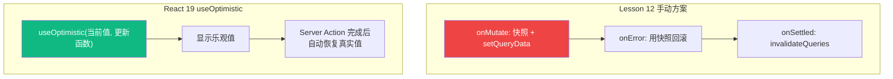
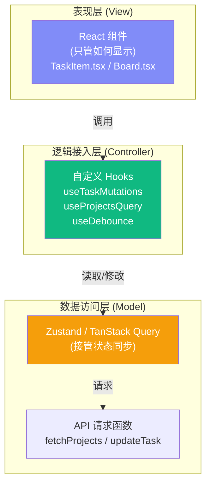

# Lesson 15：重构业务逻辑 — 自定义 Hooks、useOptimistic 与组合模式

> 🎯 **本节目标**：将越来越臃肿的组件拆解，提取可复用的业务逻辑，并掌握 React 19 新增的 `useOptimistic` Hook 和高级组件组合模式。
>
> 📦 **本节产出**：通过编写自定义 Hook（`useTaskMutations`、`useDebounce`）让 UI 组件重新变得清爽；使用 `useOptimistic` 替代手动乐观更新；理解 Compound Components 组合模式。

---

## 一、组件正在变得臃肿

在前面的课程中，我们在 `Board.tsx` 和 `TaskItem.tsx` 里塞入了大量的逻辑：
- TanStack Query 的 `useQuery` 和 `useMutation`
- 乐观更新中复杂的缓存快照（`onMutate`、`onError` 等）
- 各种按钮的点击事件处理
- UI 的渲染（JSX）

```tsx
// ❌ 典型的"胖组件" (Fat Component)
function TaskItem({ task }) {
  const queryClient = useQueryClient()
  
  // !!! 这里有 40 行长长的 useMutation 乐观更新逻辑 !!!
  const mutation = useMutation({ ... }) 

  // !!! 这里有 10 行根据搜索防抖计算得出结果的逻辑 !!!
  const debouncedSearch = useDebounce(...)

  // !!! 终于到了 UI 渲染 !!!
  return <div>...</div>
}
```

**问题在于：UI 组件的职责应该只是负责"长什么样"。**
它不应该知道"数据是怎么请求的"、"缓存是怎么回滚的"。这就是所谓的 **关注点分离 (Separation of Concerns)**。

---

## 二、自定义 Hook 的核心规则

在 React 中，Hook 本质上就是**普通的 JavaScript 函数**。
唯一的规则是：
1. 名字必须以 `use` 开头（比如 `useTasks`、`useWindowSize`）。
2. 在这个函数内部，可以调用其他的 Hook（比如 `useState`、`useQuery`）。
3. 只能在组件顶层或者其他自定义 Hook 内调用（不能在 if 语句或循环里）。

### 2.1 实战：提取请求逻辑 Hook

把之前 `Lesson 12` 里面那一长串乐观更新逻辑，抽取成一个专门的 `useTaskStatusMutation`：

```tsx
// src/hooks/useTaskMutations.ts
import { useMutation, useQueryClient } from '@tanstack/react-query'

interface Task {
  id: string
  projectId: string
  title: string
  status: string
}

const updateTaskStatus = async ({ taskId, status }: { taskId: string; status: string }) => {
  const res = await fetch(`http://localhost:3001/tasks/${taskId}`, {
    method: 'PATCH',
    headers: { 'Content-Type': 'application/json' },
    body: JSON.stringify({ status })
  })
  if (!res.ok) throw new Error('更新失败')
  return res.json()
}

export function useTaskStatusMutation(projectId: string) {
  const queryClient = useQueryClient()

  return useMutation({
    mutationFn: updateTaskStatus,
    onMutate: async (variables) => {
      await queryClient.cancelQueries({ queryKey: ['tasks', projectId] })
      const previousTasks = queryClient.getQueryData<Task[]>(['tasks', projectId])

      queryClient.setQueryData(['tasks', projectId], (old: Task[] | undefined) => 
        old?.map(t => t.id === variables.taskId ? { ...t, status: variables.status } : t)
      )

      return { previousTasks }
    },
    onError: (_err, _variables, context) => {
      if (context?.previousTasks) {
        queryClient.setQueryData(['tasks', projectId], context.previousTasks)
      }
    },
    onSettled: () => {
      queryClient.invalidateQueries({ queryKey: ['tasks', projectId] })
    }
  })
}
```

### 2.2 改造后的 UI 组件

看看现在的 `TaskItem` 有多么清爽：

```tsx
// src/components/TaskItem.tsx
import { useTaskStatusMutation } from '@/hooks/useTaskMutations'

export default function TaskItem({ task }: { task: Task }) {
  // 🐻 一行代码，引入强大的突变能力
  const statusMutation = useTaskStatusMutation(task.projectId)

  const handleToggle = () => {
    statusMutation.mutate({ 
      taskId: task.id, 
      status: task.status === 'done' ? 'todo' : 'done' 
    })
  }

  return (
    <div 
      onClick={handleToggle} 
      className={`p-4 border rounded-xl cursor-pointer transition-all
        ${statusMutation.isPending ? 'opacity-50' : ''}
      `}
    >
      {task.status === 'done' ? '✅' : '⬜️'} {task.title}
      {statusMutation.isError && <span className="text-red-500 ml-2">更新失败!</span>}
    </div>
  )
}
```

---

## 三、React 19 新武器：`useOptimistic`

在 Lesson 12 我们手动写了 `onMutate` + `setQueryData` + `onError` 回滚这一长串复杂的乐观更新。
React 19 提供了一个更简洁的方案：**`useOptimistic`**。

### 3.1 原理对比



### 3.2 实战：用 `useOptimistic` 重写任务切换

```tsx
// src/components/TaskItemOptimistic.tsx
'use client' // 如果在 Next.js 中使用

import { useOptimistic, startTransition } from 'react'

interface Task {
  id: string
  title: string
  status: 'todo' | 'done'
}

export default function TaskItemOptimistic({ 
  task, 
  toggleAction 
}: { 
  task: Task
  toggleAction: (taskId: string) => Promise<void>  // Server Action 或异步函数
}) {
  // useOptimistic 接收两个参数：
  // 1. 当前真实值
  // 2. 一个"乐观更新函数"：接收旧值和待处理的新信息，返回乐观的新值
  const [optimisticTask, setOptimisticTask] = useOptimistic(
    task,
    (currentTask, newStatus: string) => ({
      ...currentTask,
      status: newStatus as 'todo' | 'done'
    })
  )

  const handleToggle = () => {
    const newStatus = optimisticTask.status === 'done' ? 'todo' : 'done'
    
    startTransition(async () => {
      // 1. 立即在 UI 上显示乐观的新状态
      setOptimisticTask(newStatus)
      
      // 2. 调用真正的服务器操作
      await toggleAction(task.id)
      
      // 3. 完成后 React 19 自动用最新的 task prop 替换乐观值
      //    如果服务器返回了不同的结果，UI 会自动修正！
    })
  }

  return (
    <div onClick={handleToggle} className="p-4 border rounded-xl cursor-pointer">
      {optimisticTask.status === 'done' ? '✅' : '⬜️'} {optimisticTask.title}
    </div>
  )
}
```

> [!IMPORTANT]
> `useOptimistic` 的设计初衷是搭配 **Server Actions** 或 React 的 **Transition API** 使用。它极大地减少了乐观更新的代码量——不需要手动快照、不需要手动回滚、不需要 `queryClient` 操作！

---

## 四、Compound Components 组合组件模式

在 Lesson 13 我们看到了 shadcn/ui 的 Dialog 组件是这么用的：

```tsx
<Dialog>
  <DialogTrigger>打开</DialogTrigger>
  <DialogContent>
    <DialogHeader>
      <DialogTitle>标题</DialogTitle>
    </DialogHeader>
  </DialogContent>
</Dialog>
```

这种"一个父组件包含多个语义化子组件"的模式叫做 **Compound Components（组合组件）**。

### 4.1 为什么要这种模式？

```tsx
// ❌ Props 地狱：一个组件要传 20 个 props
<Dialog
  title="标题"
  description="描述"
  triggerText="打开"
  confirmText="确认"
  cancelText="取消"
  onConfirm={...}
  onCancel={...}
  showFooter={true}
  icon="warning"
  // ... 更多 props
/>

// ✅ Compound Components：结构清晰、灵活可定制
<Dialog>
  <DialogTrigger>打开</DialogTrigger>
  <DialogContent>
    <DialogHeader>
      <DialogTitle>标题</DialogTitle>
      <DialogDescription>描述</DialogDescription>
    </DialogHeader>
    {/* 你可以在这里放任何自定义内容！ */}
    <MyCustomChart />
    <DialogFooter>
      <Button variant="outline">取消</Button>
      <Button>确认</Button>
    </DialogFooter>
  </DialogContent>
</Dialog>
```

### 4.2 实战：自己写一个 Compound Component

让我们做一个简单的 `Accordion`（手风琴折叠面板）作为教学示例：

```tsx
// src/components/Accordion.tsx
import { createContext, useContext, useState, type ReactNode } from 'react'

// 1. 用 Context 做父子组件间的隐式通信
interface AccordionContextType {
  openItem: string | null
  toggle: (id: string) => void
}

const AccordionContext = createContext<AccordionContextType | null>(null)

// 2. 父组件：管理状态
export function Accordion({ children }: { children: ReactNode }) {
  const [openItem, setOpenItem] = useState<string | null>(null)
  const toggle = (id: string) => setOpenItem(prev => prev === id ? null : id)

  return (
    <AccordionContext.Provider value={{ openItem, toggle }}>
      <div className="divide-y border rounded-xl overflow-hidden">
        {children}
      </div>
    </AccordionContext.Provider>
  )
}

// 3. 子组件：通过 Context 自动感知状态
export function AccordionItem({ id, title, children }: { 
  id: string; title: string; children: ReactNode 
}) {
  const ctx = useContext(AccordionContext)
  if (!ctx) throw new Error('AccordionItem 必须在 Accordion 内使用')
  
  const isOpen = ctx.openItem === id

  return (
    <div>
      <button 
        onClick={() => ctx.toggle(id)}
        className="w-full text-left px-4 py-3 font-medium hover:bg-gray-50 flex justify-between"
      >
        {title}
        <span className={`transition-transform ${isOpen ? 'rotate-180' : ''}`}>▼</span>
      </button>
      {isOpen && (
        <div className="px-4 py-3 bg-gray-50 text-sm text-gray-600">
          {children}
        </div>
      )}
    </div>
  )
}
```

使用方式：
```tsx
<Accordion>
  <AccordionItem id="1" title="什么是 React？">
    React 是一个用于构建用户界面的 JavaScript 库。
  </AccordionItem>
  <AccordionItem id="2" title="什么是 JSX？">
    JSX 是 JavaScript XML 的缩写，让你可以在 JS 中写类 HTML 的语法。
  </AccordionItem>
</Accordion>
```

**核心要点**：父组件 `Accordion` 通过 Context 注入状态，子组件 `AccordionItem` 通过 `useContext` 消费状态。用户不需要传任何 prop 来管理开关——组合在一起时它们自动协作！

---

## 五、`useImperativeHandle` — 让父组件调用子组件的方法

有时候你需要从**父组件**控制**子组件**的行为。比如：
- 父组件点击按钮 → 让子组件的 Dialog 弹出
- 父组件点击重置 → 让子组件的表单清空
- 父组件切换 Tab → 让子组件的视频暂停

`useImperativeHandle` 让你可以给 ref 自定义暴露的方法：

```tsx
// src/components/ConfirmDialog.tsx
import { useImperativeHandle, useRef, useState, type Ref } from 'react'

// 定义暴露给父组件的 API
export interface ConfirmDialogHandle {
  open: (message: string) => void
  close: () => void
}

export default function ConfirmDialog({ 
  ref,
  onConfirm 
}: { 
  ref?: Ref<ConfirmDialogHandle>
  onConfirm: () => void 
}) {
  const [isOpen, setIsOpen] = useState(false)
  const [message, setMessage] = useState('')

  // 向父组件暴露 open 和 close 方法
  useImperativeHandle(ref, () => ({
    open: (msg: string) => {
      setMessage(msg)
      setIsOpen(true)
    },
    close: () => setIsOpen(false),
  }))

  if (!isOpen) return null

  return (
    <div className="fixed inset-0 bg-black/50 flex items-center justify-center z-50">
      <div className="bg-white rounded-2xl p-6 max-w-sm w-full mx-4">
        <p className="text-lg mb-6">{message}</p>
        <div className="flex gap-3 justify-end">
          <button onClick={() => setIsOpen(false)}
            className="px-4 py-2 rounded-xl border hover:bg-gray-50">取消</button>
          <button onClick={() => { onConfirm(); setIsOpen(false) }}
            className="px-4 py-2 rounded-xl bg-red-600 text-white hover:bg-red-700">确认</button>
        </div>
      </div>
    </div>
  )
}
```

```tsx
// src/pages/Board.tsx — 父组件使用
import { useRef } from 'react'
import ConfirmDialog, { type ConfirmDialogHandle } from '@/components/ConfirmDialog'

export default function Board() {
  // ref 类型是我们自定义的 Handle，不是 DOM 元素！
  const dialogRef = useRef<ConfirmDialogHandle>(null)

  const handleDelete = () => {
    // 命令式调用子组件的方法
    dialogRef.current?.open('确定要删除这个项目吗？此操作不可逆！')
  }

  return (
    <div>
      <button onClick={handleDelete} className="text-red-600">删除项目</button>
      
      <ConfirmDialog 
        ref={dialogRef} 
        onConfirm={() => { /* 执行删除 */ }}
      />
    </div>
  )
}
```

> [!NOTE]
> 注意这里用的是 React 19 的写法（ref 直接作为 prop），不需要 `forwardRef`！如果你还在用 React 18，需要用 `forwardRef` 包裹子组件（参见 L14 深度专题）。

**何时用 `useImperativeHandle`？**
- 需要**命令式**（imperative）的操作（`open()`、`play()`、`scrollTo()`）
- 声明式 props 无法自然表达的场景
- 注意：大多数场景应该优先用声明式的 props/state，只在真正需要命令式 API 时才用

---

## 六、架构分层思想



推荐的项目目录结构：

```
src/
├── components/        ← 纯 UI 组件（只关心展示）
│   ├── ui/           ← shadcn/ui 基础组件
│   ├── TaskItem.tsx
│   └── TaskSearch.tsx
├── hooks/            ← 自定义 Hooks（业务逻辑桥梁）
│   ├── useTaskMutations.ts
│   ├── useProjectsQuery.ts
│   └── useDebounce.ts
├── api/              ← API 请求函数（最底层，只管 fetch）
│   ├── projectRequests.ts
│   └── taskRequests.ts
├── store/            ← 全局状态管理（Zustand）
│   ├── useCartStore.ts
│   └── useThemeStore.ts
├── lib/              ← 通用工具函数
│   ├── utils.ts
│   └── validations.ts
└── pages/            ← 页面级组件（组装一切）
```

**为什么要这么分层？**
假设你们团队换掉了后端的接口（从 `RESTful fetch` 换成了 `GraphQL`）：
- **面条代码**：你要去所有的 `组件.tsx` 里找 fetch。
- **分层架构**：`组件 (UI)` 完全不碰网络；`Hooks` 也不关心底层传输；你只需要修改 `api/` 目录下的文件，上层业务全盘无伤！

---

## 七、练习

1. 编写一个 `useProjectsQuery` 自定义 Hook，封装获取所有项目列表的 `useQuery`，使得业务层只需要写 `const { data } = useProjectsQuery()` 即可。
2. 用 `useOptimistic` 重写 Board 页面中的"项目收藏"功能（点击星标切换）。
3. （思考题）为什么我们不能将组件的方法提取成普通的 Class 方法或工具函数，而非要提取成自定义 Hook？（提示：想一想 Hook 内部调用了什么？如果你把 `useState` 放在普通函数里会怎样？）

---

## 📌 本节小结

| 你做了什么 | 你学到了什么 |
|-----------|------------|
| 了解胖组件带来的维护负担 | 关注点分离（UI 仅处理视图展现逻辑） |
| 编写并抽象了带有深层副作用的 Hook | 自定义 Hook 的核心规则与参数封装 |
| 使用了 React 19 的 `useOptimistic` | 比手动 `onMutate` 更简洁的乐观更新方案 |
| 手写了一个 Compound Component | 组合模式：Context 驱动的父子组件隐式通信 |
| 梳理了项目的分层目录结构 | 现代前端架构 (UI → Hooks → Store/API) |

---

## ➡️ 下一课

[**Lesson 16：Phase 2 总结 — ErrorBoundary、Suspense 与并发渲染特性**](./Lesson_16.md)
