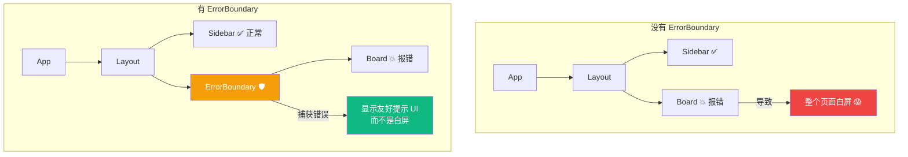
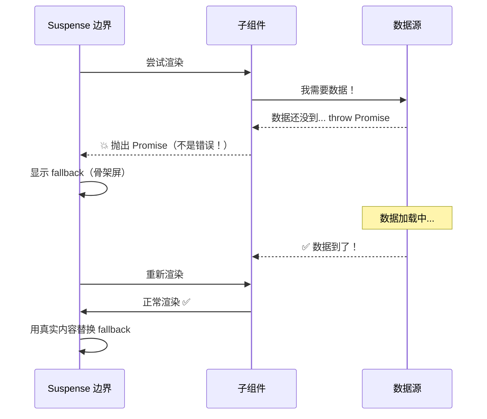
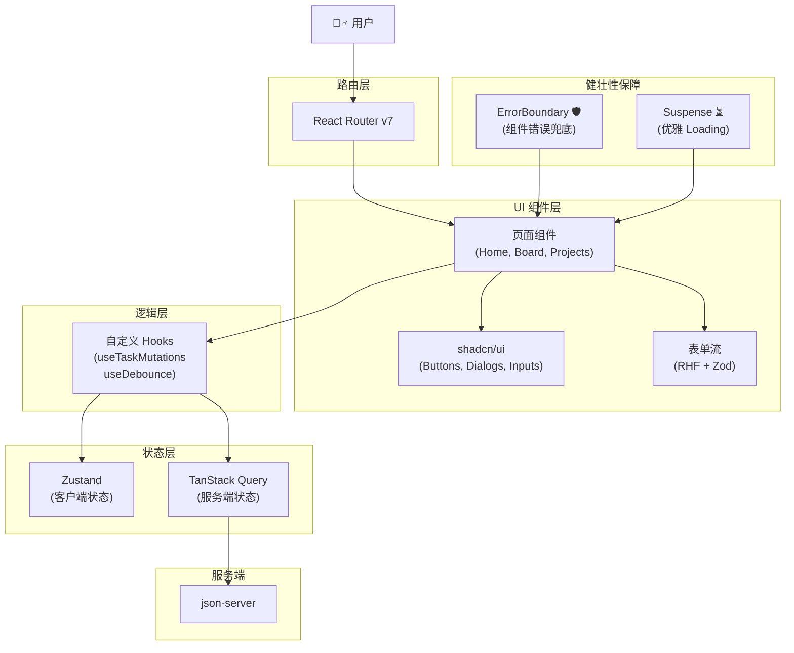

# Lesson 16：Phase 2 总结 — ErrorBoundary、Suspense 与并发渲染特性

> 🎯 **本节目标**：掌握 React 的错误处理机制、客户端 Suspense 的正确使用姿势，理解并发渲染特性的核心思想，并回顾 Phase 2 的完整架构。
>
> 📦 **本节产出**：一个带有错误兜底、优雅 Loading 态、并发更新的健壮应用。


## 一、ErrorBoundary — 组件级异常防护墙

### 1.1 问题：一个组件崩了，整个页面白屏

如果某个组件在渲染中抛出了一个 JavaScript 错误（比如读取了一个 `undefined` 对象的属性），React 在默认情况下会**卸载整个组件树**——用户看到一片白屏。



### 1.2 实现 ErrorBoundary

ErrorBoundary 是 React 中**唯一仍需使用 Class 组件**的场景（因为 `getDerivedStateFromError` 和 `componentDidCatch` 目前没有 Hook 等价物）：

```tsx
// src/components/ErrorBoundary.tsx
import { Component, type ErrorInfo, type ReactNode } from 'react'

interface Props {
  children: ReactNode
  fallback?: ReactNode
}

interface State {
  hasError: boolean
  error: Error | null
}

export class ErrorBoundary extends Component<Props, State> {
  constructor(props: Props) {
    super(props)
    this.state = { hasError: false, error: null }
  }

  // 当子组件抛出错误时，这个静态方法被调用
  static getDerivedStateFromError(error: Error): State {
    return { hasError: true, error }
  }

  // 错误详情上报（可发送到 Sentry 等监控平台）
  componentDidCatch(error: Error, errorInfo: ErrorInfo) {
    console.error('ErrorBoundary 捕获到错误：', error, errorInfo)
    // 未来可以在这里集成 Sentry.captureException(error)
  }

  render() {
    if (this.state.hasError) {
      return this.props.fallback || (
        <div className="flex flex-col items-center justify-center py-20 text-center">
          <div className="text-6xl mb-4">😵</div>
          <h2 className="text-xl font-bold text-gray-800 mb-2">页面出了点问题</h2>
          <p className="text-gray-500 mb-6 max-w-md">
            {this.state.error?.message || '发生了未知错误'}
          </p>
          <button
            onClick={() => this.setState({ hasError: false, error: null })}
            className="bg-indigo-600 text-white px-6 py-2 rounded-xl hover:bg-indigo-700"
          >
            🔄 重试
          </button>
        </div>
      )
    }

    return this.props.children
  }
}
```

### 1.3 使用方式

```tsx
// src/layouts/RootLayout.tsx
import { ErrorBoundary } from '@/components/ErrorBoundary'

export default function RootLayout() {
  return (
    <div className="flex h-full">
      <Sidebar />
      
      {/* 用 ErrorBoundary 包裹可能出错的区域 */}
      <ErrorBoundary
        fallback={
          <div className="flex-1 flex items-center justify-center text-gray-400">
            看板加载出错了，请点击侧边栏重试
          </div>
        }
      >
        <Outlet />
      </ErrorBoundary>
    </div>
  )
}
```

> [!TIP]
> **最佳实践：** 你应该在多个层级放置 ErrorBoundary（路由级 + 组件级），这样某个小部件崩溃了，不会影响到整个页面。

---

## 二、Suspense — 优雅的加载状态管理

### 2.1 为什么 Suspense 比 `isPending` 更优雅？

在之前的课程中，我们处理加载状态是这样的：

```tsx
// ❌ 每个组件都要自己管 loading 状态
function Board() {
  const { data, isPending, isError } = useQuery({ ... })
  
  if (isPending) return <Skeleton />
  if (isError) return <Error />
  return <TaskList data={data} />
}
```

问题是：**如果一个页面有 5 个异步组件，你要写 5 组 `isPending` 检查**。
Suspense 让你可以把 loading 状态"声明式"地提升到任意层级：

```tsx
import { Suspense } from 'react'

// ✅ 父级统一声明 Loading 态
function DashboardPage() {
  return (
    <div className="grid grid-cols-2 gap-6">
      <Suspense fallback={<CardSkeleton />}>
        <RecentTasks />     {/* 内部的异步会自动被 Suspense 拦截 */}
      </Suspense>
      
      <Suspense fallback={<CardSkeleton />}>
        <ProjectStats />    {/* 这个可以独立加载 */}
      </Suspense>
    </div>
  )
}
```

### 2.2 Suspense 的工作原理



> [!IMPORTANT]
> Suspense 捕获的是 **Promise**（不是 Error）。当一个组件在渲染时"抛出"一个 Promise（比如数据还在加载中），Suspense 就会先显示 `fallback`，等 Promise resolve 后重新渲染。

### 2.3 骨架屏设计

与其显示一个无聊的"加载中..."文字，不如用**骨架屏 (Skeleton)** 提前告诉用户页面的布局结构：

```tsx
// src/components/Skeleton.tsx
export function CardSkeleton() {
  return (
    <div className="bg-white rounded-xl border p-6 animate-pulse">
      <div className="h-4 bg-gray-200 rounded w-3/4 mb-4" />
      <div className="h-3 bg-gray-200 rounded w-full mb-2" />
      <div className="h-3 bg-gray-200 rounded w-5/6 mb-2" />
      <div className="h-3 bg-gray-200 rounded w-2/3" />
    </div>
  )
}

export function TaskListSkeleton() {
  return (
    <div className="space-y-3">
      {Array.from({ length: 5 }).map((_, i) => (
        <div key={i} className="bg-white rounded-xl border p-4 animate-pulse flex items-center gap-3">
          <div className="w-5 h-5 bg-gray-200 rounded" />
          <div className="h-4 bg-gray-200 rounded flex-1" />
        </div>
      ))}
    </div>
  )
}
```

---

## 三、🧠 深度专题：并发渲染特性（Concurrent Rendering）

### 3.1 什么是并发渲染？

在 React 18 之前，渲染是**同步且不可中断**的。一旦 React 开始渲染一棵大型组件树（比如 1000 个列表项），它会一路渲染到底，即使用户在这期间点击了按钮——按钮的响应也要等渲染完才能处理。

并发渲染的核心在于：**React 可以中断正在进行的渲染，先处理高优先级的用户交互。**


### 3.2 `useTransition` — 标记低优先级更新

`useTransition` 告诉 React："这个状态更新不紧急，可以被用户交互中断。"

```tsx
import { useState, useTransition } from 'react'

function SearchableList({ items }: { items: string[] }) {
  const [query, setQuery] = useState('')
  const [filteredItems, setFilteredItems] = useState(items)
  const [isPending, startTransition] = useTransition()

  const handleChange = (e: React.ChangeEvent<HTMLInputElement>) => {
    const value = e.target.value
    
    // ⚡ 输入框的更新是高优先级（用户需要立即看到自己打的字）
    setQuery(value)
    
    // 🐢 过滤 10000 条数据的计算是低优先级（可以稍等）
    startTransition(() => {
      const filtered = items.filter(item => 
        item.toLowerCase().includes(value.toLowerCase())
      )
      setFilteredItems(filtered)
    })
  }

  return (
    <div>
      <input 
        value={query} 
        onChange={handleChange}
        className="border rounded-xl px-4 py-2 w-full"
        placeholder="搜索..."
      />
      
      {/* isPending 为 true 时说明列表正在后台更新 */}
      <div className={isPending ? 'opacity-50 transition-opacity' : ''}>
        {filteredItems.map((item, i) => (
          <div key={i} className="p-2 border-b">{item}</div>
        ))}
      </div>
    </div>
  )
}
```

### 3.3 `useDeferredValue` — 延迟值的简化版

如果你只是想给一个"值"降低优先级，不需要手动管理 `startTransition`：

```tsx
import { useDeferredValue, useMemo } from 'react'

function FilteredList({ query, items }: { query: string; items: string[] }) {
  // deferredQuery 会"延迟"更新——React 会先处理高优先级的事
  const deferredQuery = useDeferredValue(query)
  const isStale = query !== deferredQuery  // 当前显示的是不是过时的？
  
  const filteredItems = useMemo(() => {
    return items.filter(item => item.includes(deferredQuery))
  }, [items, deferredQuery])

  return (
    <div className={isStale ? 'opacity-50' : ''}>
      {filteredItems.map((item, i) => (
        <div key={i}>{item}</div>
      ))}
    </div>
  )
}
```

---

## 四、`React.lazy` — 客户端代码分割

在 Phase 2 的 Vite + React SPA 项目中，所有页面组件默认会被打包到一个巨大的 JS 文件里。用户即使只访问首页，也要下载包含所有页面代码的 Bundle。

`React.lazy` 配合 `Suspense`（上面刚学的！）可以实现**按需加载**：

### 4.1 路由级代码分割

```tsx
// src/App.tsx
import { lazy, Suspense } from 'react'
import { Routes, Route } from 'react-router'

// ❌ 传统导入：所有页面代码全部打包在一起
// import Board from './pages/Board'
// import Settings from './pages/Settings'

// ✅ lazy 导入：每个页面变成独立的 chunk，访问时才下载
const Board = lazy(() => import('./pages/projects/Board'))
const Settings = lazy(() => import('./pages/Settings'))
const Analytics = lazy(() => import('./pages/Analytics'))

function App() {
  return (
    <Suspense fallback={<PageSkeleton />}>
      <Routes>
        <Route path="/projects/:id" element={<Board />} />
        <Route path="/settings" element={<Settings />} />
        <Route path="/analytics" element={<Analytics />} />
      </Routes>
    </Suspense>
  )
}
```

**打包结果对比：**
```
# 没有 lazy：一个文件
dist/assets/index-abc123.js     280 kB   ← 用户首屏全部下载

# 有 lazy：自动拆分
dist/assets/index-abc123.js      80 kB   ← 首屏只下载这个
dist/assets/Board-def456.js      65 kB   ← 访问看板时下载
dist/assets/Settings-ghi789.js   40 kB   ← 访问设置时下载
dist/assets/Analytics-jkl012.js  95 kB   ← 访问分析时下载
```

### 4.2 组件级代码分割

对于首屏用不到的重量级组件（如富文本编辑器、图表库），也可以单独 lazy：

```tsx
import { lazy, Suspense, useState } from 'react'

// 这个组件引入了一个 500kB 的图表库
const HeavyChart = lazy(() => import('./components/HeavyChart'))

function Dashboard() {
  const [showChart, setShowChart] = useState(false)

  return (
    <div>
      <button onClick={() => setShowChart(true)}>📊 显示图表</button>
      {showChart && (
        <Suspense fallback={<div className="animate-pulse bg-gray-200 h-64 rounded-xl" />}>
          <HeavyChart />  {/* 点击按钮时才下载图表库代码 */}
        </Suspense>
      )}
    </div>
  )
}
```

> [!TIP]
> **`React.lazy` 只适用于客户端 (CSR/SPA)**。在 Phase 3 的 Next.js 项目中，应该使用 `next/dynamic` 替代它（原理一样，但支持 SSR 场景）。

---

## 五、代码规范：ESLint 配置

一个专业的项目应该有统一的代码规范。React 生态推荐的配置：

```bash
npm install -D eslint @eslint/js typescript-eslint eslint-plugin-react-hooks
```

```js
// eslint.config.js
import js from '@eslint/js'
import tseslint from 'typescript-eslint'
import reactHooks from 'eslint-plugin-react-hooks'

export default tseslint.config(
  js.configs.recommended,
  ...tseslint.configs.recommended,
  {
    plugins: { 'react-hooks': reactHooks },
    rules: {
      // 确保 Hook 规则不被违反
      'react-hooks/rules-of-hooks': 'error',
      'react-hooks/exhaustive-deps': 'warn',
      // 禁止使用 any（提升类型安全）
      '@typescript-eslint/no-explicit-any': 'warn',
    }
  }
)
```

```bash
npx eslint src/    # 检查整个 src 目录
```

---

## 六、Phase 2 架构总览图

经过 Phase 2 的十节课程，你的工具箱已经涵盖了现代 React 前端开发 80% 的工作流：



### Phase 2 测验题

回顾一下你在这十节课学到的核心概念：
- 什么是 Props Drilling？我们用什么库解决它？
- Zustand 不加选择器导致什么性能问题？
- 为什么要划分服务端状态和客户端状态？
- `onMutate` 在 TanStack Query 里做什么？`useOptimistic` 又如何简化它？
- Zod 和 RHF 结合干什么事？Render Props 模式解决了什么问题？
- ErrorBoundary 捕获的是什么？Suspense 捕获的是什么？
- `useTransition` 和 `useDeferredValue` 分别适合什么场景？
- 为什么部署 React Router 的 SPA 必须配置服务器 fallback 重定向？

---

## 七、部署准备

```bash
npm run build      # Vite 打包：TypeScript 检查 + Tree Shaking + 压缩
npm run preview    # 本地预览打包结果
```

**SPA 路由 404 修复**（参见之前的部署课程）：
- Vercel/Netlify：自动支持
- Nginx：`try_files $uri $uri/ /index.html;`
