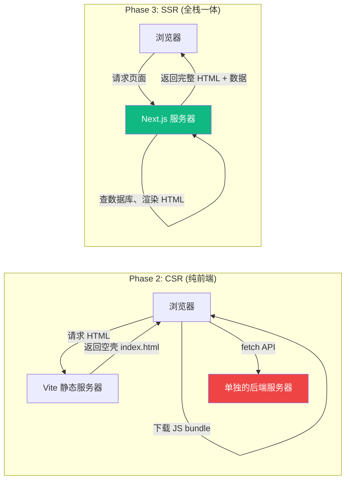
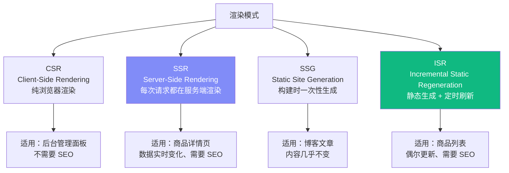
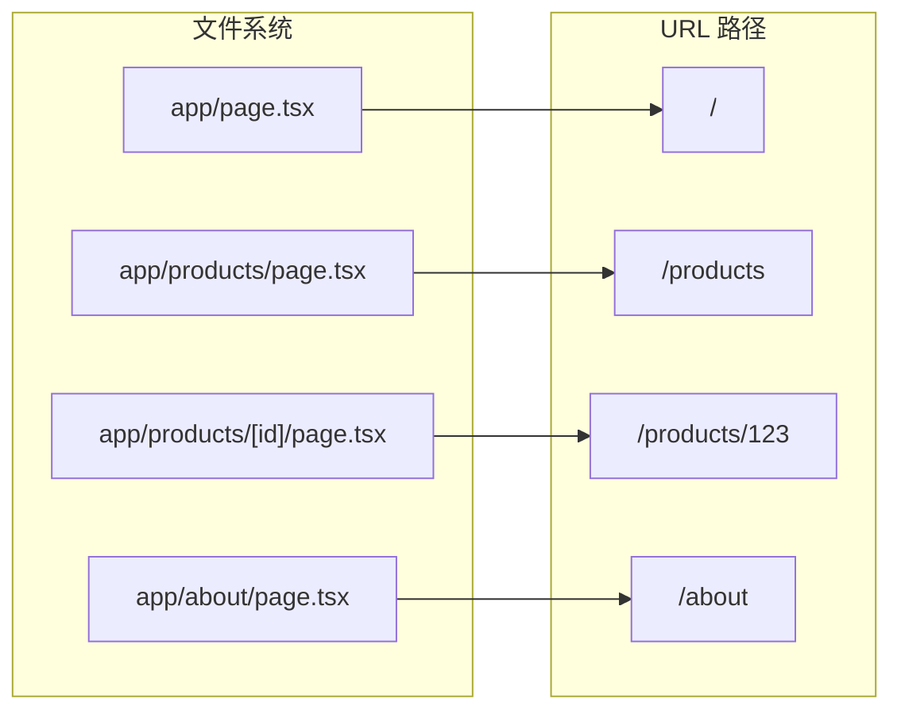
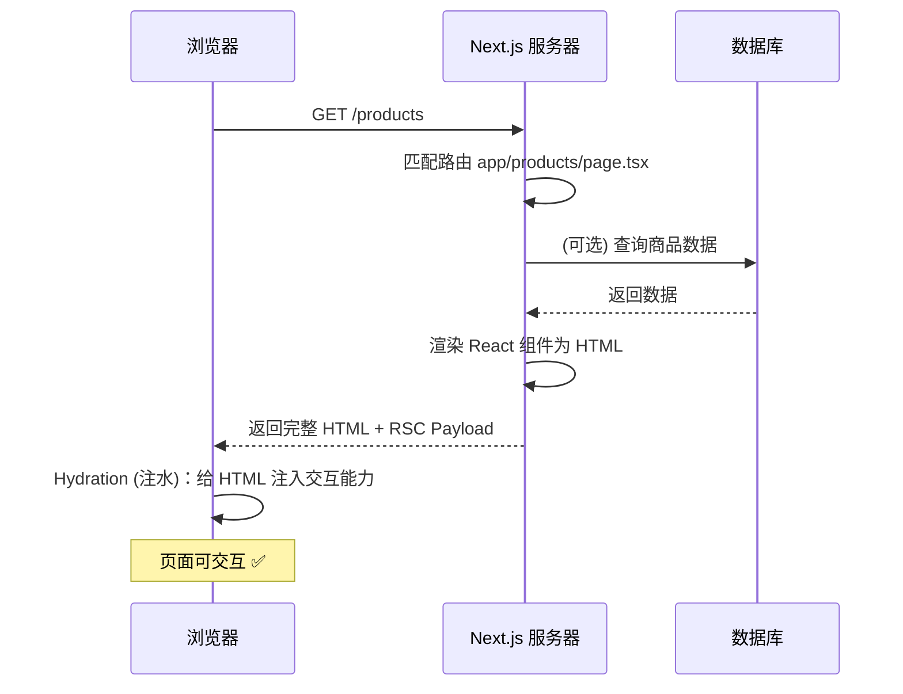

# Lesson 17：Next.js 15 项目搭建 — 进入全栈的大门

> 🎯 **本节目标**：理解 Next.js 的定位和四种渲染模式，搭建全栈电商项目骨架。
>
> 📦 **本节产出**：一个基于 Next.js 15 App Router 的全栈项目，含首页和商品列表页面。

---

## 一、为什么需要 Next.js？

在 Phase 2，我们用 Vite + React Router 搭建了一个 **纯客户端渲染 (CSR)** 的 SPA。
它有几个致命短板：

| 痛点 | CSR (Vite) | SSR (Next.js) |
|------|-----------|---------------|
| **SEO** | 搜索引擎爬虫看到空 HTML | 服务端返回完整 HTML，搜索引擎直接读 |
| **首屏速度** | 下载 JS → 执行 JS → 渲染 UI（白屏久） | 服务端渲染 HTML → 浏览器直接显示（秒开） |
| **后端 API** | 必须单独写 Node/Python 后端 | API Routes 内置，前后端一体 |
| **数据库** | 前端不能直接访问数据库 | Server Components 可直接查数据库！ |



---

## 二、四种渲染模式速览

Next.js 最强大之处：**同一个项目里，不同页面可以选择不同的渲染策略**。



| 模式 | 渲染时机 | 优点 | 缺点 |
|------|---------|------|------|
| **CSR** | 浏览器端 | 交互丰富 | SEO 差、首屏慢 |
| **SSR** | 每次请求时 | 数据最新、SEO 好 | 服务器压力大 |
| **SSG** | 构建时（`npm run build`） | 速度极快、可 CDN 缓存 | 数据不会自动更新 |
| **ISR** | 构建时 + 定时重新生成 | 兼顾速度和新鲜度 | 略有延迟 |

---

## 三、初始化项目

```bash
npx create-next-app@latest phase3-ecommerce --typescript --tailwind --eslint --app --src-dir
cd phase3-ecommerce
```

> [!NOTE]
> 我们选择了 `--app` 来启用 **App Router**（而非旧版的 Pages Router）。
> App Router 是 Next.js 13+ 的架构革新，也是 React Server Components 的官方落地载体。

### 3.1 项目结构

```
phase3-ecommerce/
├── src/
│   └── app/                    ← App Router 的核心目录
│       ├── layout.tsx          ← 根布局（等同 Phase 2 的 RootLayout）
│       ├── page.tsx            ← 首页 (/)
│       ├── globals.css         ← 全局样式
│       └── products/
│           └── page.tsx        ← 商品列表 (/products)
├── public/                     ← 静态资源
├── next.config.ts              ← Next.js 配置
├── tailwind.config.ts          ← Tailwind 配置
└── package.json
```

### 3.2 核心区别：文件即路由

在 Phase 2 里，路由需要手动在 `main.tsx` 中写 `createBrowserRouter([...])` 配置路由数组。

**Next.js App Router 使用文件系统路由——文件夹结构就是 URL 路径！**



规则很简单：
- 每个文件夹代表一段 URL
- `page.tsx` 是该路径的页面组件
- `layout.tsx` 是该路径及其子路径的共享布局
- `[id]` 方括号 = 动态路由参数（等同 React Router 中的 `:id`）

---

## 四、编写首页和商品列表

### 4.1 根布局 `app/layout.tsx`

```tsx
// src/app/layout.tsx
import type { Metadata } from 'next'
import './globals.css'

export const metadata: Metadata = {
  title: 'ShopNext — 全栈电商',
  description: '用 Next.js 15 构建的全栈电商平台',
}

export default function RootLayout({ children }: { children: React.ReactNode }) {
  return (
    <html lang="zh-CN">
      <body className="min-h-screen bg-gray-50 text-gray-900 antialiased">
        <header className="bg-white border-b border-gray-200 shadow-sm">
          <nav className="max-w-7xl mx-auto px-4 h-16 flex items-center justify-between">
            <a href="/" className="text-xl font-bold text-indigo-600">🛒 ShopNext</a>
            <div className="flex gap-6 text-sm font-medium text-gray-600">
              <a href="/products" className="hover:text-indigo-600 transition-colors">商品</a>
              <a href="/cart" className="hover:text-indigo-600 transition-colors">购物车</a>
              <a href="/login" className="hover:text-indigo-600 transition-colors">登录</a>
            </div>
          </nav>
        </header>
        <main>{children}</main>
      </body>
    </html>
  )
}
```

> [!IMPORTANT]
> **注意这里我们暂时使用了原生 `<a>` 标签。**
> 在后续课程中我们会替换为 Next.js 的 `<Link>` 组件（它和 React Router 的 `<Link>` 类似，但还支持预取 prefetch）。

### 4.2 首页 `app/page.tsx`

```tsx
// src/app/page.tsx
export default function Home() {
  return (
    <div className="max-w-7xl mx-auto px-4 py-20 text-center">
      <h1 className="text-5xl font-extrabold bg-gradient-to-r from-indigo-600 to-purple-600 bg-clip-text text-transparent">
        欢迎来到 ShopNext
      </h1>
      <p className="mt-6 text-xl text-gray-500 max-w-2xl mx-auto">
        一个用 Next.js 15 + React Server Components 构建的全栈电商平台。
      </p>
      <a 
        href="/products" 
        className="mt-8 inline-block bg-indigo-600 text-white px-8 py-3 rounded-xl font-semibold hover:bg-indigo-700 transition-colors"
      >
        浏览商品 →
      </a>
    </div>
  )
}
```

### 4.3 商品列表假数据 `app/products/page.tsx`

```tsx
// src/app/products/page.tsx

// 模拟数据（后面会替换成 Prisma 数据库查询）
const products = [
  { id: '1', name: 'React 19 实战手册', price: 99, image: '📘' },
  { id: '2', name: 'TypeScript 进阶指南', price: 129, image: '📗' },
  { id: '3', name: 'Next.js 全栈开发', price: 159, image: '📕' },
]

export default function ProductsPage() {
  return (
    <div className="max-w-7xl mx-auto px-4 py-12">
      <h1 className="text-3xl font-bold mb-8">全部商品</h1>
      <div className="grid grid-cols-1 sm:grid-cols-2 lg:grid-cols-3 gap-6">
        {products.map(product => (
          <a 
            key={product.id} 
            href={`/products/${product.id}`}
            className="group bg-white rounded-2xl border border-gray-200 overflow-hidden hover:shadow-lg transition-shadow"
          >
            <div className="h-48 bg-gray-100 flex items-center justify-center text-6xl">
              {product.image}
            </div>
            <div className="p-5">
              <h2 className="font-semibold text-lg group-hover:text-indigo-600 transition-colors">
                {product.name}
              </h2>
              <p className="mt-2 text-2xl font-bold text-indigo-600">¥{product.price}</p>
            </div>
          </a>
        ))}
      </div>
    </div>
  )
}
```

启动项目：
```bash
npm run dev
```

访问 `http://localhost:3000`，你会看到一个有渐变标题的首页。点击"浏览商品"就能看到三本书的卡片。

**右键→查看页面源代码**：你会发现 HTML 里已经包含了完整的商品数据！这在 Phase 2 的 Vite 项目中是不可能的（Vite 只会返回一个空 `<div id="root">`）。这就是 SSR 的威力。

---

## 五、🧠 深度专题：Next.js 请求生命周期



**Hydration（水合/注水）** 是 SSR 特有的概念：服务端渲染的 HTML 是"死的"（纯文本），浏览器需要重新加载 React 并"激活"事件绑定（onClick、onChange 等），这个过程叫水合。

---

## 六、约定式文件：`error.tsx` 与 `not-found.tsx`

App Router 有一套**约定式特殊文件**，自动处理加载、错误和 404 等状态：

```
src/app/products/
├── page.tsx           ← 页面组件
├── loading.tsx        ← 加载状态（见 L27）
├── error.tsx          ← 运行时错误兜底（必须是 Client Component！）
└── not-found.tsx      ← 404 页面
```

### 6.1 `error.tsx` — 路由级 ErrorBoundary

还记得 Phase 2 的 L16 中我们手写了 ErrorBoundary 类组件吗？Next.js 把这个能力内置到了文件约定中：

```tsx
// src/app/products/error.tsx
'use client'  // error.tsx 必须是 Client Component！

export default function ProductsError({
  error,
  reset,
}: {
  error: Error & { digest?: string }
  reset: () => void
}) {
  return (
    <div className="max-w-lg mx-auto px-4 py-20 text-center">
      <p className="text-6xl mb-4">😵</p>
      <h2 className="text-xl font-bold mb-2">商品页面出错了</h2>
      <p className="text-gray-500 mb-6 text-sm">{error.message}</p>
      <button onClick={reset}
        className="bg-indigo-600 text-white px-6 py-2 rounded-xl hover:bg-indigo-700">
        🔄 重试
      </button>
    </div>
  )
}
```

`reset()` 函数会**重新渲染该路由段的 Server Component**，而不是刷新整个页面。

### 6.2 `global-error.tsx` — 根级兜底

根布局 (`app/layout.tsx`) 的错误不会被 `app/error.tsx` 捕获（因为 `error.tsx` 被嵌套在 `layout.tsx` 内部）。需要 `global-error.tsx`：

```tsx
// src/app/global-error.tsx
'use client'

export default function GlobalError({
  error, reset
}: {
  error: Error; reset: () => void
}) {
  return (
    <html>
      <body className="flex items-center justify-center min-h-screen">
        <div className="text-center">
          <h1 className="text-2xl font-bold mb-4">系统错误</h1>
          <button onClick={reset} className="bg-indigo-600 text-white px-6 py-2 rounded-xl">
            重试
          </button>
        </div>
      </body>
    </html>
  )
}
```

> [!NOTE]
> `global-error.tsx` 必须自己渲染 `<html>` 和 `<body>` 标签，因为它替换了整个根布局。

---

## 七、练习

1. 创建 `app/about/page.tsx`，写一个"关于我们"页面，注意观察 URL 是否自动映射。
2. 打开浏览器的"查看源代码"，对比 Phase 2 Vite 项目的 HTML 和 Next.js 的 HTML，理解 SSR 的核心价值。

---

## 📌 本节小结

| 你做了什么 | 你学到了什么 |
|-----------|------------|
| 初始化了 Next.js 15 全栈电商项目 | Next.js 存在的意义：解决 CSR 的 SEO / 首屏 / 后端短板 |
| 创建了首页和商品列表页 | App Router 文件系统路由 |
| 查看了 SSR 返回的完整 HTML | CSR / SSR / SSG / ISR 四种渲染模式 |
| — | Hydration 水合的概念 |

---

## ➡️ 下一课

[**Lesson 18：Server Components — 颠覆认知的组件模型**](./Lesson_18.md)
