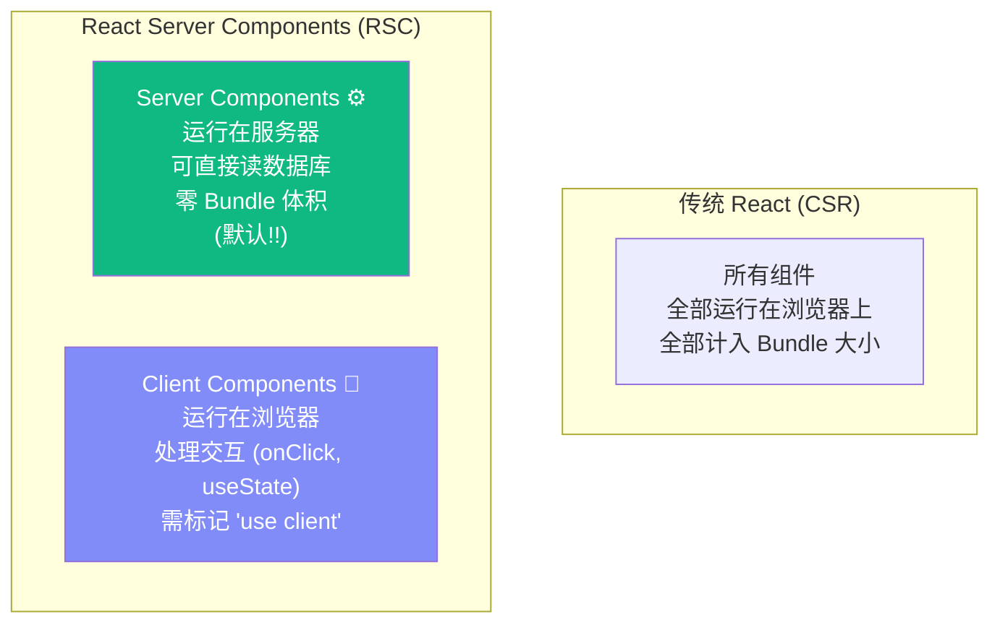
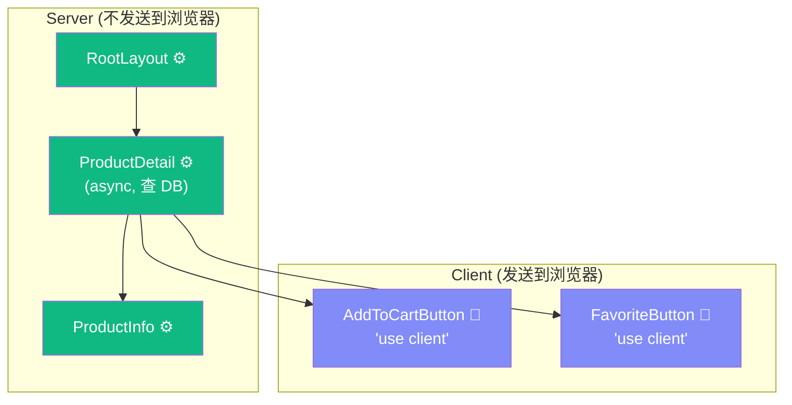
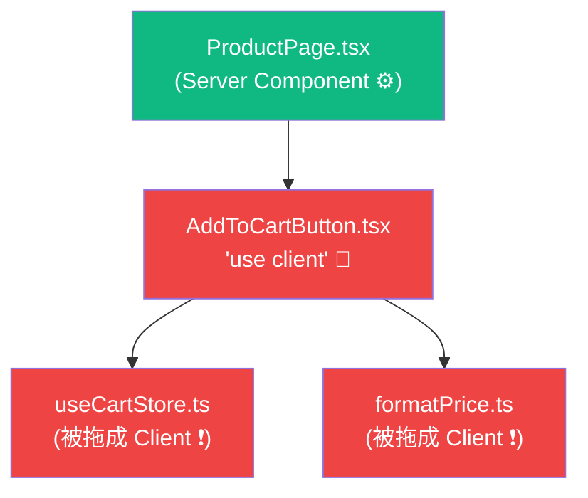
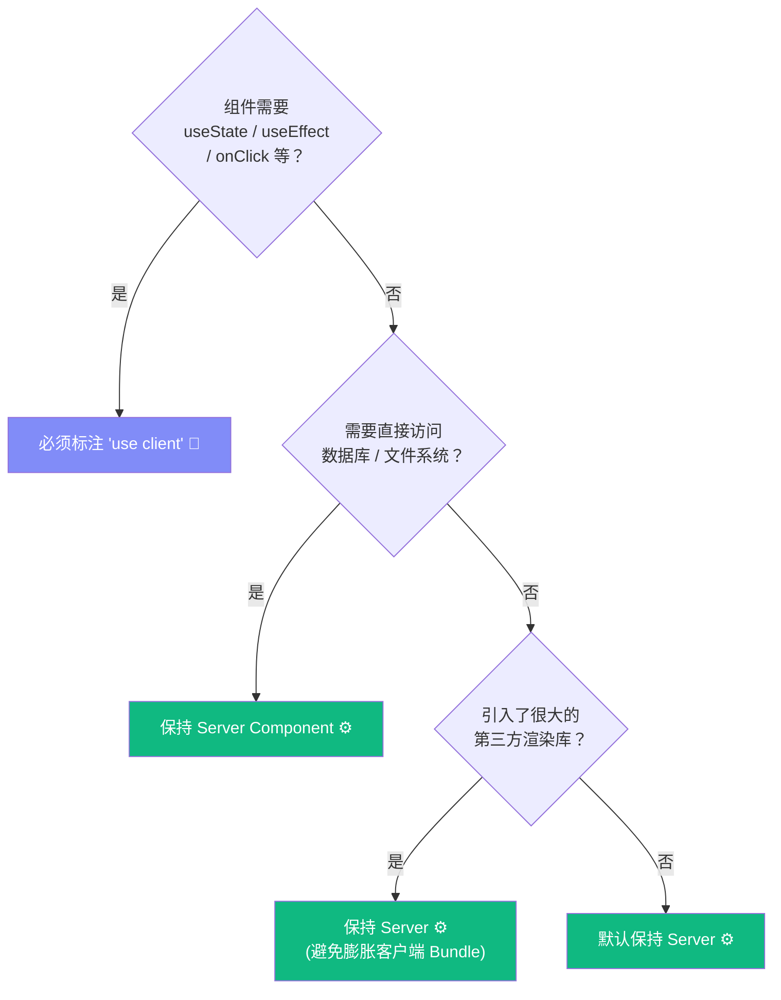

# Lesson 18：Server Components — 颠覆认知的组件模型

> 🎯 **本节目标**：深入理解 React Server Components (RSC) 的革命性架构，掌握 `"use client"` 边界的划定原则和传染性规则。
>
> 📦 **本节产出**：实现商品详情页（服务端直读数据库），并在其中嵌入客户端交互组件。

---

## 一、React Server Components 是什么？

这是 React 发展史上最大的一次架构变革。

**传统 React（包括 Phase 1 和 Phase 2 的所有代码）：** 所有组件都运行在浏览器中。
**RSC：** 组件默认运行在**服务器**上，只有你手动标记 `"use client"` 的才在浏览器执行。



### 1.1 能力差异

| 能力 | Server Component | Client Component |
|------|-----------------|-----------------|
| 直接查数据库 | ✅ `await prisma.product.findMany()` | ❌ |
| 使用 useState/useEffect | ❌ | ✅ |
| 使用事件处理 (onClick) | ❌ | ✅ |
| 发送到浏览器 JS Bundle | ❌ 零体积！ | ✅ 会计入 Bundle 大小 |
| 访问后端环境变量/密钥 | ✅ 安全（不暴露给用户） | ❌ 会泄漏！ |
| 可以是 async 函数 | ✅ `async function Page()` | ❌ |
| 读取文件系统 (fs) | ✅ | ❌ |

**核心收益：** Server Component 的代码**永远不会被发送到用户的浏览器**。
你可以在里面安全地引入 50MB 的 Markdown 解析库、读取 API 密钥——**统统不影响用户下载的 JS 包大小！**

---

## 二、实战：商品详情页

### 2.1 创建动态路由

```
src/app/products/[id]/page.tsx    ← [id] = 动态路由段
```

```tsx
// src/app/products/[id]/page.tsx
// 🚀 这是一个 Server Component（默认）—— 代码只在服务器上运行！

import { prisma } from '@/lib/prisma'
import { notFound } from 'next/navigation'
import AddToCartButton from './AddToCartButton'
import FavoriteButton from './FavoriteButton'

// Next.js 15 中 params 是 Promise
export default async function ProductDetail({ 
  params 
}: { 
  params: Promise<{ id: string }> 
}) {
  const { id } = await params
  
  // ✨ 直接在组件里查数据库！不需要 fetch，不需要 useEffect！
  const product = await prisma.product.findUnique({
    where: { id }
  })
  
  // 如果商品不存在，返回 404 页面
  if (!product) {
    notFound()
  }

  return (
    <div className="max-w-4xl mx-auto px-4 py-12">
      <div className="grid md:grid-cols-2 gap-12">
        {/* 左：图片区 */}
        <div className="bg-gray-100 rounded-2xl flex items-center justify-center text-9xl h-80">
          📦
        </div>
        
        {/* 右：信息区 (Server Component 渲染静态信息) */}
        <div>
          <span className="text-xs bg-indigo-100 text-indigo-700 px-2 py-0.5 rounded-full">
            {product.category}
          </span>
          <h1 className="text-3xl font-extrabold mt-2">{product.name}</h1>
          <p className="mt-4 text-gray-500 text-lg">{product.description}</p>
          <p className="mt-6 text-4xl font-bold text-indigo-600">¥{product.price}</p>
          <p className="mt-2 text-sm text-gray-400">库存：{product.stock} 件</p>
          
          {/* 交互区 —— 必须是 Client Component！ */}
          <div className="mt-8 flex gap-3">
            <AddToCartButton 
              productId={product.id}
              name={product.name}
              price={product.price}
            />
            <FavoriteButton productId={product.id} />
          </div>
        </div>
      </div>
    </div>
  )
}
```

### 2.2 划出 Client 边界

```tsx
// src/app/products/[id]/AddToCartButton.tsx
'use client'  // ← 这一行咒语，把该组件"送到浏览器"

import { useState } from 'react'
import { useCartStore } from '@/store/useCartStore'

export default function AddToCartButton({ 
  productId, name, price 
}: { 
  productId: string; name: string; price: number 
}) {
  const [added, setAdded] = useState(false)
  const addItem = useCartStore(state => state.addItem)

  const handleClick = () => {
    addItem({ id: productId, name, price })
    setAdded(true)
    setTimeout(() => setAdded(false), 2000)
  }

  return (
    <button 
      onClick={handleClick}
      className={`flex-1 py-3 rounded-xl font-bold text-lg transition-all ${
        added 
          ? 'bg-green-500 text-white scale-95' 
          : 'bg-indigo-600 text-white hover:bg-indigo-700'
      }`}
    >
      {added ? '✅ 已加入' : '🛒 加入购物车'}
    </button>
  )
}
```

```tsx
// src/app/products/[id]/FavoriteButton.tsx
'use client'

import { useState } from 'react'

export default function FavoriteButton({ productId }: { productId: string }) {
  const [isFav, setIsFav] = useState(false)

  return (
    <button 
      onClick={() => setIsFav(!isFav)}
      className={`w-12 h-12 rounded-xl border-2 text-xl transition-all ${
        isFav ? 'border-red-300 bg-red-50' : 'border-gray-200 hover:bg-gray-50'
      }`}
    >
      {isFav ? '❤️' : '🤍'}
    </button>
  )
}
```

---

## 三、🧠 深度专题：RSC 架构的关键规则

### 3.1 组件树的"Server/Client 切割"



### 3.2 ⚠️ `"use client"` 的传染性

这是新手最容易踩的坑：**一旦一个文件标记了 `"use client"`，它 `import` 的所有模块也会被视为客户端代码，被打包进浏览器 Bundle！**



**这意味着：** 如果你不小心在一个大型的 `"use client"` 文件里 `import` 了一个很大的纯工具库，这个库会被发送到浏览器，即使用户根本用不到！

**最佳实践：** 把 `"use client"` 尽量下推到组件树的**叶子节点**（最小的交互单元）。

```tsx
// ❌ 不好：整个页面都变成 Client（原本能在服务端完成的查询也被拖到客户端了）
'use client'
export default function ProductPage() { 
  // prisma.product.findUnique 不能在客户端调用！
}

// ✅ 好：只把需要交互的小按钮标记为 Client
// page.tsx (Server Component，可以查 DB)
// ├── ProductInfo.tsx (Server Component，纯展示)
// ├── AddToCartButton.tsx ('use client'，只有按钮交互)
// └── FavoriteButton.tsx ('use client'，只有按钮交互)
```

### 3.3 数据从 Server 流向 Client 的序列化约束

Server Component 可以通过 **Props** 传数据给 Client Component。
但这些数据必须是**可序列化**的（能被 `JSON.stringify` 处理）：

```tsx
// ✅ 可以传的：原始类型和 Plain Objects
<AddToCartButton 
  productId="123"          // string ✅
  price={99}               // number ✅
  tags={['book', 'tech']}  // array ✅
  metadata={{ weight: 0.5 }} // plain object ✅
/>

// ❌ 不可以传的：
<AddToCartButton 
  onAdd={() => {}}         // ❌ 函数不能序列化
  product={productInstance} // ❌ 类实例不能序列化
  ref={myRef}              // ❌ Ref 不能序列化
  createdAt={new Date()}   // ⚠️ Date 对象需要先转字符串！
/>
```

> [!WARNING]
> **Date 对象的陷阱：** Prisma 返回的日期字段是 `Date` 对象，直接传给 Client Component 会报错。你需要先转换：
> ```tsx
> <ClientComponent createdAt={product.createdAt.toISOString()} />
> ```

### 3.4 边界划定决策图



---

## 四、练习

1. 在商品详情页底部添加一个"相关商品推荐"区域。使用 Prisma 查询同分类的其他商品，用 Server Component 渲染。
2. 尝试在 Server Component 里写 `useState`，观察 Next.js 给出的错误信息并记住它。
3. 将商品的 `createdAt` 日期传递给一个 Client Component 显示"上架时间：X天前"，注意处理 Date 序列化。

---

## 📌 本节小结

| 你做了什么 | 你学到了什么 |
|-----------|------------|
| 创建了 Server Component 商品详情页 | RSC 默认在服务端运行，可以 `async` |
| 使用 Prisma 在组件中直接查数据库 | 无需 API 层，无需 useEffect |
| 划出了 `"use client"` 的交互按钮 | Client Component 的标记规则 |
| — | `"use client"` 的传染性：import 链条全部变 Client |
| — | 数据从 Server → Client 必须可序列化（注意 Date!) |

---

## ➡️ 下一课

[**Lesson 19：数据库设计 — Prisma ORM 建模与迁移**](./Lesson_19.md)
