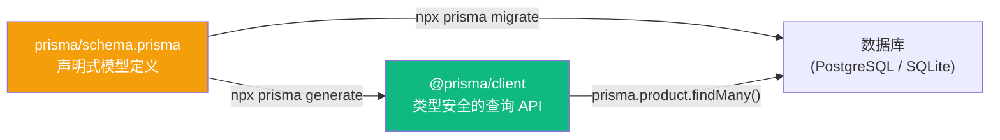
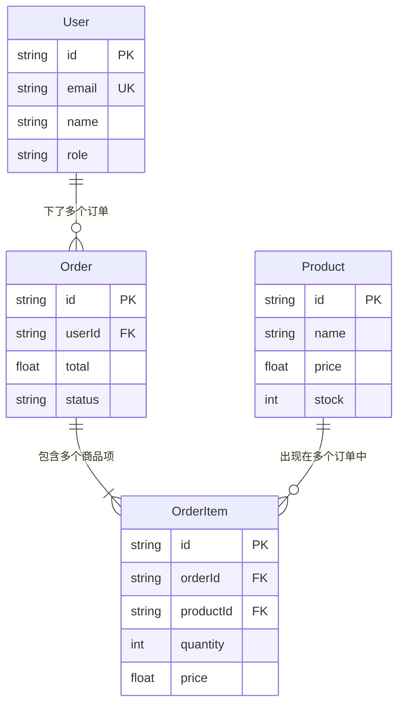
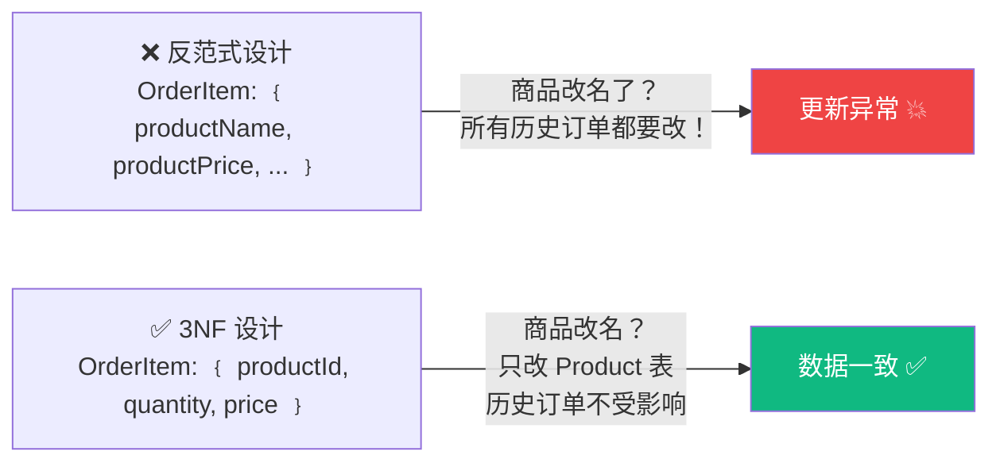

# Lesson 19：数据库设计 — Prisma ORM 建模与迁移

> 🎯 **本节目标**：用 Prisma 设计电商数据模型，连接真实数据库，告别硬编码假数据。
>
> 📦 **本节产出**：完整的数据库 Schema（用户、商品、订单），并在商品列表页从数据库读取真实数据。


## 一、Prisma 是什么？

在传统的全栈开发中，你需要手写 SQL 语句来和数据库打交道。这很痛苦：
- 拼接 SQL 字符串容易出错（还可能被 SQL 注入攻击）
- 没有类型提示
- 数据库结构变了，代码中满地找 SQL 改

**Prisma 是一个 Node.js / TypeScript 的 ORM（对象关系映射）**。它让你：
1. 用一种声明式语言描述数据库结构（Schema）
2. 自动生成类型安全的 TypeScript 客户端
3. 用链式 API 代替手写 SQL



---

## 二、安装与初始化

```bash
npm install prisma @prisma/client
npx prisma init --datasource-provider sqlite
```

> [!TIP]
> 我们在本地开发阶段使用 **SQLite**（零配置，数据存在一个本地文件里）。部署上线时再换成 PostgreSQL。Prisma 的巨大优势之一就是：**切换数据库只需改一行配置**。

初始化后项目中多出：
```
prisma/
└── schema.prisma     ← 数据模型定义文件
.env                  ← 数据库连接字符串
```

---

## 三、设计数据模型

编辑 `prisma/schema.prisma`：

```prisma
// prisma/schema.prisma
generator client {
  provider = "prisma-client-js"
}

datasource db {
  provider = "sqlite"
  url      = env("DATABASE_URL")
}

// 用户表
model User {
  id        String   @id @default(cuid())
  email     String   @unique
  name      String?
  password  String
  role      String   @default("customer")  // "customer" | "admin"
  orders    Order[]
  createdAt DateTime @default(now())
}

// 商品表
model Product {
  id          String   @id @default(cuid())
  name        String
  description String?
  price       Float
  image       String?
  category    String   @default("general")
  stock       Int      @default(0)
  orderItems  OrderItem[]
  createdAt   DateTime @default(now())
  updatedAt   DateTime @updatedAt
}

// 订单表
model Order {
  id         String      @id @default(cuid())
  userId     String
  user       User        @relation(fields: [userId], references: [id])
  items      OrderItem[]
  total      Float
  status     String      @default("pending")  // pending | paid | shipped | completed
  createdAt  DateTime    @default(now())
}

// 订单-商品 多对多关联表
model OrderItem {
  id        String  @id @default(cuid())
  orderId   String
  order     Order   @relation(fields: [orderId], references: [id])
  productId String
  product   Product @relation(fields: [productId], references: [id])
  quantity  Int
  price     Float   // 下单时的快照价格
}
```

### 3.1 关系图解



---

## 四、执行迁移与数据填充

### 4.1 创建数据库

```bash
npx prisma migrate dev --name init
```

这条命令会：
1. 根据 Schema 生成 SQL 创建所有的表
2. 在 `prisma/migrations/` 目录下记录版本历史
3. 自动执行 `prisma generate` 生成类型化客户端

### 4.2 填充测试数据 (Seed)

创建 `prisma/seed.ts`：

```ts
// prisma/seed.ts
import { PrismaClient } from '@prisma/client'

const prisma = new PrismaClient()

async function main() {
  // 清空旧数据
  await prisma.orderItem.deleteMany()
  await prisma.order.deleteMany()
  await prisma.product.deleteMany()
  await prisma.user.deleteMany()

  // 插入商品
  await prisma.product.createMany({
    data: [
      { name: 'React 19 实战手册', price: 99, description: '从零到精通的完整指南', category: 'book', stock: 100, image: '/images/react-book.jpg' },
      { name: 'TypeScript 进阶指南', price: 129, description: '类型体操与工程实践', category: 'book', stock: 50, image: '/images/ts-book.jpg' },
      { name: 'Next.js 全栈开发', price: 159, description: 'App Router 深度解析', category: 'book', stock: 80, image: '/images/next-book.jpg' },
      { name: '机械键盘 Pro', price: 599, description: '87键 茶轴 RGB', category: 'electronics', stock: 30, image: '/images/keyboard.jpg' },
      { name: '程序员 T 恤', price: 79, description: '100% 纯棉 黑色', category: 'clothing', stock: 200, image: '/images/tshirt.jpg' },
    ],
  })

  console.log('✅ 种子数据已填充!')
}

main()
  .catch(console.error)
  .finally(() => prisma.$disconnect())
```

在 `package.json` 中添加：
```json
"prisma": {
  "seed": "npx tsx prisma/seed.ts"
}
```

```bash
npm install -D tsx        # 用来运行 .ts 的 seed 脚本
npx prisma db seed        # 执行填充
```

---

## 五、在 Server Component 中查询数据库

### 5.1 创建 Prisma 客户端单例

```ts
// src/lib/prisma.ts
import { PrismaClient } from '@prisma/client'

const globalForPrisma = globalThis as unknown as { prisma: PrismaClient }

export const prisma = globalForPrisma.prisma || new PrismaClient()

if (process.env.NODE_ENV !== 'production') {
  globalForPrisma.prisma = prisma
}
```

> [!WARNING]
> **为什么需要单例？** Next.js 开发模式下热重载会反复执行模块，如果每次都 `new PrismaClient()` 会耗尽数据库连接。这个单例模式是 Prisma + Next.js 的标准写法。

### 5.2 改造商品列表页

```tsx
// src/app/products/page.tsx
import { prisma } from '@/lib/prisma'
import Link from 'next/link'

export default async function ProductsPage() {
  // 🎉 直接在 Server Component 里查询数据库！
  const products = await prisma.product.findMany({
    orderBy: { createdAt: 'desc' }
  })

  return (
    <div className="max-w-7xl mx-auto px-4 py-12">
      <h1 className="text-3xl font-bold mb-8">全部商品 ({products.length})</h1>
      <div className="grid grid-cols-1 sm:grid-cols-2 lg:grid-cols-3 gap-6">
        {products.map(product => (
          <Link 
            key={product.id}
            href={`/products/${product.id}`}
            className="group bg-white rounded-2xl border border-gray-200 overflow-hidden hover:shadow-lg transition-shadow"
          >
            <div className="h-48 bg-gray-100 flex items-center justify-center text-5xl">
              📦
            </div>
            <div className="p-5">
              <h2 className="font-semibold text-lg group-hover:text-indigo-600 transition-colors">
                {product.name}
              </h2>
              <p className="mt-1 text-sm text-gray-500">{product.description}</p>
              <p className="mt-3 text-2xl font-bold text-indigo-600">¥{product.price}</p>
            </div>
          </Link>
        ))}
      </div>
    </div>
  )
}
```

**注意看这段代码有多惊人：**
- 没有 `useEffect`
- 没有 `useState`
- 没有 `fetch`
- 没有 Loading 状态管理
- **直接 `await prisma.product.findMany()`——因为我们在服务器上运行！**

---

## 六、🧠 深度专题：数据库范式与索引

### 6.1 为什么 OrderItem 要记录 `price`？

注意我们的 `OrderItem` 有 `price` 字段，即使 `Product` 已经有了。
这叫 **价格快照**：商品价格可能随时变，但订单里的价格必须是下单那一刻的价格。这是电商系统的铁律设计。

### 6.2 数据库范式 (Normal Forms)

范式是数据库设计中减少数据冗余、避免更新异常的规则：

| 范式 | 要求 | 通俗理解 |
|------|------|---------|
| **1NF** | 每个字段只存一个值 | ❌ `tags: "React,TypeScript"` → ✅ 拆成关联表 |
| **2NF** | 非主键字段必须完全依赖主键 | 订单项的商品名不应存在 OrderItem 中（它依赖 productId，不是 orderId） |
| **3NF** | 非主键字段之间不能互相依赖 | 如果存了 `price` 和 `quantity`，就不该再存 `subtotal`（因为 subtotal = price × quantity） |



> [!TIP]
> **何时"反范式" (Denormalization)？**
> 上面 OrderItem 中的 `price` 字段看似违反了 3NF（"不是已经存在 Product 里了吗？"），但这是**故意的冗余**——价格快照。
> 在高读取、低写入的场景中（如商品列表页），适度反范式可以减少 JOIN 查询，提升性能。

### 6.3 索引 (Index) — 给数据库加"目录"

当数据量达到几十万，`WHERE email = '...'` 会遍历全表（全表扫描）。添加索引就像给字典加目录：

```prisma
model User {
  email String @unique  // @unique 自动创建唯一索引
}

model Product {
  category String
  price    Float
  
  @@index([category])              // 单字段索引：按分类查询加速
  @@index([category, price])       // 复合索引：按分类 + 价格排序双重加速
}

model Order {
  userId    String
  createdAt DateTime @default(now())
  
  @@index([userId, createdAt])     // 查某用户的最近订单
}
```

**复合索引的顺序很重要（最左前缀原则）：**
- `@@index([category, price])` 可以加速 `WHERE category = 'book'`
- 也可以加速 `WHERE category = 'book' AND price < 100`
- 但**不能**加速单独的 `WHERE price < 100`（因为 price 不在最左边）

---

## 七、练习

1. 打开 `npx prisma studio`（Prisma 自带的数据库可视化管理界面），浏览和编辑你刚才填充的数据。
2. 修改商品详情页 `app/products/[id]/page.tsx`，把硬编码数据改成 `prisma.product.findUnique({ where: { id } })`。

---

## 📌 本节小结

| 你做了什么 | 你学到了什么 |
|-----------|------------|
| 用 Prisma Schema 定义了完整的电商数据模型 | ORM 的概念和 Prisma 的声明式建模 |
| 执行了数据库迁移和数据填充 | `prisma migrate` + `prisma db seed` |
| 在 Server Component 里直接查询了数据库 | 无需 API 层、无需 useEffect！ |
| — | 数据库设计中的价格快照和索引知识 |
