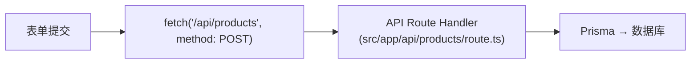
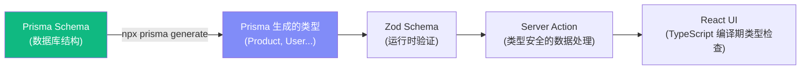

# Lesson 20：Server Actions — 全栈 CRUD 与表单处理

> 🎯 **本节目标**：使用 Next.js Server Actions 实现无需 API 路由的全栈数据操作，掌握错误处理、缓存刷新和 React 19 的 `useActionState` Hook。
>
> 📦 **本节产出**：商品管理后台（增/删/改），带有表单验证、错误提示和乐观更新。


## 一、什么是 Server Actions？

在传统的全栈开发中，前端和后端的通信链路是这样的：



Server Actions 把这条链路**压缩成一步**：

```mermaid
flowchart LR
    Form["<form action=﹛serverAction﹜>"] --> DB["直接执行服务端代码<br/>→ Prisma → 数据库"]
```



---

## 二、创建 Server Actions

```ts
// src/app/admin/products/actions.ts
'use server'  // ← 宣告此文件的所有导出函数都是 Server Actions

import { prisma } from '@/lib/prisma'
import { revalidatePath } from 'next/cache'
import { redirect } from 'next/navigation'
import { z } from 'zod'

// 用 Zod 定义验证规则
const ProductSchema = z.object({
  name: z.string().min(1, '商品名称不能为空').max(100),
  description: z.string().optional(),
  price: z.coerce.number().positive('价格必须大于 0'),
  category: z.string().min(1, '请选择分类'),
  stock: z.coerce.number().int().min(0, '库存不能为负数'),
})

// =================== 创建商品 ===================
export async function createProduct(prevState: any, formData: FormData) {
  // 1. 校验数据
  const raw = {
    name: formData.get('name'),
    description: formData.get('description'),
    price: formData.get('price'),
    category: formData.get('category'),
    stock: formData.get('stock'),
  }

  const parsed = ProductSchema.safeParse(raw)
  
  if (!parsed.success) {
    // 返回友好的错误信息给前端（而不是 throw！）
    return {
      errors: parsed.error.flatten().fieldErrors,
      message: '表单校验失败',
    }
  }

  // 2. 写入数据库
  try {
    await prisma.product.create({ data: parsed.data })
  } catch (error) {
    return { message: '创建商品失败，请重试' }
  }

  // 3. 清除缓存 + 重定向
  revalidatePath('/admin/products')
  revalidatePath('/products')
  redirect('/admin/products')
}

// =================== 删除商品 ===================
export async function deleteProduct(productId: string) {
  try {
    await prisma.product.delete({ where: { id: productId } })
  } catch (error) {
    return { message: '删除失败' }
  }
  
  revalidatePath('/admin/products')
  revalidatePath('/products')
}

// =================== 更新商品 ===================
export async function updateProduct(productId: string, prevState: any, formData: FormData) {
  const raw = {
    name: formData.get('name'),
    price: formData.get('price'),
    category: formData.get('category'),
    stock: formData.get('stock'),
    description: formData.get('description'),
  }

  const parsed = ProductSchema.safeParse(raw)
  if (!parsed.success) {
    return { errors: parsed.error.flatten().fieldErrors }
  }

  try {
    await prisma.product.update({ where: { id: productId }, data: parsed.data })
  } catch (error) {
    return { message: '更新失败' }
  }

  revalidatePath('/admin/products')
  revalidatePath('/products')
  redirect('/admin/products')
}
```

> [!IMPORTANT]
> **Server Actions 的错误处理最佳实践：**
> - 业务可预期错误（如表单校验失败、库存不足）优先 `return` 结构化结果
> - 不可恢复的异常（如数据库连接中断）可以 `throw`，交给错误边界兜底
> - 前端组件根据返回值显示可操作的友好提示

---

## 三、React 19 `useActionState` — 管理表单状态

```tsx
// src/app/admin/products/new/page.tsx
'use client'

import { useActionState } from 'react'
import { createProduct } from '../actions'

export default function NewProductPage() {
  // useActionState 替代了之前的 useFormState
  // 参数：(action函数, 初始state)
  // 返回：[当前state, 包装后的action, 是否pending]
  const [state, action, isPending] = useActionState(createProduct, null)

  return (
    <div className="max-w-2xl mx-auto px-4 py-12">
      <h1 className="text-2xl font-bold mb-8">新增商品</h1>
      
      {/* 全局错误提示 */}
      {state?.message && (
        <div className="bg-red-50 text-red-600 p-4 rounded-xl mb-6 text-sm">
          ⚠️ {state.message}
        </div>
      )}

      <form action={action} className="space-y-6">
        <div>
          <label className="block text-sm font-medium text-gray-700 mb-1">商品名称</label>
          <input name="name" required
            className="w-full border rounded-xl px-4 py-3 focus:ring-2 focus:ring-indigo-500" />
          {/* 字段级错误提示 */}
          {state?.errors?.name && (
            <p className="text-red-500 text-xs mt-1">{state.errors.name[0]}</p>
          )}
        </div>

        <div>
          <label className="block text-sm font-medium text-gray-700 mb-1">价格 (元)</label>
          <input name="price" type="number" step="0.01" required
            className="w-full border rounded-xl px-4 py-3" />
          {state?.errors?.price && (
            <p className="text-red-500 text-xs mt-1">{state.errors.price[0]}</p>
          )}
        </div>

        <div>
          <label className="block text-sm font-medium text-gray-700 mb-1">分类</label>
          <select name="category" required 
            className="w-full border rounded-xl px-4 py-3">
            <option value="">选择分类</option>
            <option value="book">📚 图书</option>
            <option value="electronics">💻 电子</option>
            <option value="clothing">👕 服饰</option>
          </select>
          {state?.errors?.category && (
            <p className="text-red-500 text-xs mt-1">{state.errors.category[0]}</p>
          )}
        </div>

        <div>
          <label className="block text-sm font-medium text-gray-700 mb-1">库存</label>
          <input name="stock" type="number" required defaultValue={0}
            className="w-full border rounded-xl px-4 py-3" />
        </div>

        <div>
          <label className="block text-sm font-medium text-gray-700 mb-1">描述</label>
          <textarea name="description" rows={3}
            className="w-full border rounded-xl px-4 py-3" />
        </div>

        <button type="submit" disabled={isPending}
          className="w-full bg-indigo-600 text-white py-3 rounded-xl font-bold hover:bg-indigo-700 disabled:opacity-50 transition-colors">
          {isPending ? '⏳ 创建中...' : '创建商品'}
        </button>
      </form>
    </div>
  )
}
```

---

## 四、`useFormStatus` — 让提交按钮自动感知表单状态

在上面的代码中，我们通过 `useActionState` 返回的 `isPending` 来禁用提交按钮。但如果提交按钮是一个独立的可复用组件，你就需要把 `isPending` 作为 prop 传进去。

React 19 提供了 `useFormStatus`，让你在**不传 prop** 的情况下，在任何表单子组件内部获取表单状态：

```tsx
// src/components/SubmitButton.tsx
'use client'
import { useFormStatus } from 'react-dom'

export function SubmitButton({ children }: { children: React.ReactNode }) {
  // 会自动找到最近的祖先 <form> 的提交状态！
  const { pending } = useFormStatus()

  return (
    <button type="submit" disabled={pending}
      className="w-full bg-indigo-600 text-white py-3 rounded-xl font-bold 
                 hover:bg-indigo-700 disabled:opacity-50 transition-colors">
      {pending ? '⏳ 提交中...' : children}
    </button>
  )
}
```

使用时，只需把它放在 `<form>` 内部即可：

```tsx
<form action={action} className="space-y-6">
  {/* ...其他表单字段... */}
  <SubmitButton>创建商品</SubmitButton>  {/* 不需要传 isPending！ */}
</form>
```

> [!IMPORTANT]
> **`useFormStatus` 必须在 `<form>` 的子组件中使用。** 如果你在包含 `<form>` 的同一个组件里调用它，它会找不到表单上下文。必须抽成子组件！

---

## 五、商品管理列表页（Server Component）

```tsx
// src/app/admin/products/page.tsx
import { prisma } from '@/lib/prisma'
import { deleteProduct } from './actions'
import Link from 'next/link'

export default async function AdminProductsPage() {
  const products = await prisma.product.findMany({
    orderBy: { createdAt: 'desc' }
  })

  return (
    <div className="max-w-5xl mx-auto px-4 py-12">
      <div className="flex justify-between items-center mb-8">
        <h1 className="text-2xl font-bold">商品管理</h1>
        <Link href="/admin/products/new" 
          className="bg-indigo-600 text-white px-4 py-2 rounded-xl hover:bg-indigo-700">
          + 新增商品
        </Link>
      </div>

      <div className="bg-white rounded-xl border overflow-hidden">
        <table className="w-full">
          <thead className="bg-gray-50 text-sm text-gray-500">
            <tr>
              <th className="text-left p-4">商品名</th>
              <th className="text-left p-4">分类</th>
              <th className="text-right p-4">价格</th>
              <th className="text-right p-4">库存</th>
              <th className="text-right p-4">操作</th>
            </tr>
          </thead>
          <tbody className="divide-y">
            {products.map(product => (
              <tr key={product.id} className="hover:bg-gray-50">
                <td className="p-4 font-medium">{product.name}</td>
                <td className="p-4 text-sm text-gray-500">{product.category}</td>
                <td className="p-4 text-right">¥{product.price}</td>
                <td className="p-4 text-right">{product.stock}</td>
                <td className="p-4 text-right">
                  <form action={async () => {
                    'use server'
                    await deleteProduct(product.id)
                  }}>
                    <button type="submit" className="text-red-500 text-sm hover:underline">
                      删除
                    </button>
                  </form>
                </td>
              </tr>
            ))}
          </tbody>
        </table>
      </div>
    </div>
  )
}
```

---

## 六、🧠 深度专题：全栈类型安全

Server Actions 的一大优势是你可以共享类型。从 Prisma Schema → Zod 验证 → 前端表单，**一条类型链贯穿全栈**：



你甚至可以从 Prisma 类型自动推导 Zod schema：
```bash
npm install zod-prisma-types  # 自动生成 Zod schema
```

---

## 七、`revalidatePath` vs `revalidateTag` — 缓存刷新策略

```tsx
// 方式 1: 按路径刷新（简单粗暴，最常用）
revalidatePath('/products')          // 刷新商品列表页的缓存
revalidatePath('/products/[id]')     // 刷新所有商品详情页

// 方式 2: 按标签刷新（精细控制）
// 在 fetch 或 unstable_cache 中给数据打标签：
const products = await prisma.product.findMany()
// 使用 unstable_cache 打标签
const getCachedProducts = unstable_cache(
  () => prisma.product.findMany(),
  ['products'],
  { tags: ['products'] }
)

// 在 Server Action 中按标签刷新
import { revalidateTag } from 'next/cache'
revalidateTag('products')  // 只刷新打了 'products' 标签的缓存
```

---

## 八、练习

1. 在删除商品时添加确认弹窗（使用 Lesson 13 学过的 `Dialog` 组件）。
2. 实现商品编辑页面 `/admin/products/[id]/edit`，使用 `updateProduct` Action。
3. 使用 `useOptimistic`（Lesson 15）让删除操作变成乐观更新——点击删除后立即从列表中移除。

---

## 📌 本节小结

| 你做了什么 | 你学到了什么 |
|-----------|------------|
| 创建了增删改的 Server Actions | `"use server"` 声明 + Zod 验证 |
| 实现了带错误提示的表单页面 | `useActionState` + field-level errors |
| 构建了商品管理后台列表 | Server Component 直接查 DB + 行内 Action |
| — | `revalidatePath` vs `revalidateTag` 缓存刷新 |
| — | 全栈类型安全链路：Prisma → Zod → Action → UI |
