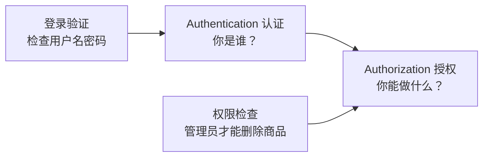
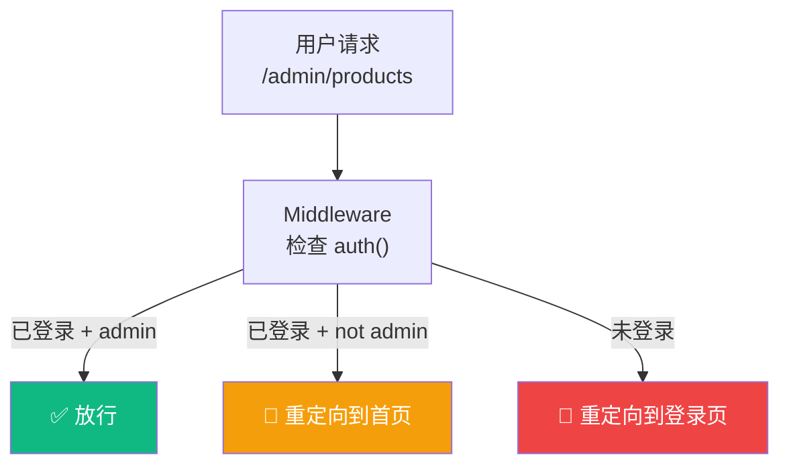
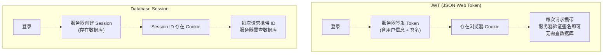

# Lesson 21：用户认证 — NextAuth.js v5 登录体系

> 🎯 **本节目标**：为电商平台搭建完整的用户认证系统，包括注册、登录、OAuth 社交登录和路由守卫。
>
> 📦 **本节产出**：带有注册/登录页面、Middleware 路由保护和角色权限检查的安全认证系统。

---

## 一、认证 (Authentication) vs 授权 (Authorization)



---

## 二、安装 NextAuth.js v5

```bash
npm install next-auth@beta @auth/prisma-adapter bcryptjs
npm install -D @types/bcryptjs
```

### 2.1 扩展 Prisma Schema

NextAuth 的 Prisma Adapter 需要额外的数据库表来存储 OAuth 账户和会话：

```prisma
// prisma/schema.prisma — 在原有 User 模型基础上补充

model User {
  id            String    @id @default(cuid())
  email         String    @unique
  emailVerified DateTime?
  name          String?
  password      String?   // OAuth 用户不需要密码，改为可选
  image         String?
  role          String    @default("customer")
  accounts      Account[]
  sessions      Session[]
  orders        Order[]
  createdAt     DateTime  @default(now())
}

// OAuth 第三方账户关联表
model Account {
  id                String  @id @default(cuid())
  userId            String
  type              String
  provider          String
  providerAccountId String
  refresh_token     String?
  access_token      String?
  expires_at        Int?
  token_type        String?
  scope             String?
  id_token          String?
  session_state     String?
  user              User    @relation(fields: [userId], references: [id], onDelete: Cascade)
  
  @@unique([provider, providerAccountId])
}

// 数据库 Session 表（使用 JWT 策略时可选）
model Session {
  id           String   @id @default(cuid())
  sessionToken String   @unique
  userId       String
  expires      DateTime
  user         User     @relation(fields: [userId], references: [id], onDelete: Cascade)
}
```

运行迁移更新数据库：
```bash
npx prisma migrate dev --name add-auth-tables
```

### 2.2 配置 Auth

```ts
// src/lib/auth.ts
import NextAuth from "next-auth"
import Credentials from "next-auth/providers/credentials"
import GitHub from "next-auth/providers/github"
import { PrismaAdapter } from "@auth/prisma-adapter"
import { prisma } from "./prisma"
import bcrypt from "bcryptjs"

export const { handlers, auth, signIn, signOut } = NextAuth({
  adapter: PrismaAdapter(prisma),
  providers: [
    // 方式1：GitHub OAuth 登录
    GitHub({
      clientId: process.env.GITHUB_ID!,
      clientSecret: process.env.GITHUB_SECRET!,
    }),
    
    // 方式2：邮箱 + 密码登录
    Credentials({
      credentials: {
        email: { label: "邮箱", type: "email" },
        password: { label: "密码", type: "password" },
      },
      async authorize(credentials) {
        if (!credentials?.email || !credentials?.password) return null
        
        const user = await prisma.user.findUnique({
          where: { email: credentials.email as string }
        })
        if (!user || !user.password) return null
        
        const isValid = await bcrypt.compare(
          credentials.password as string, 
          user.password
        )
        if (!isValid) return null
        
        return { id: user.id, email: user.email, name: user.name, role: user.role }
      }
    })
  ],
  pages: {
    signIn: '/login',
  },
  session: { strategy: "jwt" },
  callbacks: {
    // 把 role 信息注入到 JWT 和 Session 中
    async jwt({ token, user }) {
      if (user) token.role = (user as any).role
      return token
    },
    async session({ session, token }) {
      if (session.user) {
        session.user.id = token.sub!
        ;(session.user as any).role = token.role
      }
      return session
    }
  }
})
```

### 2.3 挂载 API 路由

```ts
// src/app/api/auth/[...nextauth]/route.ts
import { handlers } from "@/lib/auth"
export const { GET, POST } = handlers
```

---

## 三、用户注册

```ts
// src/app/register/actions.ts
'use server'

import { prisma } from '@/lib/prisma'
import bcrypt from 'bcryptjs'
import { redirect } from 'next/navigation'

export async function registerUser(prevState: any, formData: FormData) {
  const email = formData.get('email') as string
  const password = formData.get('password') as string
  const name = formData.get('name') as string

  // 检查邮箱是否已存在
  const existing = await prisma.user.findUnique({ where: { email } })
  if (existing) {
    return { error: '该邮箱已被注册' }
  }

  // 密码加密（永远不要存明文密码！）
  const hashedPassword = await bcrypt.hash(password, 12)

  await prisma.user.create({
    data: { email, name, password: hashedPassword }
  })

  redirect('/login?registered=true')
}
```

```tsx
// src/app/register/page.tsx
'use client'

import { useActionState } from 'react'
import { registerUser } from './actions'

export default function RegisterPage() {
  const [state, action, isPending] = useActionState(registerUser, null)

  return (
    <div className="max-w-md mx-auto px-4 py-20">
      <h1 className="text-2xl font-bold text-center mb-8">注册 ShopNext</h1>
      
      {state?.error && (
        <div className="bg-red-50 text-red-600 p-3 rounded-xl mb-4 text-sm">
          {state.error}
        </div>
      )}

      <form action={action} className="space-y-4">
        <input name="name" placeholder="昵称" required
          className="w-full border rounded-xl px-4 py-3" />
        <input name="email" type="email" placeholder="邮箱" required
          className="w-full border rounded-xl px-4 py-3" />
        <input name="password" type="password" placeholder="密码 (至少6位)" required minLength={6}
          className="w-full border rounded-xl px-4 py-3" />
        <button type="submit" disabled={isPending}
          className="w-full bg-indigo-600 text-white py-3 rounded-xl font-medium hover:bg-indigo-700 disabled:opacity-50">
          {isPending ? '注册中...' : '创建账号'}
        </button>
      </form>

      <p className="text-center text-sm text-gray-500 mt-6">
        已有账号？ <a href="/login" className="text-indigo-600">去登录</a>
      </p>
    </div>
  )
}
```

---

## 四、登录页面

```tsx
// src/app/login/page.tsx
import { signIn } from '@/lib/auth'

export default function LoginPage() {
  return (
    <div className="max-w-md mx-auto px-4 py-20">
      <h1 className="text-2xl font-bold text-center mb-8">登录 ShopNext</h1>
      
      {/* GitHub OAuth 一键登录 */}
      <form action={async () => {
        'use server'
        await signIn('github', { redirectTo: '/' })
      }}>
        <button type="submit" className="w-full bg-gray-900 text-white py-3 rounded-xl font-medium hover:bg-gray-800 mb-4">
          🐙 使用 GitHub 登录
        </button>
      </form>

      <div className="text-center text-gray-400 my-4">— 或用邮箱登录 —</div>

      {/* 邮箱密码登录 */}
      <form action={async (formData: FormData) => {
        'use server'
        await signIn('credentials', {
          email: formData.get('email'),
          password: formData.get('password'),
          redirectTo: '/',
        })
      }} className="space-y-4">
        <input name="email" type="email" placeholder="邮箱" required
          className="w-full border rounded-xl px-4 py-3" />
        <input name="password" type="password" placeholder="密码" required
          className="w-full border rounded-xl px-4 py-3" />
        <button type="submit" className="w-full bg-indigo-600 text-white py-3 rounded-xl font-medium hover:bg-indigo-700">
          登录
        </button>
      </form>
    </div>
  )
}
```

---

## 五、Middleware 路由守卫

Next.js Middleware 运行在 **每个请求之前**，是做认证检查的理想位置：

```ts
// src/middleware.ts
import { auth } from '@/lib/auth'
import { NextResponse } from 'next/server'

export default auth((req) => {
  const isLoggedIn = !!req.auth
  const isOnAdmin = req.nextUrl.pathname.startsWith('/admin')
  const isOnCheckout = req.nextUrl.pathname.startsWith('/checkout')
  const isOnLogin = req.nextUrl.pathname.startsWith('/login')
  
  // 管理员页面需要 admin 角色
  if (isOnAdmin) {
    if (!isLoggedIn) {
      return NextResponse.redirect(new URL('/login', req.nextUrl))
    }
    if ((req.auth?.user as any)?.role !== 'admin') {
      return NextResponse.redirect(new URL('/', req.nextUrl))
    }
  }
  
  // 结算页面需要登录
  if (isOnCheckout && !isLoggedIn) {
    return NextResponse.redirect(new URL('/login', req.nextUrl))
  }
  
  // 已登录用户不需要再看登录页
  if (isOnLogin && isLoggedIn) {
    return NextResponse.redirect(new URL('/', req.nextUrl))
  }
  
  return NextResponse.next()
})

// 配置 Middleware 匹配哪些路径
export const config = {
  matcher: ['/admin/:path*', '/checkout/:path*', '/login'],
}
```



---

## 六、🧠 深度专题：JWT vs Session



| | JWT | Session |
|-|-----|---------|
| 数据库查询 | 不需要 | 每次请求都要 |
| 吊销能力 | 难（Token 发了就管不了） | 易（删数据库记录） |
| 适合场景 | 无状态微服务、轻量应用 | 需要即时吊销的银行系统 |

---

## 七、练习

1. 在导航栏添加用户头像和"退出登录"按钮（使用 `signOut()`）。
2. 创建 `/admin/products` 页面，只有 `role === 'admin'` 的用户才能访问，其他人自动被 Middleware 拦截。
3. 实现"记住我"功能：修改 JWT 的过期时间（`maxAge` 配置）。

---

## 📌 本节小结

| 你做了什么 | 你学到了什么 |
|-----------|------------|
| 配置了 NextAuth.js v5 认证系统 | OAuth + Credentials 双模式认证 |
| 实现了用户注册（密码加密存储） | `bcrypt.hash` 与安全密码存储 |
| 创建了登录页面和会话获取 | Server Component 中 `auth()` 获取会话 |
| 编写了 Middleware 路由守卫 | 请求级认证检查与角色权限控制 |
| — | JWT vs Database Session 的架构差异 |

---

## ➡️ 下一课

[**Lesson 22：商品展示 — 分类搜索与 SEO 优化**](./Lesson_22.md)
