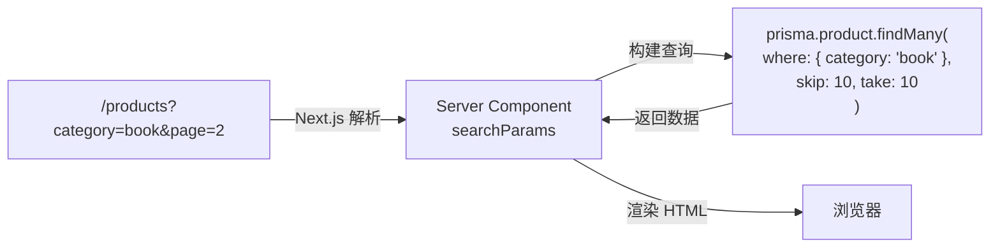
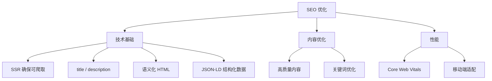

# Lesson 22：商品展示 — 分类搜索、分页与 SEO 优化

> 🎯 **本节目标**：实现商品的分类展示、关键词搜索、服务端分页，并通过 Metadata API 和 JSON-LD 结构化数据全面优化 SEO。
>
> 📦 **本节产出**：用户可以按分类筛选、搜索关键词、翻页浏览的商品展示页面，并带有完善的动态 meta 标签和结构化数据。

---

## 一、URL Search Params：服务端筛选的灵魂

在 Phase 2 中，筛选和搜索状态存在 `useState` 里，刷新页面就没了。
在全栈应用中，**筛选条件应该反映在 URL 里** (`/products?category=book&q=react&page=2`)：



优势：
- 用户可以分享搜索结果链接
- 浏览器后退/前进正常工作
- 搜索引擎可以索引不同筛选结果

---

## 二、实战：分类 + 搜索 + 分页

### 2.1 商品列表页

```tsx
// src/app/products/page.tsx
import { prisma } from '@/lib/prisma'
import Link from 'next/link'
import SearchBar from './SearchBar'
import Pagination from './Pagination'

const PAGE_SIZE = 6

export default async function ProductsPage({
  searchParams
}: {
  searchParams: Promise<{ category?: string; q?: string; page?: string }>
}) {
  const params = await searchParams
  const category = params.category
  const query = params.q
  const page = Number(params.page) || 1

  // 构建 Prisma 查询条件
  const where = {
    ...(category && { category }),
    ...(query && {
      OR: [
        { name: { contains: query } },
        { description: { contains: query } },
      ]
    })
  }

  const [products, total] = await Promise.all([
    prisma.product.findMany({
      where,
      skip: (page - 1) * PAGE_SIZE,
      take: PAGE_SIZE,
      orderBy: { createdAt: 'desc' }
    }),
    prisma.product.count({ where })
  ])

  const totalPages = Math.ceil(total / PAGE_SIZE)

  return (
    <div className="max-w-7xl mx-auto px-4 py-12">
      <h1 className="text-3xl font-bold mb-8">
        全部商品 
        <span className="text-lg font-normal text-gray-400 ml-2">({total} 件)</span>
      </h1>

      <SearchBar defaultQuery={query} defaultCategory={category} />

      {products.length === 0 ? (
        <div className="text-center py-20 text-gray-400">
          <p className="text-5xl mb-4">🔍</p>
          <p>没有找到匹配的商品</p>
        </div>
      ) : (
        <div className="grid grid-cols-1 sm:grid-cols-2 lg:grid-cols-3 gap-6 mt-8">
          {products.map(product => (
            <Link key={product.id} href={`/products/${product.id}`} 
              className="group bg-white rounded-2xl border hover:shadow-lg transition-shadow overflow-hidden"
              prefetch={true}  // 预取详情页数据
            >
              <div className="h-48 bg-gray-100 flex items-center justify-center text-5xl">📦</div>
              <div className="p-5">
                <span className="text-xs bg-indigo-100 text-indigo-700 px-2 py-0.5 rounded-full">
                  {product.category}
                </span>
                <h2 className="font-semibold text-lg mt-2 group-hover:text-indigo-600 transition-colors">
                  {product.name}
                </h2>
                <p className="mt-3 text-2xl font-bold text-indigo-600">¥{product.price}</p>
              </div>
            </Link>
          ))}
        </div>
      )}

      {totalPages > 1 && (
        <Pagination 
          currentPage={page} 
          totalPages={totalPages}
          category={category}
          query={query}
        />
      )}
    </div>
  )
}
```

### 2.2 搜索栏组件

```tsx
// src/app/products/SearchBar.tsx
'use client'

import { useRouter } from 'next/navigation'
import { useState } from 'react'

const CATEGORIES = [
  { value: '', label: '全部' },
  { value: 'book', label: '📚 图书' },
  { value: 'electronics', label: '💻 电子' },
  { value: 'clothing', label: '👕 服饰' },
]

export default function SearchBar({ defaultQuery, defaultCategory }: { 
  defaultQuery?: string; defaultCategory?: string 
}) {
  const router = useRouter()
  const [query, setQuery] = useState(defaultQuery || '')

  const handleSearch = (e: React.FormEvent) => {
    e.preventDefault()
    const params = new URLSearchParams()
    if (query) params.set('q', query)
    if (defaultCategory) params.set('category', defaultCategory)
    router.push(`/products?${params.toString()}`)
  }

  const handleCategoryClick = (cat: string) => {
    const params = new URLSearchParams()
    if (cat) params.set('category', cat)
    if (query) params.set('q', query)
    router.push(`/products?${params.toString()}`)
  }

  return (
    <div>
      <form onSubmit={handleSearch} className="flex gap-2 mb-4">
        <input value={query} onChange={e => setQuery(e.target.value)}
          placeholder="搜索商品名称或描述..."
          className="flex-1 border rounded-xl px-4 py-2.5 focus:ring-2 focus:ring-indigo-500 outline-none" />
        <button type="submit" className="bg-indigo-600 text-white px-6 rounded-xl hover:bg-indigo-700">
          搜索
        </button>
      </form>
      <div className="flex gap-2 flex-wrap">
        {CATEGORIES.map(cat => (
          <button key={cat.value} onClick={() => handleCategoryClick(cat.value)}
            className={`px-4 py-1.5 rounded-full text-sm font-medium transition-colors ${
              (defaultCategory || '') === cat.value
                ? 'bg-indigo-600 text-white'
                : 'bg-white border text-gray-600 hover:bg-gray-100'
            }`}>
            {cat.label}
          </button>
        ))}
      </div>
    </div>
  )
}
```

### 2.3 分页组件

```tsx
// src/app/products/Pagination.tsx
import Link from 'next/link'

interface PaginationProps {
  currentPage: number
  totalPages: number
  category?: string
  query?: string
}

export default function Pagination({ currentPage, totalPages, category, query }: PaginationProps) {
  const buildUrl = (page: number) => {
    const params = new URLSearchParams()
    params.set('page', String(page))
    if (category) params.set('category', category)
    if (query) params.set('q', query)
    return `/products?${params.toString()}`
  }

  // 生成页码数组（最多显示 5 个）
  const getPageNumbers = () => {
    const pages: number[] = []
    const start = Math.max(1, currentPage - 2)
    const end = Math.min(totalPages, currentPage + 2)
    for (let i = start; i <= end; i++) pages.push(i)
    return pages
  }

  return (
    <nav className="flex items-center justify-center gap-1 mt-12">
      {/* 首页 */}
      {currentPage > 2 && (
        <Link href={buildUrl(1)} 
          className="px-3 py-2 rounded-lg text-sm text-gray-500 hover:bg-gray-100">
          首页
        </Link>
      )}

      {/* 上一页 */}
      {currentPage > 1 && (
        <Link href={buildUrl(currentPage - 1)} 
          className="px-3 py-2 rounded-lg text-sm text-gray-500 hover:bg-gray-100">
          ← 上一页
        </Link>
      )}

      {/* 页码 */}
      {getPageNumbers().map(p => (
        <Link key={p} href={buildUrl(p)}
          className={`w-10 h-10 flex items-center justify-center rounded-lg text-sm font-medium transition-colors ${
            p === currentPage
              ? 'bg-indigo-600 text-white'
              : 'text-gray-500 hover:bg-gray-100'
          }`}>
          {p}
        </Link>
      ))}

      {/* 下一页 */}
      {currentPage < totalPages && (
        <Link href={buildUrl(currentPage + 1)} 
          className="px-3 py-2 rounded-lg text-sm text-gray-500 hover:bg-gray-100">
          下一页 →
        </Link>
      )}

      {/* 末页 */}
      {currentPage < totalPages - 1 && (
        <Link href={buildUrl(totalPages)} 
          className="px-3 py-2 rounded-lg text-sm text-gray-500 hover:bg-gray-100">
          末页
        </Link>
      )}
    </nav>
  )
}
```

> [!TIP]
> **`next/link` 的预取 (Prefetch) 机制：** 当 `<Link>` 组件出现在视口中时，Next.js 会在后台**自动预取**该链接的页面数据。这意味着用户点击时页面几乎是即时加载！你可以通过 `prefetch={false}` 关闭此行为，但一般保持默认即可。

---

## 三、SEO 与 Metadata API

### 3.1 静态 Metadata

```tsx
// src/app/products/page.tsx
import type { Metadata } from 'next'

export const metadata: Metadata = {
  title: '全部商品 — ShopNext',
  description: '浏览 ShopNext 的全部商品，包含图书、电子产品、服饰等分类。',
}
```

### 3.2 动态 Metadata（商品详情页）

```tsx
// src/app/products/[id]/page.tsx
import type { Metadata } from 'next'
import { prisma } from '@/lib/prisma'

export async function generateMetadata({ 
  params 
}: { 
  params: Promise<{ id: string }> 
}): Promise<Metadata> {
  const { id } = await params
  const product = await prisma.product.findUnique({ where: { id } })
  
  if (!product) return { title: '商品不存在' }
  
  return {
    title: `${product.name} — ShopNext`,
    description: product.description || `购买 ${product.name}，仅需 ¥${product.price}`,
    openGraph: {
      title: product.name,
      description: product.description || undefined,
      images: product.image ? [product.image] : [],
    },
  }
}
```

### 3.3 JSON-LD 结构化数据

JSON-LD 是 Google 推荐的结构化数据格式，可以让搜索结果直接展示价格、评分等信息（Rich Snippets）：

```tsx
// src/app/products/[id]/page.tsx （在 ProductDetail 组件中添加）
export default async function ProductDetail({ params }: { params: Promise<{ id: string }> }) {
  const { id } = await params
  const product = await prisma.product.findUnique({ where: { id } })
  if (!product) notFound()

  // JSON-LD 结构化数据
  const jsonLd = {
    '@context': 'https://schema.org',
    '@type': 'Product',
    name: product.name,
    description: product.description,
    offers: {
      '@type': 'Offer',
      price: product.price,
      priceCurrency: 'CNY',
      availability: product.stock > 0 
        ? 'https://schema.org/InStock' 
        : 'https://schema.org/OutOfStock',
    },
  }

  return (
    <>
      {/* 注入 JSON-LD 到 head */}
      <script
        type="application/ld+json"
        dangerouslySetInnerHTML={{ __html: JSON.stringify(jsonLd) }}
      />
      
      <div className="max-w-4xl mx-auto px-4 py-12">
        {/* 商品详情 UI... */}
      </div>
    </>
  )
}
```

---

## 四、🧠 深度专题：SEO 核心要素



---

## 五、练习

1. 为搜索栏添加 `useDebounce`（Lesson 12 学过的），实现实时搜索。
2. 在商品详情页的 JSON-LD 中添加 `aggregateRating` 评分字段。
3. 使用 Google Search Console 的 [Rich Results Test](https://search.google.com/test/rich-results) 验证你的 JSON-LD 是否正确。

---

## 📌 本节小结

| 你做了什么 | 你学到了什么 |
|-----------|------------|
| 实现了服务端分类、搜索和分页 | URL searchParams 驱动的查询 |
| 构建了完整的分页组件 | 首页/末页/页码的通用分页逻辑 |
| 配置了静态和动态 Metadata | Next.js Metadata API + Open Graph |
| 添加了 JSON-LD 结构化数据 | Google Rich Snippets |
| — | `next/link` prefetch 预取机制 |

---

## ➡️ 下一课

[**Lesson 23：购物车与订单 — 混合状态管理**](./Lesson_23.md)
