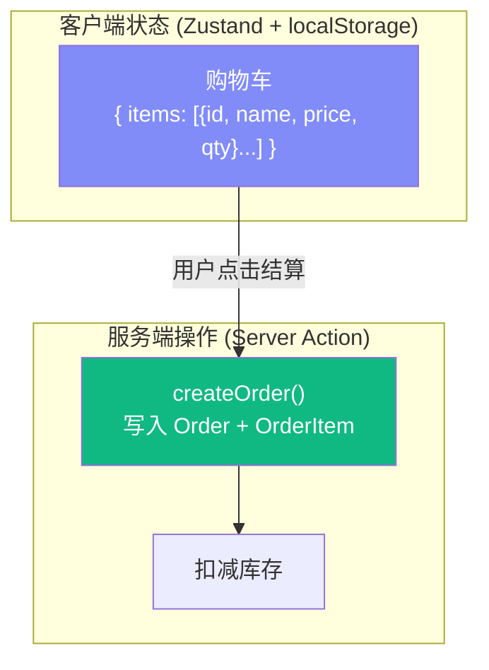
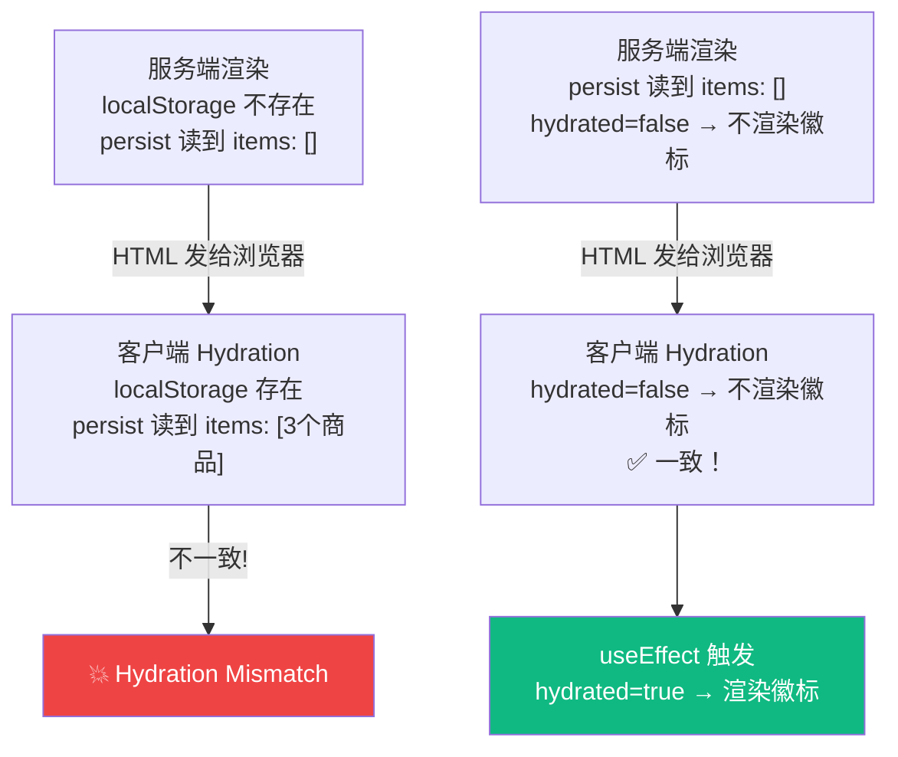
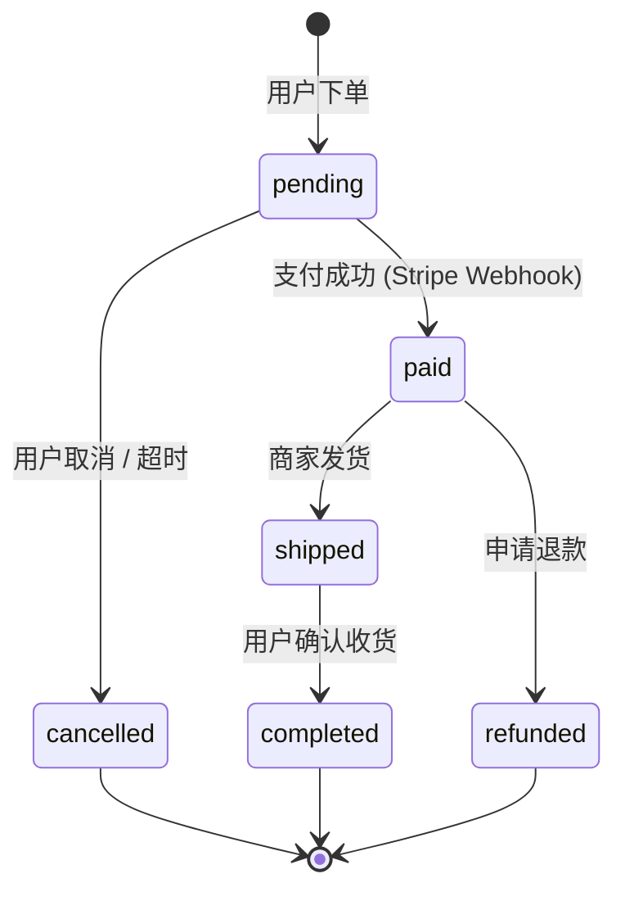

# Lesson 23：购物车与订单 — 混合状态管理

> 🎯 **本节目标**：实现购物车和下单结算功能，掌握 Zustand 在 Next.js SSR 环境下的混合使用，解决 Hydration 不匹配问题。
>
> 📦 **本节产出**：带有实时数量调整的购物车页面、导航栏徽标、以及创建订单的完整结算流程。

---

## 一、购物车的状态归属

购物车是一个典型的 **客户端状态**：
- 用户还没有登录也能加购物车
- 数据不需要实时同步到数据库
- 需要即时响应用户操作（加减数量、删除）

但下单（创建 Order）就是 **服务端操作**，需要写数据库。



---

## 二、创建购物车 Store

```ts
// src/store/useCartStore.ts
import { create } from 'zustand'
import { persist } from 'zustand/middleware'

interface CartItem {
  productId: string
  name: string
  price: number
  quantity: number
}

interface CartState {
  items: CartItem[]
  addItem: (product: { id: string; name: string; price: number }) => void
  removeItem: (productId: string) => void
  updateQuantity: (productId: string, quantity: number) => void
  clearCart: () => void
  totalPrice: () => number
  totalItems: () => number
}

export const useCartStore = create<CartState>()(
  persist(
    (set, get) => ({
      items: [],

      addItem: (product) => set((state) => {
        const existing = state.items.find(i => i.productId === product.id)
        if (existing) {
          return {
            items: state.items.map(i =>
              i.productId === product.id ? { ...i, quantity: i.quantity + 1 } : i
            )
          }
        }
        return {
          items: [...state.items, { 
            productId: product.id, name: product.name, 
            price: product.price, quantity: 1 
          }]
        }
      }),

      removeItem: (productId) => set((state) => ({
        items: state.items.filter(i => i.productId !== productId)
      })),

      updateQuantity: (productId, quantity) => set((state) => ({
        items: quantity <= 0
          ? state.items.filter(i => i.productId !== productId)
          : state.items.map(i => i.productId === productId ? { ...i, quantity } : i)
      })),

      clearCart: () => set({ items: [] }),

      totalPrice: () => get().items.reduce((sum, i) => sum + i.price * i.quantity, 0),
      totalItems: () => get().items.reduce((sum, i) => sum + i.quantity, 0),
    }),
    { name: 'shopping-cart' }
  )
)
```

---

## 三、解决 Hydration Mismatch 问题

> [!CAUTION]
> **这是 SSR + Zustand 最常见的坑！** 服务端渲染时 `localStorage` 不存在（服务器没有浏览器），所以 Zustand persist 读到的初始值为空。但客户端 Hydration 时会从 `localStorage` 读到缓存的购物车数据。两边不一致 → React 报错 **Hydration Mismatch**！

解决方案：**延迟挂载（只在客户端渲染后才显示 Store 数据）**

```tsx
// src/hooks/useHydration.ts
import { useEffect, useState } from 'react'

/**
 * 确保组件只在客户端 Hydration 完成后才显示 Store 数据。
 * 避免 SSR 时服务端和客户端数据不一致导致的 Hydration Mismatch。
 */
export function useHydration() {
  const [hydrated, setHydrated] = useState(false)

  useEffect(() => {
    setHydrated(true)
  }, [])

  return hydrated
}
```

在需要使用 Store 的 Client Component 中使用：

```tsx
// src/components/CartBadge.tsx
'use client'

import { useCartStore } from '@/store/useCartStore'
import { useHydration } from '@/hooks/useHydration'

export default function CartBadge() {
  const totalItems = useCartStore(state => state.totalItems)
  const hydrated = useHydration()

  return (
    <a href="/cart" className="relative">
      🛒
      {/* 只有 Hydration 完成后才显示数量 */}
      {hydrated && totalItems() > 0 && (
        <span className="absolute -top-2 -right-2 bg-red-500 text-white text-xs w-5 h-5 rounded-full flex items-center justify-center font-bold">
          {totalItems()}
        </span>
      )}
    </a>
  )
}
```



---

## 四、购物车页面

```tsx
// src/app/cart/page.tsx
import CartContent from './CartContent'

export default function CartPage() {
  return (
    <div className="max-w-4xl mx-auto px-4 py-12">
      <h1 className="text-3xl font-bold mb-8">🛒 购物车</h1>
      <CartContent />
    </div>
  )
}
```

```tsx
// src/app/cart/CartContent.tsx
'use client'

import { useCartStore } from '@/store/useCartStore'
import { useHydration } from '@/hooks/useHydration'
import { checkoutAction } from './actions'

export default function CartContent() {
  const { items, removeItem, updateQuantity, totalPrice, clearCart } = useCartStore()
  const hydrated = useHydration()

  if (!hydrated) {
    return <div className="animate-pulse py-20 text-center text-gray-300">加载购物车...</div>
  }

  if (items.length === 0) {
    return (
      <div className="text-center py-20">
        <p className="text-6xl mb-4">🛒</p>
        <p className="text-gray-400 text-lg">购物车空空如也</p>
        <a href="/products" className="inline-block mt-6 bg-indigo-600 text-white px-6 py-2 rounded-xl">
          去购物 →
        </a>
      </div>
    )
  }

  return (
    <div>
      <div className="space-y-4">
        {items.map(item => (
          <div key={item.productId} className="flex items-center justify-between bg-white p-5 rounded-xl border">
            <div>
              <p className="font-semibold">{item.name}</p>
              <p className="text-sm text-gray-500">¥{item.price} × {item.quantity}</p>
            </div>
            <div className="flex items-center gap-3">
              <button onClick={() => updateQuantity(item.productId, item.quantity - 1)}
                className="w-8 h-8 rounded-full border text-gray-600 hover:bg-gray-100 flex items-center justify-center">
                −
              </button>
              <span className="font-medium w-8 text-center">{item.quantity}</span>
              <button onClick={() => updateQuantity(item.productId, item.quantity + 1)}
                className="w-8 h-8 rounded-full border text-gray-600 hover:bg-gray-100 flex items-center justify-center">
                +
              </button>
              <button onClick={() => removeItem(item.productId)}
                className="text-red-500 text-sm ml-4 hover:underline">删除</button>
            </div>
          </div>
        ))}
      </div>

      <div className="mt-8 flex items-center justify-between bg-white p-6 rounded-xl border">
        <div>
          <p className="text-gray-500 text-sm">总计</p>
          <p className="text-3xl font-bold text-indigo-600">¥{totalPrice().toFixed(2)}</p>
        </div>
        <form action={async () => {
          await checkoutAction(items)
          clearCart()
        }}>
          <button type="submit" className="bg-indigo-600 text-white px-8 py-3 rounded-xl font-bold hover:bg-indigo-700 transition-colors">
            去结算 →
          </button>
        </form>
      </div>
    </div>
  )
}
```

---

## 五、结算 Server Action

```ts
// src/app/cart/actions.ts
'use server'

import { prisma } from '@/lib/prisma'
import { auth } from '@/lib/auth'
import { redirect } from 'next/navigation'
import { revalidatePath } from 'next/cache'

interface CartItem {
  productId: string
  name: string
  price: number
  quantity: number
}

export async function checkoutAction(items: CartItem[]) {
  const session = await auth()
  if (!session?.user?.id) redirect('/login')

  // 使用事务确保原子性：校验价格 + 扣减库存 + 创建订单
  const order = await prisma.$transaction(async (tx) => {
    // 1) 在事务中读取最新商品快照（防止前端篡改价格）
    const products = await tx.product.findMany({
      where: { id: { in: items.map(i => i.productId) } }
    })
    const productMap = new Map(products.map(p => [p.id, p]))

    if (products.length !== items.length) {
      throw new Error('购物车中包含已下架商品')
    }

    // 计算真实总价
    const total = items.reduce((sum, item) => {
      const product = productMap.get(item.productId)
      if (!product) throw new Error(`商品 ${item.productId} 不存在`)
      return sum + product.price * item.quantity
    }, 0)

    // 2) 条件扣减库存（compare-and-set），防止并发超卖
    for (const item of items) {
      const updated = await tx.product.updateMany({
        where: {
          id: item.productId,
          stock: { gte: item.quantity },
        },
        data: {
          stock: { decrement: item.quantity },
        }
      })
      if (updated.count === 0) {
        const product = productMap.get(item.productId)
        throw new Error(`${product?.name ?? item.productId} 库存不足`)
      }
    }

    // 3) 创建订单（使用数据库中的真实价格）
    return tx.order.create({
      data: {
        userId: session.user.id,
        total,
        status: 'pending',
        items: {
          create: items.map(item => {
            const product = productMap.get(item.productId)!
            return {
              productId: item.productId,
              quantity: item.quantity,
              price: product.price,
            }
          }),
        }
      }
    })
  })

  revalidatePath('/products')
  redirect(`/checkout/success?orderId=${order.id}`)
}
```

> [!IMPORTANT]
> **`$transaction` + 条件更新（`stock >= quantity`）**确保了"创建订单"和"扣减库存"要么同时成功，要么同时失败，并避免并发场景的超卖问题。

---

## 六、🧠 深度专题：订单的状态机建模



```ts
// src/lib/order-status.ts
const VALID_TRANSITIONS: Record<string, string[]> = {
  pending: ['paid', 'cancelled'],
  paid: ['shipped', 'refunded'],
  shipped: ['completed'],
}

export function canTransition(from: string, to: string): boolean {
  return VALID_TRANSITIONS[from]?.includes(to) ?? false
}
```

---

## 七、练习

1. 实现结算成功页面 `/checkout/success`，显示订单编号和支付总额。
2. 在导航栏添加 `<CartBadge />`，使用 `useHydration` 防止 Hydration 报错。
3. 在 `checkoutAction` 中添加库存不足的友好错误提示（返回错误消息给前端展示）。

---

## 📌 本节小结

| 你做了什么 | 你学到了什么 |
|-----------|------------|
| 用 Zustand 创建了客户端购物车 Store | 全栈应用中客户端 vs 服务端状态边界 |
| 解决了 SSR Hydration Mismatch | `useHydration` 延迟挂载技巧 |
| 实现了完整的结算 Server Action | `$transaction` 事务保证原子性 |
| — | 状态机建模在订单管理中的应用 |

---

## ➡️ 下一课

[**Lesson 24：支付集成 — Stripe 在线支付**](./Lesson_24.md)
