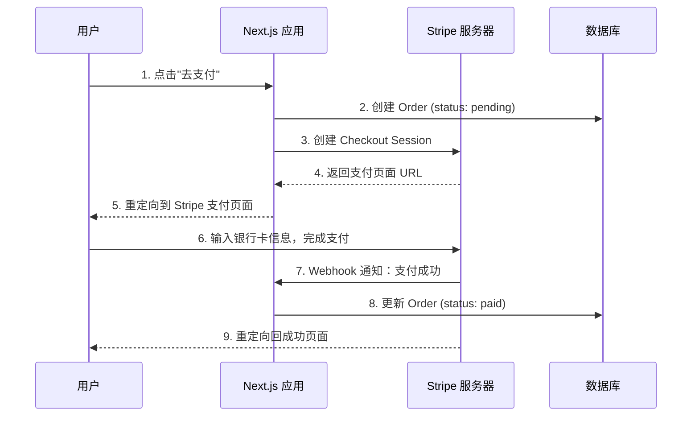

# Lesson 24：支付集成 — Stripe 在线支付

> 🎯 **本节目标**：对接 Stripe 支付网关，实现从下单到付款的完整闭环。
>
> 📦 **本节产出**：用户可以通过 Stripe Checkout 完成真实的支付流程（测试模式），并通过 Webhook 自动更新订单状态。

---

## 一、支付流程全景



---

## 二、安装与配置 Stripe

```bash
npm install stripe
```

在 `.env` 中添加（去 [Stripe Dashboard](https://dashboard.stripe.com/test/apikeys) 的测试模式获取密钥）：

```env
STRIPE_SECRET_KEY=sk_test_xxxxxx
STRIPE_WEBHOOK_SECRET=whsec_xxxxxx
NEXT_PUBLIC_STRIPE_PUBLISHABLE_KEY=pk_test_xxxxxx
```

创建 Stripe 客户端单例：

```ts
// src/lib/stripe.ts
import Stripe from 'stripe'

export const stripe = new Stripe(process.env.STRIPE_SECRET_KEY!, {
  apiVersion: '2024-12-18.acacia',
})
```

---

## 三、创建 Checkout Session（Server Action）

```ts
// src/app/checkout/actions.ts
'use server'

import { stripe } from '@/lib/stripe'
import { prisma } from '@/lib/prisma'
import { auth } from '@/lib/auth'
import { redirect } from 'next/navigation'

export async function createCheckoutSession(items: { productId: string; quantity: number }[]) {
  const session = await auth()
  if (!session?.user) redirect('/login')

  // 1. 从数据库获取商品信息（防止前端篡改价格！）
  const products = await prisma.product.findMany({
    where: { id: { in: items.map(i => i.productId) } }
  })

  // 2. 创建订单
  const totalAmount = items.reduce((sum, item) => {
    const product = products.find(p => p.id === item.productId)!
    return sum + product.price * item.quantity
  }, 0)

  const order = await prisma.order.create({
    data: {
      userId: session.user.id!,
      total: totalAmount,
      status: 'pending',
      items: {
        create: items.map(item => {
          const product = products.find(p => p.id === item.productId)!
          return {
            productId: item.productId,
            quantity: item.quantity,
            price: product.price,
          }
        })
      }
    }
  })

  // 3. 创建 Stripe Checkout Session
  const checkoutSession = await stripe.checkout.sessions.create({
    mode: 'payment',
    payment_method_types: ['card'],
    metadata: { orderId: order.id },  // 关键！用于 Webhook 回调时定位订单
    line_items: items.map(item => {
      const product = products.find(p => p.id === item.productId)!
      return {
        price_data: {
          currency: 'cny',
          product_data: { name: product.name },
          unit_amount: Math.round(product.price * 100), // Stripe 要求以"分"为单位
        },
        quantity: item.quantity,
      }
    }),
    success_url: `${process.env.NEXT_PUBLIC_BASE_URL}/checkout/success?orderId=${order.id}`,
    cancel_url: `${process.env.NEXT_PUBLIC_BASE_URL}/cart`,
  })

  // 4. 重定向到 Stripe 托管的支付页面
  redirect(checkoutSession.url!)
}
```

> [!CAUTION]
> **安全铁律：永远不要信任前端传来的价格！**
> 我们在 Server Action 中，根据前端传来的 `productId` 重新从数据库查找真实价格来计算总额。恶意用户可以篡改前端的价格字段，但无法欺骗服务端的数据库查询。

---

## 四、Webhook 接收支付通知

当 Stripe 收到用户的银行卡支付后，它会向你预先配置好的 URL 发一个 POST 请求。
我们需要用 **API Route**（不是 Server Action）来接收它——因为这个请求来自 Stripe 的服务器，不是来自浏览器表单。

```ts
// src/app/api/webhook/stripe/route.ts
import { NextRequest, NextResponse } from 'next/server'
import { stripe } from '@/lib/stripe'
import { prisma } from '@/lib/prisma'

export async function POST(request: NextRequest) {
  const body = await request.text()
  const signature = request.headers.get('stripe-signature')!

  let event
  try {
    // 验证请求确实来自 Stripe（防止伪造）
    event = stripe.webhooks.constructEvent(
      body,
      signature,
      process.env.STRIPE_WEBHOOK_SECRET!
    )
  } catch (err) {
    return NextResponse.json({ error: '签名验证失败' }, { status: 400 })
  }

  // 处理支付成功事件
  if (event.type === 'checkout.session.completed') {
    const session = event.data.object as any
    const orderId = session.metadata.orderId

    await prisma.order.update({
      where: { id: orderId },
      data: { status: 'paid' }
    })
  }

  return NextResponse.json({ received: true })
}
```

---

## 五、🧠 深度专题：支付安全与幂等性

### 5.1 为什么需要 Webhook？

网络不可靠！用户支付成功后，浏览器重定向回 `success_url` 可能会：
- 网断了
- 用户关闭了页面
- 浏览器崩溃了

如果你只依赖 `success_url` 来更新订单状态，就会出现"用户付了钱但订单还是 pending"的灾难。

Webhook 是 **Stripe 服务器**主动推送，只要 Stripe 确认收到钱，它就会不断重试推送直到你的服务器返回 200。

### 5.2 幂等性 (Idempotency)

Stripe 的 Webhook 可能因为网络问题而重复发送同一个事件。你的处理逻辑必须是**幂等的**：执行一次和执行十次的结果完全相同。

```ts
// ✅ 幂等写法：先查再更新
const order = await prisma.order.findUnique({ where: { id: orderId } })
if (order?.status !== 'pending') return // 已经处理过了，跳过

await prisma.order.update({ where: { id: orderId }, data: { status: 'paid' } })
```

---

## 六、练习

1. 创建 `/checkout/success` 页面，显示订单信息和支付成功提示。
2. 在本地用 Stripe CLI 测试 Webhook：`stripe listen --forward-to localhost:3000/api/webhook/stripe`。

---

## 📌 本节小结

| 你做了什么 | 你学到了什么 |
|-----------|------------|
| 创建了 Stripe Checkout Session | 服务端安全定价，不信任前端传值 |
| 编写了 Webhook 接收支付回调 | API Route vs Server Actions 的使用场景区分 |
| — | 支付安全：签名验证与幂等性 |
| — | Webhook 解决网络不可靠导致的状态丢失 |

---

## ➡️ 下一课

[**Lesson 25：单元测试 — Vitest + Testing Library**](./Lesson_25.md)
