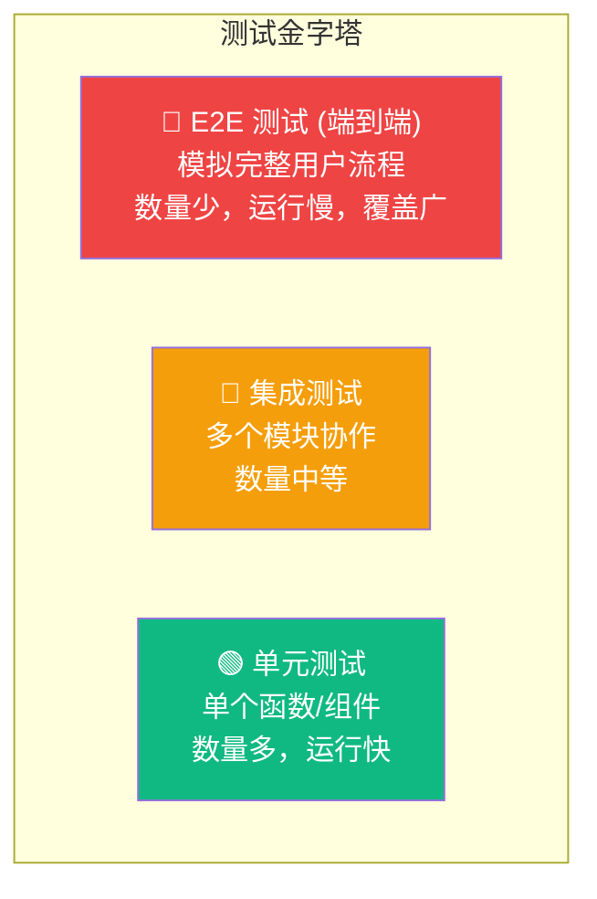

# Lesson 25：单元测试 — Vitest + Testing Library

> 🎯 **本节目标**：为组件、自定义 Hook 和 Server Action 编写单元测试，建立代码质量保障体系。
>
> 📦 **本节产出**：覆盖关键业务逻辑的测试套件，确保后续重构不破坏既有功能。

---

## 一、为什么要写测试？

项目越大，每次修改代码都可能引发"蝴蝶效应"——改了 A 模块，B 模块莫名崩了。
测试的核心价值是：**给你修改代码的勇气。**



本节课聚焦 **单元测试** (金字塔底层)，下节课做 **E2E 测试** (金字塔顶层)。

---

## 二、安装 Vitest 与 Testing Library

```bash
npm install -D vitest @testing-library/react @testing-library/jest-dom @vitejs/plugin-react jsdom
```

创建 `vitest.config.ts`：

```ts
// vitest.config.ts
import { defineConfig } from 'vitest/config'
import react from '@vitejs/plugin-react'
import path from 'path'

export default defineConfig({
  plugins: [react()],
  test: {
    environment: 'jsdom',      // 模拟浏览器环境
    globals: true,             // 全局注入 describe/it/expect
    setupFiles: ['./src/test/setup.ts'],
  },
  resolve: {
    alias: {
      '@': path.resolve(__dirname, './src'),
    }
  }
})
```

```ts
// src/test/setup.ts
import '@testing-library/jest-dom'  // 注入 toBeInTheDocument() 等匹配器
```

在 `package.json` 添加：
```json
"scripts": {
  "test": "vitest",
  "test:run": "vitest run"
}
```

---

## 三、测试组件

### 3.1 测试一个简单的组件

```tsx
// src/components/__tests__/ProductCard.test.tsx
import { render, screen } from '@testing-library/react'
import { describe, it, expect } from 'vitest'

// 假设我们有一个 ProductCard 组件
function ProductCard({ name, price }: { name: string; price: number }) {
  return (
    <div>
      <h2>{name}</h2>
      <p>¥{price}</p>
    </div>
  )
}

describe('ProductCard', () => {
  it('应该正确显示商品名称和价格', () => {
    render(<ProductCard name="React 手册" price={99} />)
    
    expect(screen.getByText('React 手册')).toBeInTheDocument()
    expect(screen.getByText('¥99')).toBeInTheDocument()
  })
})
```

运行测试：
```bash
npm test
```

### 3.2 测试用户交互

```tsx
// src/components/__tests__/AddToCartButton.test.tsx
import { render, screen, fireEvent } from '@testing-library/react'
import { describe, it, expect, vi } from 'vitest'

function AddToCartButton({ onAdd }: { onAdd: () => void }) {
  return <button onClick={onAdd}>加入购物车</button>
}

describe('AddToCartButton', () => {
  it('点击时应该调用 onAdd 回调', () => {
    const mockOnAdd = vi.fn()  // 创建一个间谍函数
    render(<AddToCartButton onAdd={mockOnAdd} />)
    
    fireEvent.click(screen.getByText('加入购物车'))
    
    expect(mockOnAdd).toHaveBeenCalledTimes(1)
  })
})
```

---

## 四、测试自定义 Hook

自定义 Hook 不能直接调用（只能在 React 组件中使用），需要用 `renderHook`：

```tsx
// src/hooks/__tests__/useCartStore.test.ts
import { renderHook, act } from '@testing-library/react'
import { describe, it, expect, beforeEach } from 'vitest'
import { useCartStore } from '@/store/useCartStore'

describe('useCartStore', () => {
  beforeEach(() => {
    // 每个测试前清空购物车
    const { result } = renderHook(() => useCartStore())
    act(() => result.current.clearCart())
  })

  it('添加商品应该增加 items 数量', () => {
    const { result } = renderHook(() => useCartStore())
    
    act(() => {
      result.current.addItem({ id: '1', name: 'React 手册', price: 99 })
    })
    
    expect(result.current.items).toHaveLength(1)
    expect(result.current.items[0].name).toBe('React 手册')
  })

  it('添加相同商品应该增加数量而不是重复', () => {
    const { result } = renderHook(() => useCartStore())
    
    act(() => {
      result.current.addItem({ id: '1', name: 'React 手册', price: 99 })
      result.current.addItem({ id: '1', name: 'React 手册', price: 99 })
    })
    
    expect(result.current.items).toHaveLength(1)
    expect(result.current.items[0].quantity).toBe(2)
  })

  it('totalPrice 应该正确计算总价', () => {
    const { result } = renderHook(() => useCartStore())
    
    act(() => {
      result.current.addItem({ id: '1', name: 'A', price: 100 })
      result.current.addItem({ id: '2', name: 'B', price: 200 })
    })
    
    expect(result.current.totalPrice()).toBe(300)
  })
})
```

---

## 五、测试纯函数 (工具函数)

纯函数是最容易测试的，因为相同输入永远产生相同输出：

```ts
// src/lib/__tests__/utils.test.ts
import { describe, it, expect } from 'vitest'

// 假设我们有个价格格式化函数
function formatPrice(price: number): string {
  return `¥${price.toFixed(2)}`
}

// 状态转换验证函数
function canTransition(from: string, to: string): boolean {
  const valid: Record<string, string[]> = {
    pending: ['paid', 'cancelled'],
    paid: ['shipped', 'refunded'],
  }
  return valid[from]?.includes(to) ?? false
}

describe('formatPrice', () => {
  it('应该格式化整数价格', () => {
    expect(formatPrice(99)).toBe('¥99.00')
  })
  it('应该保留两位小数', () => {
    expect(formatPrice(9.9)).toBe('¥9.90')
  })
})

describe('canTransition', () => {
  it('pending 可以转换到 paid', () => {
    expect(canTransition('pending', 'paid')).toBe(true)
  })
  it('pending 不可以直接跳到 shipped', () => {
    expect(canTransition('pending', 'shipped')).toBe(false)
  })
})
```

---

## 六、练习

1. 为商品列表页的搜索栏组件编写测试：模拟用户输入"React"并点击搜索，验证 `router.push` 被调用且包含正确的查询参数。
2. 为 `deleteProduct` Server Action 编写测试，使用 `vi.mock` 模拟 Prisma client。

---

## 📌 本节小结

| 你做了什么 | 你学到了什么 |
|-----------|------------|
| 配置了 Vitest + Testing Library 测试环境 | 测试金字塔与各层测试的定位 |
| 编写了组件渲染和交互测试 | `render` / `screen` / `fireEvent` API |
| 测试了 Zustand Store 的行为 | `renderHook` + `act` 测试自定义 Hook |
| 测试了纯函数和工具逻辑 | 间谍函数 `vi.fn()` 和模拟 `vi.mock()` |

---

## ➡️ 下一课

[**Lesson 26：E2E 测试 — Playwright 全流程自动化**](./Lesson_26.md)
