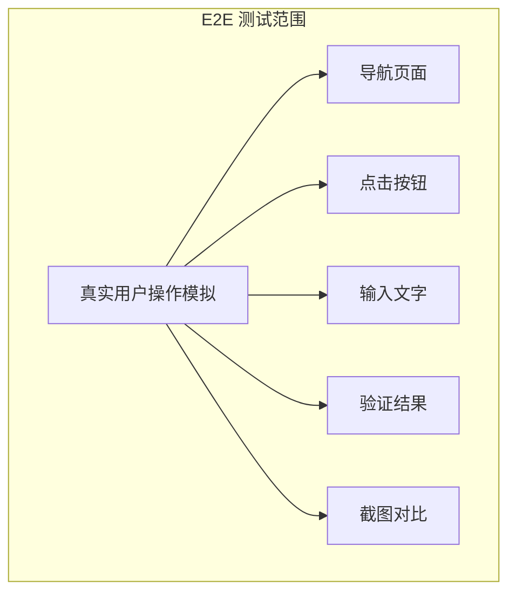
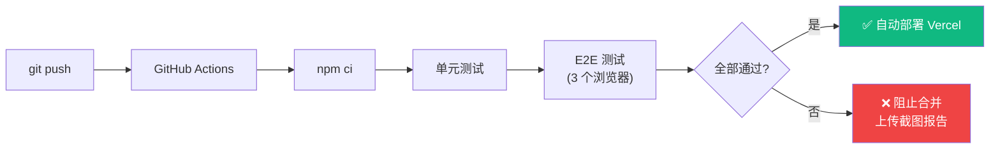

# Lesson 26：E2E 测试 — Playwright 全流程自动化

> 🎯 **本节目标**：使用 Playwright 编写端到端测试，覆盖登录、浏览、搜索、购物车等完整用户流程，理解 Page Object Model 设计模式。
>
> 📦 **本节产出**：一套可在 CI/CD 中运行的自动化测试套件，覆盖电商核心链路。


## 一、E2E 测试 vs 单元测试

| | 单元测试 (Vitest) | E2E 测试 (Playwright) |
|-|------------------|---------------------|
| 测什么 | 单个函数或组件 | 完整的用户流程 |
| 运行环境 | 模拟的 jsdom | 真实浏览器 (Chromium/Firefox/WebKit) |
| 速度 | 极快 (毫秒) | 较慢 (秒) |
| 价值 | 确保单个单元正确 | 确保整体流程跑通 |
| 数量 | 很多 | 精选核心流程 |



---

## 二、安装与配置

```bash
npm init playwright@latest
```

按照提示选择：
- 测试目录：`e2e`
- 安装浏览器：是

```ts
// playwright.config.ts
import { defineConfig, devices } from '@playwright/test'

export default defineConfig({
  testDir: './e2e',
  
  // 全局超时设置
  timeout: 30 * 1000,
  
  // 运行截图和视频
  use: {
    baseURL: 'http://localhost:3000',
    screenshot: 'only-on-failure',  // 失败时自动截图
    video: 'retain-on-failure',     // 失败时保留录像
    trace: 'on-first-retry',       // 重试时记录 trace
  },
  
  // 多浏览器测试配置
  projects: [
    {
      name: 'chromium',
      use: { ...devices['Desktop Chrome'] },
    },
    {
      name: 'firefox',
      use: { ...devices['Desktop Firefox'] },
    },
    {
      name: 'webkit',
      use: { ...devices['Desktop Safari'] },
    },
    // 移动端测试
    {
      name: 'mobile-chrome',
      use: { ...devices['Pixel 5'] },
    },
  ],
  
  // 自动启动开发服务器
  webServer: {
    command: 'npm run dev',
    url: 'http://localhost:3000',
    reuseExistingServer: !process.env.CI,
  },
})
```

---

## 三、编写基础测试

### 3.1 首页测试

```ts
// e2e/home.spec.ts
import { test, expect } from '@playwright/test'

test.describe('首页', () => {
  test('应该显示 ShopNext 标题和导航', async ({ page }) => {
    await page.goto('/')
    
    // 验证主标题
    await expect(page.getByText('欢迎来到 ShopNext')).toBeVisible()
    
    // 验证导航栏链接
    await expect(page.getByRole('link', { name: '商品' })).toBeVisible()
    await expect(page.getByRole('link', { name: '购物车' })).toBeVisible()
  })

  test('点击浏览商品应该导航到商品列表页', async ({ page }) => {
    await page.goto('/')
    await page.getByText('浏览商品').click()
    
    await expect(page).toHaveURL('/products')
    await expect(page.getByText('全部商品')).toBeVisible()
  })

  test('导航栏所有链接应该正常工作', async ({ page }) => {
    await page.goto('/')
    
    // 测试商品链接
    await page.getByRole('link', { name: '商品' }).click()
    await expect(page).toHaveURL('/products')
    
    // 返回首页
    await page.getByRole('link', { name: 'ShopNext' }).click()
    await expect(page).toHaveURL('/')
  })
})
```

### 3.2 商品浏览流程

```ts
// e2e/products.spec.ts
import { test, expect } from '@playwright/test'

test.describe('商品浏览', () => {
  test('商品列表应该展示商品卡片', async ({ page }) => {
    await page.goto('/products')
    
    // 应该能看到商品
    const productCards = page.locator('[href^="/products/"]')
    await expect(productCards.first()).toBeVisible()
    
    // 至少应该有 3 个商品
    const count = await productCards.count()
    expect(count).toBeGreaterThanOrEqual(3)
  })

  test('点击商品应该进入详情页', async ({ page }) => {
    await page.goto('/products')
    
    // 记录第一个商品的名称
    const firstProduct = page.locator('[href^="/products/"]').first()
    const productName = await firstProduct.locator('h2').textContent()
    
    // 点击进入详情
    await firstProduct.click()
    await expect(page.url()).toContain('/products/')
    
    // 详情页应该包含该商品名称
    await expect(page.getByText(productName!)).toBeVisible()
    
    // 应该看到"加入购物车"按钮
    await expect(page.getByText('加入购物车')).toBeVisible()
  })

  test('搜索功能应该正确筛选商品', async ({ page }) => {
    await page.goto('/products')
    
    // 在搜索框输入
    await page.fill('input[placeholder*="搜索"]', 'React')
    await page.getByText('搜索').click()
    
    // URL 应该包含搜索参数
    await expect(page).toHaveURL(/q=React/)
    
    // 结果页应该只显示匹配的商品
    // 等待搜索结果加载
    await page.waitForTimeout(500)
  })

  test('分类筛选应该正常工作', async ({ page }) => {
    await page.goto('/products')
    
    // 点击某个分类按钮
    await page.getByText('📚 图书').click()
    
    // URL 应该包含分类参数
    await expect(page).toHaveURL(/category=book/)
  })
})
```

---

## 四、测试完整购物流程

```ts
// e2e/shopping-flow.spec.ts
import { test, expect } from '@playwright/test'

test.describe('购物流程', () => {
  test('完整的浏览 → 加购 → 查看购物车流程', async ({ page }) => {
    // 1. 进入商品列表
    await page.goto('/products')
    
    // 2. 点击第一个商品
    await page.locator('[href^="/products/"]').first().click()
    await expect(page.getByText('加入购物车')).toBeVisible()
    
    // 3. 加入购物车
    await page.getByText('加入购物车').click()
    await expect(page.getByText('已加入')).toBeVisible()
    
    // 4. 前往购物车页面
    await page.getByRole('link', { name: '购物车' }).click()
    await expect(page).toHaveURL('/cart')
    
    // 5. 购物车应该有商品
    await expect(page.locator('[class*="border"]').first()).toBeVisible()
  })

  test('购物车数量调整功能', async ({ page }) => {
    // 先加入一个商品...（省略上面的步骤）
    await page.goto('/cart')
    
    // 找到加号按钮并点击
    const plusButton = page.getByText('+').first()
    if (await plusButton.isVisible()) {
      await plusButton.click()
      // 数量应该变成 2
      await expect(page.getByText('2')).toBeVisible()
    }
  })
})
```

---

## 五、🧠 深度专题：Page Object Model (POM)

当测试变多时，如果每个测试都直接写 `page.goto`、`page.click` 等底层操作，代码会变得非常冗余。如果页面 UI 改了（比如按钮文案从"加入购物车"改成"加购"），你要改几十个测试文件。

**Page Object Model** 把每个页面封装成一个类，集中管理页面交互逻辑：

```ts
// e2e/pages/ProductsPage.ts
import { type Page, type Locator, expect } from '@playwright/test'

export class ProductsPage {
  readonly page: Page
  readonly searchInput: Locator
  readonly searchButton: Locator
  readonly productCards: Locator

  constructor(page: Page) {
    this.page = page
    this.searchInput = page.locator('input[placeholder*="搜索"]')
    this.searchButton = page.getByText('搜索')
    this.productCards = page.locator('[href^="/products/"]')
  }

  async goto() {
    await this.page.goto('/products')
  }

  async search(query: string) {
    await this.searchInput.fill(query)
    await this.searchButton.click()
  }

  async clickFirstProduct() {
    await this.productCards.first().click()
  }

  async getProductCount() {
    return this.productCards.count()
  }
}
```

```ts
// e2e/pages/ProductDetailPage.ts
import { type Page, type Locator } from '@playwright/test'

export class ProductDetailPage {
  readonly page: Page
  readonly addToCartButton: Locator
  readonly favoriteButton: Locator
  readonly productTitle: Locator

  constructor(page: Page) {
    this.page = page
    this.addToCartButton = page.getByText('加入购物车')
    this.favoriteButton = page.locator('button:has-text("🤍"), button:has-text("❤️")')
    this.productTitle = page.locator('h1')
  }

  async addToCart() {
    await this.addToCartButton.click()
  }

  async getTitle() {
    return this.productTitle.textContent()
  }
}
```

使用 POM 的测试代码变得非常清晰：

```ts
// e2e/shopping-pom.spec.ts
import { test, expect } from '@playwright/test'
import { ProductsPage } from './pages/ProductsPage'
import { ProductDetailPage } from './pages/ProductDetailPage'

test('使用 POM 的购物流程', async ({ page }) => {
  const productsPage = new ProductsPage(page)
  const detailPage = new ProductDetailPage(page)

  // 搜索商品
  await productsPage.goto()
  await productsPage.search('React')
  
  // 进入详情
  await productsPage.clickFirstProduct()
  const title = await detailPage.getTitle()
  expect(title).toContain('React')
  
  // 加入购物车
  await detailPage.addToCart()
})
```

---

## 六、网络拦截与 Mock

Playwright 可以拦截网络请求，方便在测试中 mock 数据：

```ts
test('拦截 API 请求进行 Mock', async ({ page }) => {
  // 拦截商品列表的 API 请求
  await page.route('**/api/products*', async (route) => {
    await route.fulfill({
      status: 200,
      contentType: 'application/json',
      body: JSON.stringify([
        { id: '1', name: '测试商品', price: 99 },
      ]),
    })
  })
  
  await page.goto('/products')
  await expect(page.getByText('测试商品')).toBeVisible()
})

test('等待特定网络响应', async ({ page }) => {
  await page.goto('/products')
  
  // 等待搜索请求完成
  const responsePromise = page.waitForResponse(
    response => response.url().includes('/products') && response.status() === 200
  )
  
  await page.fill('input[placeholder*="搜索"]', 'React')
  await page.getByText('搜索').click()
  
  const response = await responsePromise
  expect(response.ok()).toBeTruthy()
})
```

---

## 七、视觉回归测试

```ts
test('商品列表页的视觉回归', async ({ page }) => {
  await page.goto('/products')
  await page.waitForLoadState('networkidle')
  
  // 第一次运行会生成基准截图（存储在 e2e/__snapshots__/）
  // 后续运行会对比差异
  await expect(page).toHaveScreenshot('products-page.png', {
    maxDiffPixelRatio: 0.01,  // 允许 1% 的像素差异
  })
})
```

运行命令：
```bash
npx playwright test                    # 运行所有测试
npx playwright test --update-snapshots  # 更新基准截图
npx playwright show-report             # 查看 HTML 测试报告
```

---

## 八、CI/CD 集成

```yaml
# .github/workflows/test.yml
name: Test
on: [push, pull_request]
jobs:
  test:
    runs-on: ubuntu-latest
    steps:
      - uses: actions/checkout@v4
      - uses: actions/setup-node@v4
        with: { node-version: 20 }
      
      - run: npm ci
      - run: npm run test:run                 # 单元测试
      
      - run: npx playwright install --with-deps
      - run: npx playwright test              # E2E 测试
      
      # 如果 E2E 失败，上传截图和视频作为调试资源
      - uses: actions/upload-artifact@v4
        if: failure()
        with:
          name: playwright-report
          path: playwright-report/
          retention-days: 7
```



---

## 九、练习

1. 为登录流程编写 E2E 测试：填写邮箱密码 → 点击登录 → 验证跳转到首页且导航栏显示用户名。
2. 扩展 Page Object Model，为购物车页面创建 `CartPage` 类。
3. 使用 `page.screenshot()` 对商品详情页关键布局做视觉回归快照。

---

## 📌 本节小结

| 你做了什么 | 你学到了什么 |
|-----------|------------|
| 配置了 Playwright 多浏览器测试环境 | E2E 测试在测试金字塔中的定位 |
| 编写了完整的购物浏览流程测试 | `goto` / `click` / `fill` / `waitForResponse` API |
| 封装了 Page Object Model | POM 模式减少重复、降低维护成本 |
| 实现了网络拦截 Mock | `page.route()` 拦截和伪造响应 |
| 配置了视觉回归快照 | `toHaveScreenshot()` 像素级对比 |
| 集成了 GitHub Actions CI | 自动化测试 + 失败截图上传 |
