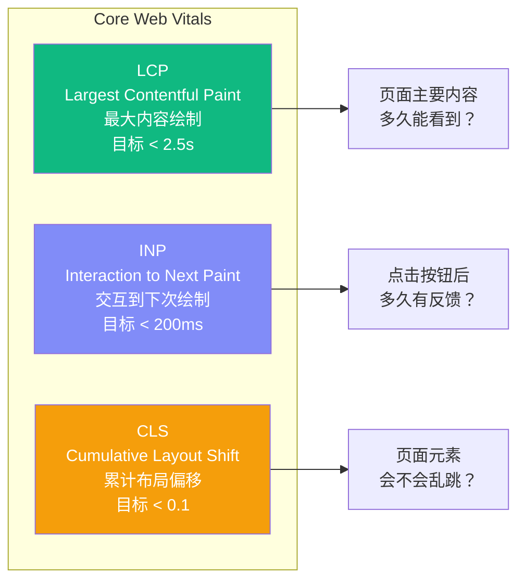
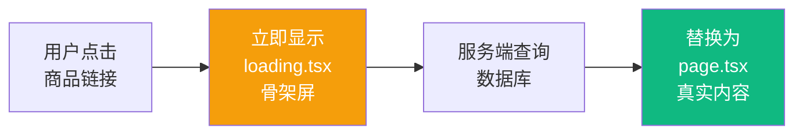
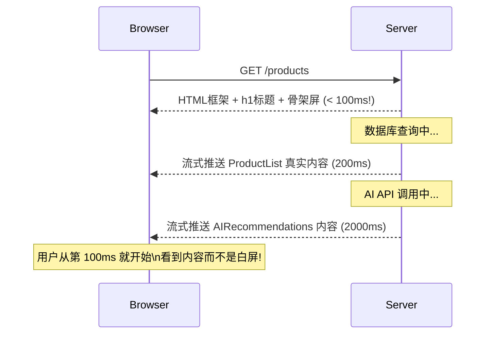
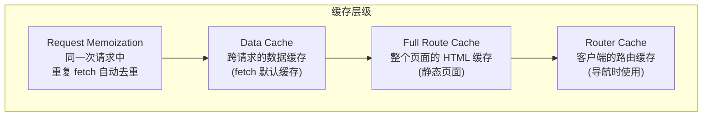

# Lesson 27：性能优化 — Core Web Vitals、流式渲染与缓存策略

> 🎯 **本节目标**：理解 Web 性能的核心指标，掌握 Next.js 的图片优化、字体优化、动态导入、流式渲染和缓存 API 等全方位优化手段。
>
> 📦 **本节产出**：一个 Lighthouse 评分显著提升的电商应用，建立性能预算意识。


## 一、Core Web Vitals — Google 的衡量标准

Google 使用三个核心指标来衡量网页的用户体验，并将其作为搜索排名的重要因素：



### 1.1 使用 Lighthouse 检查你的分数

1. 打开 Chrome DevTools → Lighthouse 标签页
2. 选择 "Performance"，点击 "Analyze page load"
3. 等待 10-20 秒，查看报告

每个指标都会按红/黄/绿标注。接下来的优化手段将逐一提升它们。

---

## 二、`next/image` — 图片优化 (改善 LCP)

图片是影响 LCP 的头号杀手。Next.js 的 `<Image>` 组件自动优化图片：

```tsx
import Image from 'next/image'

// ❌ 原生 img：加载原图、不压缩、不懒加载、可能引起 CLS


// ✅ next/image：自动压缩为 WebP、响应式尺寸、懒加载、预留空间防 CLS
<Image 
  src="/products/keyboard.jpg" 
  alt="键盘"
  width={400}
  height={300}
  priority           // 首屏图片加 priority 跳过懒加载
  placeholder="blur" // 加载时显示模糊占位图
/>
```

Next.js 在背后做了什么：
1. **格式转换**：自动把 JPEG/PNG 转成更小的 WebP/AVIF
2. **响应式**：根据设备屏幕生成不同尺寸的图片（`srcset` 属性）
3. **懒加载**：视口外的图片不加载，滚动到时才请求
4. **尺寸预留**：根据 `width` 和 `height` 自动预留空间，防止布局偏移 (CLS)
5. **缓存**：生成的优化图片会被缓存到服务器

---

## 三、`next/font` — 字体优化 (改善 CLS + LCP)

自定义字体是导致 **CLS (布局偏移)** 的常见原因。浏览器先用系统字体渲染文字，等自定义字体下载好后切换——文字突然跳了一下！

```tsx
// src/app/layout.tsx
import { Inter } from 'next/font/google'

// Next.js 在构建时自动下载字体文件并内联到你的项目中
// 用户不需要再向 Google Fonts CDN 发请求！
const inter = Inter({ 
  subsets: ['latin'],
  display: 'swap',     // 先用系统字体，加载完切换
})

export default function RootLayout({ children }: { children: React.ReactNode }) {
  return (
    <html lang="zh-CN" className={inter.className}>
      <body>{children}</body>
    </html>
  )
}
```

`next/font` 的优势：
- **零网络请求**：字体在构建时下载并 self-host
- **零 CLS**：自动应用 `size-adjust` CSS 属性，让系统字体和自定义字体的行高/宽度一致
- **自动子集化**：只下载你实际使用的字符

---

## 四、`loading.tsx` — 文件级 Loading 态

Next.js App Router 有一个约定式的 Loading UI 文件：在路由文件夹中放一个 `loading.tsx`，它会自动作为该路由的 `<Suspense fallback>`。

```
src/app/products/
├── page.tsx           ← 商品列表（Server Component，可能慢）
├── loading.tsx        ← 自动在 page.tsx 加载时显示
└── [id]/
    ├── page.tsx       ← 商品详情
    └── loading.tsx    ← 自动在详情加载时显示
```

```tsx
// src/app/products/loading.tsx
export default function ProductsLoading() {
  return (
    <div className="max-w-7xl mx-auto px-4 py-12">
      <div className="h-8 bg-gray-200 rounded w-48 mb-8 animate-pulse" />
      <div className="grid grid-cols-1 sm:grid-cols-2 lg:grid-cols-3 gap-6">
        {Array.from({ length: 6 }).map((_, i) => (
          <div key={i} className="bg-white rounded-2xl border overflow-hidden animate-pulse">
            <div className="h-48 bg-gray-200" />
            <div className="p-5 space-y-3">
              <div className="h-4 bg-gray-200 rounded w-3/4" />
              <div className="h-6 bg-gray-200 rounded w-1/3" />
            </div>
          </div>
        ))}
      </div>
    </div>
  )
}
```

当用户从首页导航到 `/products` 时，Next.js 会先显示 `loading.tsx` 的骨架屏，等数据库查询完成后自动替换为真实内容。

**等效于自己写 `<Suspense>`，但是零配置！**



---

## 五、流式渲染 (Streaming) + Suspense

传统 SSR 的流程是：等**所有数据**都加载完 → 一次性渲染完整 HTML → 发送。
如果某个数据源特别慢（如调第三方 AI 推荐 API），整个页面都被拖慢。

**流式渲染**允许服务端**边渲染边发送**，用 `<Suspense>` 精细地控制每个区域的 loading 状态：

```tsx
// src/app/products/page.tsx
import { Suspense } from 'react'

export default function ProductsPage() {
  return (
    <div className="max-w-7xl mx-auto px-4 py-12">
      <h1 className="text-3xl font-bold mb-8">商品列表</h1>

      {/* 区域 1：商品列表（查数据库，约 200ms） */}
      <Suspense fallback={<ProductsSkeleton />}>
        <ProductList />
      </Suspense>

      {/* 区域 2：AI 推荐（调外部 API，可能 2秒+） */}
      <Suspense fallback={<div className="animate-pulse py-8">🤖 正在生成个性化推荐...</div>}>
        <AIRecommendations />
      </Suspense>
    </div>
  )
}

// 这两个组件是独立的 Server Components
async function ProductList() {
  const products = await prisma.product.findMany()
  return <div>{/* 渲染 */}</div>
}

async function AIRecommendations() {
  // 模拟慢速 API
  const recs = await fetch('https://ai-api.example.com/recommend', { 
    next: { revalidate: 3600 } // 1小时缓存
  }).then(r => r.json())
  return <div>{/* 渲染 */}</div>
}
```



---

## 六、动态导入 — 减少首屏 JS 体积

```tsx
import dynamic from 'next/dynamic'

// 重量级组件动态导入（代码分割）
const RichTextEditor = dynamic(() => import('@/components/RichTextEditor'), {
  loading: () => <div className="animate-pulse bg-gray-200 h-40 rounded-xl" />,
  ssr: false,  // 这个组件只在客户端运行（如依赖 window/document）
})
```

**原理**：Turbopack 会把 `RichTextEditor` 的代码单独打包成一个 chunk。
用户访问首页时，这个 chunk 不会被下载。只有当这个组件真正要渲染时，才会发起额外的网络请求。

---

## 七、Next.js 缓存体系

Next.js 有一套复杂但强大的缓存机制：



### 7.1 `fetch` 缓存控制

```tsx
// 默认：缓存结果，永不过期（SSG 行为）
const data = await fetch('https://api.example.com/data')

// 每次请求都重新获取（SSR 行为）
const data = await fetch('https://api.example.com/data', { cache: 'no-store' })

// 每 60 秒重新验证一次（ISR 行为）
const data = await fetch('https://api.example.com/data', { next: { revalidate: 60 } })
```

### 7.2 `unstable_cache` 用于非 fetch 操作

Prisma 查询不是 `fetch`，所以需要用 `unstable_cache`（或 Next.js 15 的 `cache()`）：

```tsx
import { unstable_cache } from 'next/cache'

const getCachedProducts = unstable_cache(
  async () => {
    return prisma.product.findMany({ orderBy: { createdAt: 'desc' } })
  },
  ['products-list'],       // 缓存 key
  { revalidate: 300 }      // 5 分钟过期
)

// 在 Server Component 中使用
export default async function ProductsPage() {
  const products = await getCachedProducts()
  // ...
}
```

---

## 八、Bundle 分析与性能预算

### 8.1 分析包体积

```bash
npm install -D @next/bundle-analyzer
```

```ts
// next.config.ts
import bundleAnalyzer from '@next/bundle-analyzer'

const withBundleAnalyzer = bundleAnalyzer({
  enabled: process.env.ANALYZE === 'true',
})

export default withBundleAnalyzer({ /* your config */ })
```

```bash
ANALYZE=true npm run build
```

浏览器会自动打开矩形树图（Treemap），清晰展示每个包的体积。

### 8.2 性能预算 (Performance Budget)

设定团队规则，防止包体积无序膨胀：

```json
// package.json 或 CI 脚本中
{
  "performanceBudget": {
    "maxFirstLoad": "100kB",
    "maxPageBundle": "300kB"
  }
}
```

在 CI 中可以使用 `@next/bundle-analyzer` 配合脚本检查：如果 First Load JS 超过预算，则构建失败。

**常见的预算参考值：**
| 指标 | 优秀 | 良好 | 需优化 |
|------|------|------|--------|
| First Load JS | < 90kB | < 150kB | > 200kB |
| LCP | < 1.5s | < 2.5s | > 4s |
| CLS | < 0.05 | < 0.1 | > 0.25 |

---

## 九、`useTransition` 在 Next.js 中的应用

还记得 Lesson 16 学过的 `useTransition` 吗？在 Next.js 中，它配合 `router.push()` 使用效果极佳：

```tsx
'use client'
import { useTransition } from 'react'
import { useRouter } from 'next/navigation'

function CategoryFilter({ categories }: { categories: string[] }) {
  const router = useRouter()
  const [isPending, startTransition] = useTransition()

  const handleFilter = (category: string) => {
    // 将路由导航标记为低优先级
    // 这样输入框等高优先级交互不会被阻塞
    startTransition(() => {
      router.push(`/products?category=${category}`)
    })
  }

  return (
    <div className={isPending ? 'opacity-50 transition-opacity' : ''}>
      {categories.map(cat => (
        <button key={cat} onClick={() => handleFilter(cat)}>{cat}</button>
      ))}
    </div>
  )
}
```

---

## 十、练习

1. 把商品列表页和详情页的所有 `` 替换为 `<Image>`，对比 Lighthouse 分数。
2. 为 `/products` 路由添加 `loading.tsx` 骨架屏。
3. 使用 Chrome DevTools Performance 标签页录制一次商品浏览操作，找出最耗时的环节。

---

## 📌 本节小结

| 你做了什么 | 你学到了什么 |
|-----------|------------|
| 了解了 Core Web Vitals 三大指标 | LCP / INP / CLS 的含义与优化方向 |
| 使用了 `next/image` 优化图片 | 自动 WebP、懒加载、CLS 预防 |
| 使用了 `next/font` 优化字体 | 零 CLS、self-host、自动子集化 |
| 创建了 `loading.tsx` 骨架屏 | 约定式 Loading 态 |
| 用 Suspense 实现了流式渲染 | 边渲染边发送 |
| 了解了 Next.js 缓存体系 | fetch cache / `unstable_cache` / revalidate |
| 用 Bundle Analyzer 做了体积分析 | 性能预算概念 |
