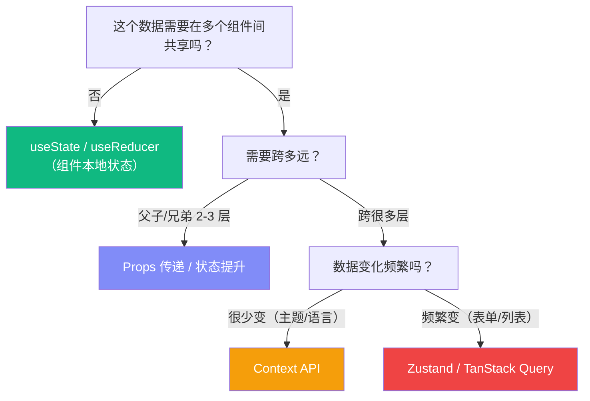
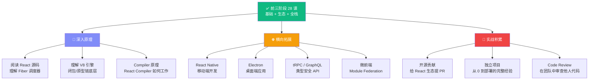

# Lesson 29：React 最佳实践与反模式 — 写出专业级代码

> 🎯 **本节目标**：掌握 React 开发的工程最佳实践，学会识别和避免常见反模式，写出可维护、高性能、安全、无障碍的专业级代码。
>
> 📦 **本节产出**：一份随时可查阅的实战速查手册，涵盖组件设计、状态管理、性能优化、TypeScript、无障碍、安全和调试技巧。


## 一、组件设计最佳实践

### 1.1 单一职责原则

```tsx
// ❌ 一个组件干了太多事
function ProductPage() {
  const [products, setProducts] = useState([])
  const [searchTerm, setSearchTerm] = useState('')
  const [cart, setCart] = useState([])
  const [isModalOpen, setIsModalOpen] = useState(false)
  // ... 200 行的巨型组件
}

// ✅ 拆分为职责清晰的小组件 + 自定义 Hook
function ProductPage() {
  return (
    <>
      <ProductSearch />
      <ProductGrid />
      <CartSummary />
    </>
  )
}
```

**经验法则：** 如果一个组件超过 **150 行**，就该考虑拆分了。

### 1.2 组件命名与文件组织

```
# ✅ 推荐的命名规范
components/
├── ui/                    # 通用 UI 原子组件 (Button, Input, Dialog)
├── features/              # 业务功能组件
│   ├── ProductCard.tsx     # PascalCase 命名
│   ├── ProductCard.test.tsx
│   └── useProductCard.ts   # 配套 Hook 放一起
├── layouts/               # 布局组件 (Sidebar, Header)
└── providers/             # Context Provider 包装组件
```

### 1.3 Props 设计原则

```tsx
// ❌ Boolean Props 地狱
<Button primary large rounded disabled loading />

// ✅ 用有语义的枚举/变体
<Button variant="primary" size="lg" disabled loading />

// ❌ 传递过多 Props（超过 5 个就要警惕）
<UserCard name={} email={} avatar={} role={} joinDate={} isOnline={} ... />

// ✅ 传递对象
<UserCard user={user} />
```

### 1.4 组合优于配置

```tsx
// ❌ 用 Props 控制一切（配置式）
<Card
  title="标题"
  subtitle="副标题"
  image="/photo.jpg"
  footer={<Button>操作</Button>}
  showBorder
  variant="elevated"
/>

// ✅ 用 children / Compound Components（组合式）
<Card variant="elevated">
  <CardImage src="/photo.jpg" />
  <CardBody>
    <CardTitle>标题</CardTitle>
    <CardSubtitle>副标题</CardSubtitle>
  </CardBody>
  <CardFooter>
    <Button>操作</Button>
  </CardFooter>
</Card>
```

组合式更灵活——你可以轻松地在 CardBody 里加一个评分组件，而配置式需要再加一个 `rating` prop。

---

## 二、State 管理最佳实践

### 2.1 状态放在哪里？决策树



### 2.2 减少不必要的 State

```tsx
// ❌ 冗余 state（可以从现有 state 派生）
const [todos, setTodos] = useState<Todo[]>([])
const [completedCount, setCompletedCount] = useState(0)  // 冗余！
const [activeCount, setActiveCount] = useState(0)         // 冗余！

// ✅ 用派生值代替
const [todos, setTodos] = useState<Todo[]>([])
const completedCount = todos.filter(t => t.completed).length  // 每次渲染自动计算
const activeCount = todos.length - completedCount
```

**原则：如果一个值可以从 State 或 Props 计算出来，就不要单独存 State。**

### 2.3 State 更新的不可变原则

```tsx
// ❌ 直接修改（Mutation）—— React 检测不到变化！
const handleToggle = (id: number) => {
  const todo = todos.find(t => t.id === id)
  todo!.completed = !todo!.completed  // 直接修改了对象
  setTodos(todos)                      // React 认为引用没变，不重渲染！
}

// ✅ 不可变更新（Immutable Update）
const handleToggle = (id: number) => {
  setTodos(prev => prev.map(t => 
    t.id === id ? { ...t, completed: !t.completed } : t
  ))
}

// ✅ 嵌套对象的不可变更新
const updateNestedField = () => {
  setUser(prev => ({
    ...prev,
    address: {
      ...prev.address,
      city: '上海'  // 只改了 city，其他保持不变
    }
  }))
}
```

---

## 三、useEffect 最佳实践

### 3.1 你可能不需要 useEffect

这是 React 官方文档着重强调的一点：**很多场景被滥用了 useEffect**。

```tsx
// ❌ 用 useEffect 同步派生值
const [firstName, setFirstName] = useState('')
const [lastName, setLastName] = useState('')
const [fullName, setFullName] = useState('')

useEffect(() => {
  setFullName(`${firstName} ${lastName}`)  // 多余的 state + effect！
}, [firstName, lastName])

// ✅ 直接在渲染中计算
const fullName = `${firstName} ${lastName}`
```

```tsx
// ❌ 用 useEffect 响应事件
useEffect(() => {
  if (submitted) {
    sendAnalytics('form_submitted')  // 应该放在事件处理器里！
  }
}, [submitted])

// ✅ 在事件处理器中执行
const handleSubmit = () => {
  setSubmitted(true)
  sendAnalytics('form_submitted')  // 事件驱动，不是状态驱动
}
```

### 3.2 useEffect 合法用例

| 场景 | 说明 |
|------|------|
| 订阅外部系统 | WebSocket、EventListener、IntersectionObserver |
| 同步到外部存储 | localStorage、sessionStorage |
| 发起数据请求 | fetch API（但更推荐 TanStack Query 或 RSC） |
| 操作 DOM | focus、scroll、测量尺寸 |
| 定时器 | setTimeout、setInterval（记得清理！） |

### 3.3 清理函数：必须返回！

```tsx
// ❌ 忘记清理 → 内存泄漏
useEffect(() => {
  const ws = new WebSocket('wss://...')
  ws.onmessage = (e) => setData(JSON.parse(e.data))
  // 组件卸载时 WebSocket 还在连着！
}, [])

// ✅ 返回清理函数
useEffect(() => {
  const ws = new WebSocket('wss://...')
  ws.onmessage = (e) => setData(JSON.parse(e.data))
  
  return () => ws.close()  // 组件卸载时关闭连接
}, [])
```

---

## 四、性能优化最佳实践

### 4.1 不要过早优化！

```tsx
// ❌ 到处加 memo / useMemo / useCallback
const MemoizedButton = memo(Button)        // 大多数情况没必要
const value = useMemo(() => a + b, [a, b]) // 简单计算不需要 memo
const handler = useCallback(() => {}, [])  // 不是所有回调都需要缓存

// ✅ 只在出现性能问题时优化
// 先用 React DevTools Profiler 测量，找到真正的瓶颈
```

### 4.2 何时使用 memo / useMemo / useCallback？

| 情况 | 是否需要 |
|------|---------|
| 列表项组件（渲染 100+ 个） | ✅ 用 `memo` 包裹列表项 |
| 传给 memo 组件的回调函数 | ✅ 用 `useCallback` 缓存 |
| 复杂计算（排序 10000 条数据） | ✅ 用 `useMemo` 缓存 |
| 简单计算（字符串拼接、加减） | ❌ 不需要 |
| 只渲染几个子组件 | ❌ 不需要 |
| 传给原生 DOM 元素的回调 | ❌ 不需要 |

### 4.3 key 的正确使用

```tsx
// ❌ 用 index 做 key（列表会增删排序时）
{todos.map((todo, index) => <TodoItem key={index} todo={todo} />)}

// ✅ 用唯一且稳定的 ID
{todos.map(todo => <TodoItem key={todo.id} todo={todo} />)}

// 🔥 进阶技巧：用 key 强制重置组件状态
<UserProfile key={userId} userId={userId} />
// userId 变了 → React 销毁旧组件、创建新组件 → 内部 state 全部重置
```

---

## 五、TypeScript 最佳实践

### 5.1 组件 Props 类型

```tsx
// ✅ 用 interface（可扩展）
interface ButtonProps {
  variant?: 'primary' | 'secondary' | 'ghost'
  size?: 'sm' | 'md' | 'lg'
  children: React.ReactNode
  onClick?: () => void
}

// ✅ 继承原生 HTML 属性
interface ButtonProps extends React.ButtonHTMLAttributes<HTMLButtonElement> {
  variant?: 'primary' | 'secondary'
  // 自动继承 onClick, disabled, type, className 等所有原生属性！
}

function Button({ variant = 'primary', children, ...rest }: ButtonProps) {
  return <button className={`btn-${variant}`} {...rest}>{children}</button>
}
```

### 5.2 泛型组件

```tsx
// ✅ 通用的列表组件
interface ListProps<T> {
  items: T[]
  renderItem: (item: T) => React.ReactNode
  keyExtractor: (item: T) => string
}

function List<T>({ items, renderItem, keyExtractor }: ListProps<T>) {
  return (
    <ul>
      {items.map(item => (
        <li key={keyExtractor(item)}>{renderItem(item)}</li>
      ))}
    </ul>
  )
}

// 使用时 TypeScript 自动推断 T 的类型！
<List 
  items={products}                           // T 被推断为 Product
  renderItem={(p) => <span>{p.name}</span>}  // p 自动有 Product 类型
  keyExtractor={(p) => p.id}
/>
```

### 5.3 类型收窄（Discriminated Unions）

```tsx
// ✅ 用联合类型让 TypeScript 帮你检查所有分支
type NotificationProps = 
  | { type: 'success'; message: string }
  | { type: 'error'; message: string; retry: () => void }   // error 必须有 retry
  | { type: 'loading' }                                       // loading 不需要 message

function Notification(props: NotificationProps) {
  switch (props.type) {
    case 'success': return <div className="text-green-600">{props.message}</div>
    case 'error':   return <div className="text-red-600">{props.message} <button onClick={props.retry}>重试</button></div>
    case 'loading': return <div className="animate-spin">⏳</div>
  }
}
```

---

## 六、无障碍 (Accessibility / a11y)

> 这是很多前端教程忽略但**极其重要**的话题。全球约 15% 的人口有某种形式的残障。

### 6.1 基本规则

```tsx
// ❌ 用 div 做按钮
<div onClick={handleClick} className="cursor-pointer">提交</div>

// ✅ 用语义化 HTML
<button onClick={handleClick}>提交</button>

// ❌ 图片没有 alt


// ✅ 加描述

// 纯装饰图片用空 alt


// ❌ 表单没有 label
<input type="email" placeholder="请输入邮箱" />

// ✅ label 关联 input（使用 useId！）
const id = useId()
<label htmlFor={id}>邮箱</label>
<input id={id} type="email" />
```

### 6.2 键盘导航

```tsx
// 自定义交互元素必须支持键盘
function DropdownItem({ onSelect, children }: { onSelect: () => void; children: React.ReactNode }) {
  return (
    <div
      role="option"                              // 告诉屏幕阅读器这是一个选项
      tabIndex={0}                               // 让元素可以被 Tab 聚焦
      onClick={onSelect}
      onKeyDown={(e) => {
        if (e.key === 'Enter' || e.key === ' ') {
          e.preventDefault()
          onSelect()                             // 回车和空格也要触发
        }
      }}
    >
      {children}
    </div>
  )
}
```

### 6.3 ARIA 属性速查

| 属性 | 用途 | 示例 |
|------|------|------|
| `aria-label` | 给没有可见文字的元素命名 | `<button aria-label="关闭">✕</button>` |
| `aria-hidden` | 对屏幕阅读器隐藏装饰性元素 | `<span aria-hidden="true">🎉</span>` |
| `aria-live` | 动态内容变化时通知用户 | `<div aria-live="polite">{count} 项结果</div>` |
| `aria-expanded` | 折叠/展开状态 | `<button aria-expanded={isOpen}>菜单</button>` |
| `aria-disabled` | 禁用状态（保持可聚焦） | `<button aria-disabled={!isValid}>提交</button>` |

> [!TIP]
> **shadcn/ui 的组件（基于 Radix UI）已经内置了完善的 ARIA 支持。** 这也是我们在 Lesson 13 选择它的重要原因之一。

---

## 七、安全最佳实践

### 7.1 XSS 防护

```tsx
// ✅ React 默认会转义所有文本内容（安全！）
const userInput = '<script>alert("xss")</script>'
return <div>{userInput}</div>  // 渲染为文本，不会执行脚本

// ❌ dangerouslySetInnerHTML 会绕过转义（危险！）
return <div dangerouslySetInnerHTML={{ __html: userInput }} />  // XSS 漏洞！

// ✅ 如果必须渲染 HTML，先消毒
import DOMPurify from 'dompurify'
return <div dangerouslySetInnerHTML={{ __html: DOMPurify.sanitize(userInput) }} />
```

### 7.2 Server Actions 安全

```tsx
// ❌ 信任客户端传来的数据
export async function deleteProduct(productId: string) {
  await prisma.product.delete({ where: { id: productId } })  // 谁都能删！
}

// ✅ 始终验证权限
export async function deleteProduct(productId: string) {
  const session = await auth()
  if (!session || session.user.role !== 'admin') {
    throw new Error('无权操作')
  }
  await prisma.product.delete({ where: { id: productId } })
}
```

### 7.3 环境变量安全

```bash
# ✅ 服务端密钥（不加 NEXT_PUBLIC_ 前缀）
DATABASE_URL=postgresql://...
STRIPE_SECRET_KEY=sk_live_...

# ✅ 客户端公开信息（加 NEXT_PUBLIC_ 前缀）
NEXT_PUBLIC_STRIPE_PUBLISHABLE_KEY=pk_live_...
NEXT_PUBLIC_APP_URL=https://myapp.com

# ❌ 绝对不要这么做！
NEXT_PUBLIC_DATABASE_URL=...       # 数据库密码暴露给浏览器！
NEXT_PUBLIC_STRIPE_SECRET_KEY=...  # 支付密钥暴露给浏览器！
```

---

## 八、调试技巧

### 8.1 React DevTools

| 功能 | 用途 |
|------|------|
| **Components 面板** | 查看组件树、Props、State、Hooks 的实时值 |
| **Profiler 面板** | 录制渲染过程，找出渲染耗时最长的组件 |
| **"Highlight updates"** | 开启后，每次重渲染的组件会闪烁高亮 |

### 8.2 常用调试手段

```tsx
// 1. 用 console.log 追踪渲染
function MyComponent({ value }: { value: string }) {
  console.log('MyComponent rendered with:', value)
  // ...
}

// 2. 用 useEffect 追踪 state 变化
useEffect(() => {
  console.log('todos changed:', todos)
}, [todos])

// 3. 用 React.StrictMode 提前发现问题
// 在开发模式下会故意：
// - 渲染两次（检测副作用是否幂等）
// - 执行 Effect 两次（检测清理函数是否正确）
// - 检查废弃的 API 使用
```

---

## 九、常见反模式速查

| 反模式 | 问题 | 正确做法 |
|--------|------|---------|
| Props Drilling > 3 层 | 中间组件被迫传递不需要的 Props | Context / Zustand |
| useEffect 同步 state | 导致多余的渲染周期 | 直接在渲染中计算派生值 |
| useEffect 中 fetch 无清理 | 竞态条件（旧请求覆盖新结果） | AbortController / TanStack Query |
| 在循环/条件中调用 Hook | 破坏 Hook 调用顺序，React 崩溃 | 始终在组件顶层调用 |
| 用 `index` 做 key | 列表增删时组件状态错乱 | 用唯一 ID |
| `useState` + `useEffect` 管理服务端数据 | 缺少缓存、重试、乐观更新 | TanStack Query / SWR |
| Context 中放频繁变化的数据 | 所有消费者不必要地重渲染 | Zustand selector |
| 组件中直接 `fetch` 不缓存 | 路由切换回来后重复请求 | TanStack Query staletime |

---

## 十、熟练掌握 React 的补强训练清单

如果你的目标是"能独立高质量交付 React 项目"，建议在学完前三阶段（前 28 课）后继续完成下面 6 个专项训练：

| 专项 | 训练内容 | 达标标准 |
|------|---------|---------|
| 渲染模型 | 手写 2 个案例解释 render/commit、状态快照、批处理、Effect 时机 | 能准确解释"为什么会重渲染"和"为什么出现旧值闭包" |
| 状态架构 | 对同一需求分别用 local state / Context / Zustand / TanStack Query 建模 | 能说清每种方案的边界和迁移成本 |
| 性能分析 | 用 React DevTools Profiler 分析 3 个真实性能问题并给出前后对比 | 优化结果有量化指标（渲染次数、耗时、包体积） |
| TypeScript | 写 3 个泛型组件、2 个复杂 Hook 类型（含返回值推导） | 不使用 `any` 仍能保持良好可读性 |
| 可访问性 | 为表单、弹窗、菜单补齐键盘导航和 ARIA 语义 | 可仅靠键盘完整操作关键流程 |
| 工程质量 | 补齐测试金字塔（单测/集成/E2E）和错误监控链路 | 关键路径（登录/下单）有自动化回归保护 |

推荐按下面顺序执行（每周一个主题）：
1. 第 1-2 周：渲染模型 + 状态架构
2. 第 3-4 周：性能分析 + TypeScript
3. 第 5-6 周：可访问性 + 工程质量
4. 第 7-8 周：脱稿重做一个中型项目（不看教程，从需求到部署）

---

## 十一、📌 前三阶段（28 节课）后的精通路线图

学完本课程，你掌握了 React **开发技能**的 80%。要达到真正的"精通"，还需要：



**精通 = 知识深度 × 工程广度 × 实战经验。** 本课程解决了"知识深度"和"工程广度"的基础盘，剩下的需要通过持续的实战来积累。
