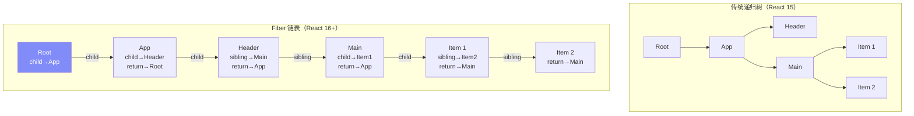
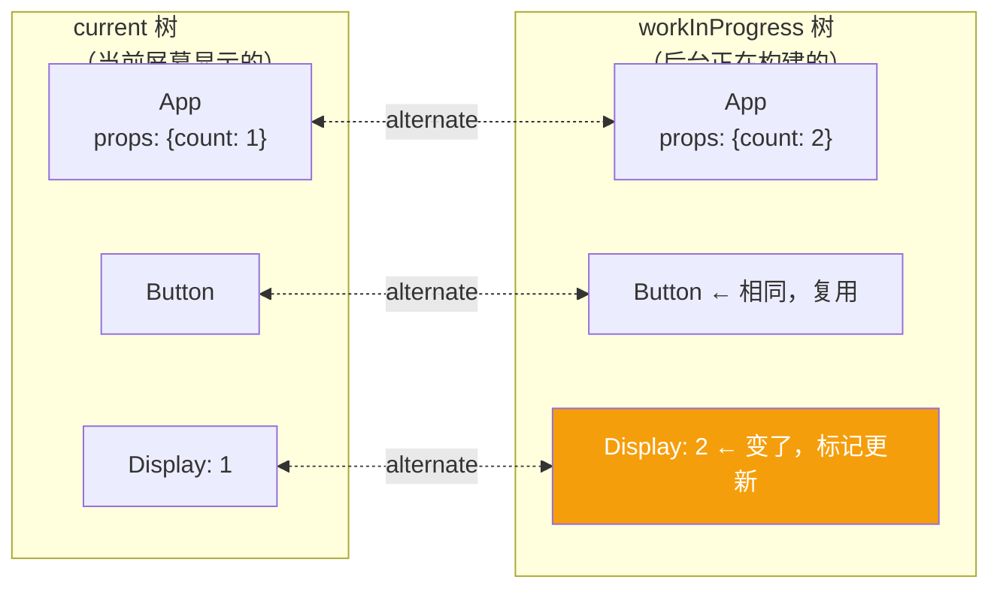
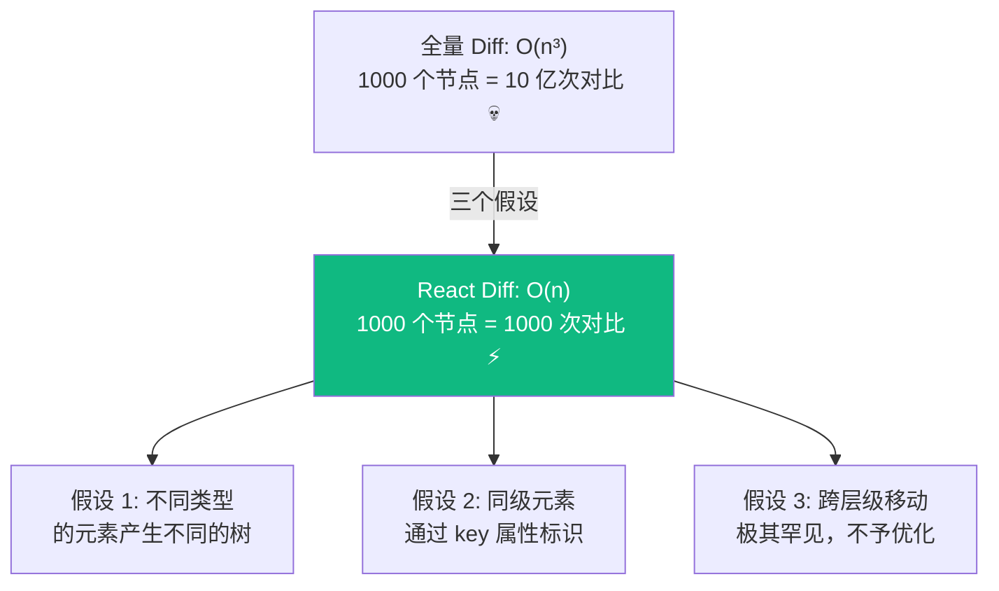
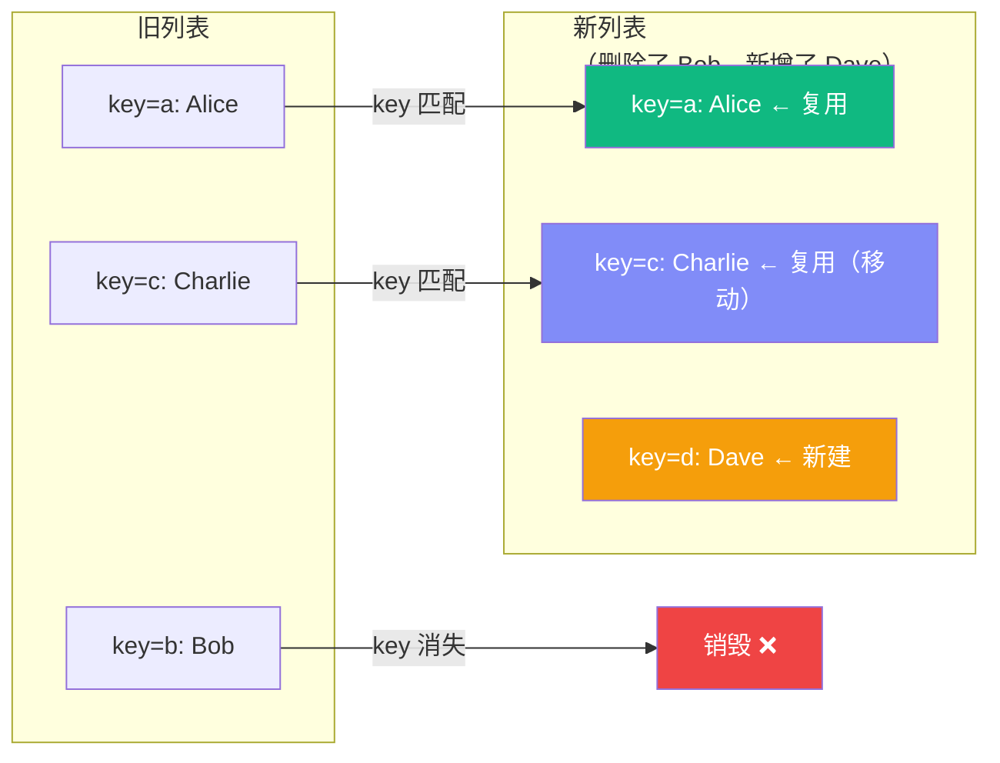
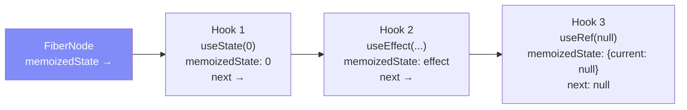
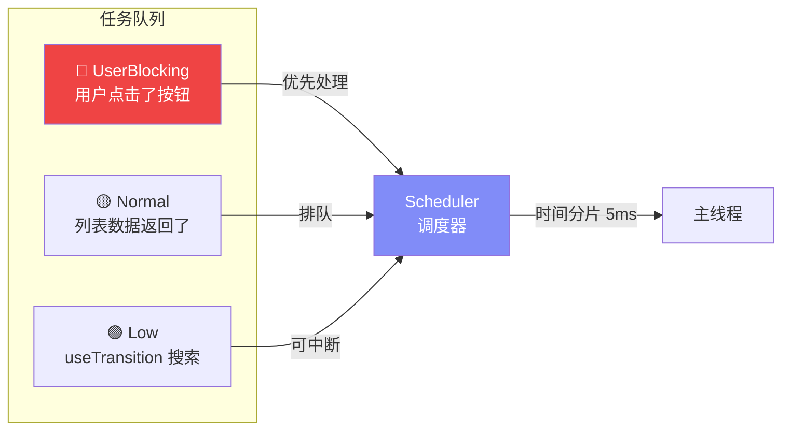
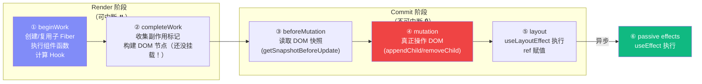
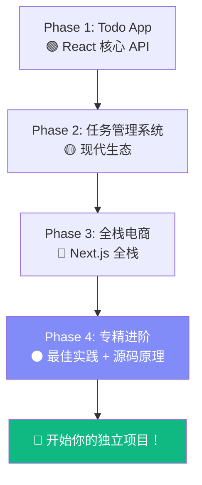

# Lesson 30：React 源码深度剖析 — Fiber、Reconciler 与调度器

> 🎯 **本节目标**：理解 React 的核心内部实现——Fiber 架构、Reconciliation 算法、Scheduler 调度机制，以及 React Compiler 的编译原理。这是通过顶级公司前端面试的必备知识。
>
> 📦 **本节产出**：对 React 内部运行机制的深刻理解，能够解释 React "为什么这样设计"，而不仅仅是"怎么用"。

---

## 一、从源码仓库说起

React 的源码托管在 [github.com/facebook/react](https://github.com/facebook/react)，是一个 Monorepo。核心包结构：

```
packages/
├── react/                 ← 公共 API（useState, useEffect 等）
├── react-dom/             ← DOM 渲染器（浏览器环境）
├── react-reconciler/      ← 🧠 核心！协调器（diff 算法）
├── scheduler/             ← ⏰ 调度器（优先级、时间分片）
├── react-server/          ← RSC 服务端渲染
└── react-compiler/        ← 🆕 React Compiler
```

> [!NOTE]
> React 的设计是**渲染器无关**的。`react` 包只定义 Hook 和组件 API；`react-dom` 负责把虚拟树渲染到 DOM；`react-native-renderer` 则渲染到原生视图。它们共享同一个 `react-reconciler`。

---

## 二、Fiber 架构深度解析

### 2.1 什么是 Fiber？

在 Lesson 01 我们知道了 Fiber 是 React 16+ 的内部架构。现在深入看它的数据结构：

**一个 Fiber 节点就是一个普通的 JavaScript 对象**，代表组件树中的一个工作单元：

```ts
// 简化版 Fiber 节点结构（实际源码在 react-reconciler/src/ReactFiber.js）
interface FiberNode {
  // === 身份信息 ===
  tag: number           // 节点类型：FunctionComponent(0), ClassComponent(1), HostComponent(5)...
  type: any             // 对应的组件函数或 HTML 标签名
  key: string | null    // 就是 JSX 中的 key
  
  // === 树结构（链表） ===
  return: FiberNode | null   // 父节点
  child: FiberNode | null    // 第一个子节点
  sibling: FiberNode | null  // 下一个兄弟节点
  
  // === 状态 ===
  memoizedState: any    // Hook 链表（useState, useEffect 等）
  memoizedProps: any    // 上次渲染的 Props
  pendingProps: any     // 本次待处理的 Props
  
  // === 副作用 ===
  flags: number         // 位运算标记（Placement | Update | Deletion）
  
  // === 双缓冲 ===
  alternate: FiberNode | null  // 指向另一棵树中的对应节点
}
```

### 2.2 为什么用链表而不是树？



**关键区别：链表可以中断和恢复！**

递归处理树结构时，调用栈会一路深入，无法在中间暂停。而链表遍历用的是一个 `while` 循环 + 指针移动，随时可以保存当前位置、让出主线程、稍后恢复。

```ts
// 简化的 Fiber 遍历（workLoop）
function workLoop(deadline: IdleDeadline) {
  let currentFiber = nextUnitOfWork
  
  while (currentFiber && deadline.timeRemaining() > 1) {
    // 处理一个 Fiber 节点
    currentFiber = performUnitOfWork(currentFiber)
  }
  
  if (currentFiber) {
    // 时间片用完了！保存进度，交还主线程
    requestIdleCallback(workLoop)
  } else {
    // 全部处理完了，提交到 DOM
    commitRoot()
  }
}
```

### 2.3 双缓冲机制 (Double Buffering)

React 同时维护**两棵 Fiber 树**：



- **current 树**：对应当前屏幕上的 UI
- **workInProgress 树**：后台正在构建的新 UI
- 构建完成后，React 将 `workInProgress` **一次性切换**为新的 `current`（指针交换，O(1)）
- 旧的 `current` 变成下一次更新的 `workInProgress` 底板（复用内存）

这就像动画制作中的**双缓冲**：在后台画好下一帧，然后瞬间翻页，用户看不到中间状态。

---

## 三、Reconciliation 算法（Diff）

### 3.1 核心假设

React 的 Diff 算法能把 O(n³) 的树对比优化到 O(n)，靠的是**三个大胆假设**：



### 3.2 Diff 的三种策略

**策略一：类型变了 → 整棵子树销毁重建**

```tsx
// 前后两次渲染：
<div><Counter /></div>   →   <span><Counter /></span>
// div 变成了 span → React 销毁整个 <div> 子树（包括 Counter 的状态！）
// 重新创建 <span> 和全新的 <Counter>
```

**策略二：相同类型 → 只更新变化的属性**

```tsx
// 前后两次渲染：
<div className="old" style={{color: 'red'}} />
<div className="new" style={{color: 'blue'}} />
// 同样是 div → React 只更新 className 和 style，不重建 DOM
```

**策略三：列表 → 用 key 对比**



> [!IMPORTANT]
> **这就是为什么 `key` 如此重要！** 没有 key，React 只能按索引对比，导致：
> - 列表中间删除一个元素 → 后面所有元素的 Props "错位" → 状态混乱
> - 用 `index` 做 key → 删除/排序时等同于没有 key

---

## 四、Hooks 的内部实现

### 4.1 Hook 是一个链表

每个函数组件的 Fiber 节点上有一个 `memoizedState` 字段，存储的是一个 **Hook 链表**：



**这就是为什么 Hook 不能在条件/循环中调用！**

```tsx
// ❌ 条件调用 Hook
function Bad({ showExtra }) {
  const [name, setName] = useState('')     // Hook 1
  if (showExtra) {
    const [extra, setExtra] = useState('') // Hook 2 ← 有时存在有时不存在！
  }
  const ref = useRef(null)                  // Hook 3（或 Hook 2？）
}
```

React 在每次渲染时按**调用顺序**遍历链表。如果中间插入或跳过了一个 Hook，后续所有 Hook 的读取位置都会错位 → 状态混乱 → 崩溃。

### 4.2 useState 的更新队列

```ts
// 简化的 useState 内部结构
interface StateHook<S> {
  memoizedState: S           // 当前值
  queue: {
    pending: Update<S> | null  // 待处理的更新链表（环形链表）
  }
  next: Hook | null
}

// 当你调用 setState 时：
function dispatchSetState(fiber, queue, action) {
  const update = { action, next: null }
  
  // 将 update 加入环形链表
  if (queue.pending === null) {
    update.next = update  // 自环
  } else {
    update.next = queue.pending.next
    queue.pending.next = update
  }
  queue.pending = update
  
  // 调度一次更新
  scheduleUpdateOnFiber(fiber)
}
```

这解释了为什么 `setState` 到真的生效之间有延迟——更新被**放入队列**，等到下一次渲染时统一处理。

---

## 五、Scheduler 调度器

### 5.1 优先级系统

React 18+ 的更新不再是"先来先服务"，而是有**优先级**的：

| 优先级 | 触发场景 | 超时时间 |
|--------|---------|---------|
| **Immediate** | 同步的 `flushSync` | 立即 |
| **UserBlocking** | 点击、输入等用户交互 | 250ms |
| **Normal** | 网络响应、`setState` | 5000ms |
| **Low** | `useTransition` 包裹的更新 | 10000ms |
| **Idle** | 屏幕外的预渲染 | 永不过期 |



### 5.2 时间分片（Time Slicing）

```ts
// 简化的时间分片逻辑
function workLoop() {
  while (workInProgress !== null) {
    // 处理一个 Fiber 节点
    performUnitOfWork(workInProgress)
    
    // 检查是否需要让出主线程（每 5ms 检查一次）
    if (shouldYield()) {
      // 保存当前 Fiber 指针，交还控制权
      // 浏览器可以处理用户输入、绘制动画
      scheduleCallback(workLoop)
      return
    }
  }
}

function shouldYield(): boolean {
  // 当前时间超过了分配的 5ms 截止时间
  return getCurrentTime() >= deadline
}
```

**这就是 `useTransition` 能让输入框不卡顿的秘密：** 搜索结果的渲染被标记为低优先级，每渲染 5ms 就让位给用户输入处理。

---

## 六、渲染的两个阶段



**关键理解：**
- **Render 阶段**可以被中断、重启，甚至丢弃（这就是为什么渲染函数必须是纯函数！）
- **Commit 阶段**必须同步完成，保证 DOM 更新的原子性
- `useLayoutEffect` 在 DOM 变更后**同步**执行（阶段 ⑤）
- `useEffect` 在浏览器绘制后**异步**执行（阶段 ⑥）

---

## 七、React Compiler 原理

### 7.1 它解决什么问题？

```tsx
// 开发者写的代码
function ProductList({ products, onSelect }) {
  const sorted = products.sort((a, b) => a.price - b.price)
  const handleClick = (id) => onSelect(id)
  
  return sorted.map(p => <ProductCard key={p.id} product={p} onClick={() => handleClick(p.id)} />)
}
```

**问题：** 每次渲染都会重新排序、创建新的 `handleClick` 和箭头函数，导致子组件即使用了 `memo` 也无效。

### 7.2 编译器自动插入 Memoization

React Compiler 在**编译时**分析代码的数据依赖关系，自动插入缓存：

```tsx
// ❓ 编译器理解后（概念化的输出）
function ProductList({ products, onSelect }) {
  // 编译器自动追踪：sorted 依赖 products
  const sorted = useMemo(() => products.sort((a, b) => a.price - b.price), [products])
  
  // 编译器自动追踪：handleClick 依赖 onSelect
  const handleClick = useCallback((id) => onSelect(id), [onSelect])
  
  // 编译器自动追踪：每个箭头函数依赖 handleClick 和 p.id
  return sorted.map(p => <ProductCard key={p.id} product={p} onClick={useCallback(() => handleClick(p.id), [handleClick, p.id])} />)
}
```

> [!NOTE]
> 实际的编译器输出比上面复杂得多——它不是简单地插入 `useMemo/useCallback`，而是使用自己的缓存 slot 机制。但概念是相同的：**追踪数据流依赖 → 只在依赖变化时重新计算**。

### 7.3 如何启用

```bash
npm install -D babel-plugin-react-compiler
```

```js
// babel.config.js
module.exports = {
  plugins: [
    ['babel-plugin-react-compiler', {}]
  ]
}
```

目前 React Compiler 仍在逐步稳定中，Meta 已在 Instagram 和 Facebook 的大规模生产环境验证。

---

## 八、面试高频问题解析

### Q1: React 的 Diff 算法为什么是 O(n)？

**答：** 通过三个假设将问题简化——(1) 不同类型直接销毁重建不对比子树；(2) 同级通过 key 标识可以 O(1) 查找；(3) 不处理跨层级移动。这样每个节点只需对比一次，总复杂度 O(n)。

### Q2: 为什么 Hook 不能在 if/for 里调用？

**答：** Hook 在 Fiber 节点上以链表形式存储，React 按调用顺序索引。条件调用会导致链表长度不一致，后续 Hook 读取到错误的状态。

### Q3: setState 是同步还是异步的？

**答：** 在 React 18+ 中，所有 setState 都是"批量处理"的（Automatic Batching）。setState 本身是同步函数调用，但它只是将更新放入队列，真正的状态变化和重渲染发生在下一个微任务中。可以理解为"调度是同步的，生效是异步的"。

### Q4: useEffect 和 useLayoutEffect 的区别？

**答：** 在 Commit 阶段的时序不同。`useLayoutEffect` 在 DOM 变更后、浏览器绘制前**同步**执行（阻塞绘制），用于测量 DOM。`useEffect` 在浏览器绘制后**异步**执行（不阻塞），用于非紧急副作用。

### Q5: React 19 的 RSC 和传统 SSR 有什么区别？

**答：** 传统 SSR 将同一套组件在服务端渲染为 HTML 字符串，客户端再执行一遍进行 Hydration（水合）。RSC 是全新的模型：Server Components **只在服务端执行**，它们的输出是一种序列化的中间格式（RSC Payload），客户端只需要处理 Client Components 的交互。这意味着 Server Components 的代码（包括依赖库）完全不进入客户端 Bundle。

---

## 九、练习与深入阅读

### 动手实验

1. **观察 Fiber 树**：在 React DevTools 的 Components 面板中，勾选 "Show owner stacks"，观察 Fiber 节点的 parent/child/sibling 关系。
2. **体验时间分片**：写一个渲染 10000 个列表项的组件，分别用 `useState` 和 `useTransition` 触发更新，观察输入框的响应差异。
3. **尝试 React Compiler**：在一个 Vite 项目中启用 `babel-plugin-react-compiler`，对比编译前后的 Bundle 产物。

### 推荐阅读

| 资源 | 说明 |
|------|------|
| [React 源码 (GitHub)](https://github.com/facebook/react) | 直接阅读 `packages/react-reconciler/` 目录 |
| [Build your own React](https://pomb.us/build-your-own-react/) | 用 300 行代码实现一个迷你 React |
| [React 技术揭秘](https://react.iamkasong.com/) | 中文社区最好的 React 源码解读 |
| [Dan Abramov 的博客](https://overreacted.io/) | React 核心团队成员的深度文章 |

---

## 📌 本节小结

| 你学到了什么 | 核心要点 |
|-------------|---------|
| Fiber 节点数据结构 | 链表遍历可中断，支持并发渲染 |
| 双缓冲机制 | current 树 + workInProgress 树，瞬间切换 |
| Reconciliation Diff | 三个假设 → O(n) 复杂度 → key 的本质作用 |
| Hook 链表 | 按调用顺序索引 → 不能条件调用的原因 |
| Scheduler 调度器 | 5 级优先级 + 5ms 时间分片 |
| 渲染两阶段 | Render（可中断）→ Commit（不可中断）→ Effects |
| React Compiler | 编译时自动追踪依赖、插入缓存 |

---

## ➡️ 课程到这里就结束了 🎉

恭喜你！完成了从入门到源码级理解的 React 学习之旅。



**去做一个你自己想做的项目吧。那才是真正掌握 React 的起点。**
